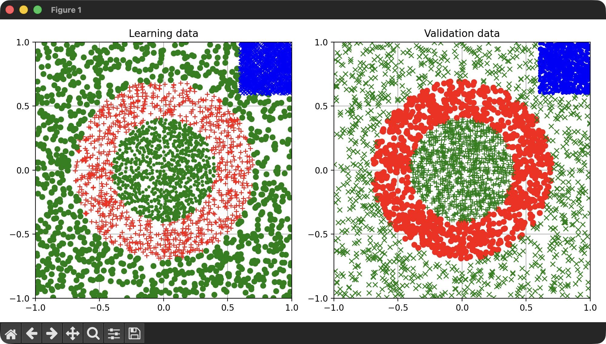

# Classification with the TensorFlow lite Library

(c) 2025-2026, Edo. Franzi, 2026-04-23

## Introduction

This is an example of a complete neural network classifier demonstrating the full capabilities of µKOS-X in conjunction with TensorFlow Lite. The goal is to present, step by step, how to design and implement such a classifier.

As an illustrative case, we aim to build a model capable of classifying 2D coordinates (x, y), where both values range from -1 to 1, into three distinct classes:

- **C1 – Ring (red):** points forming a circular ring structure
- **C2 – Inner-Outer (green):** points located between the inner and outer regions
- **C3 – Square (blue):** points forming a square-shaped region

This example highlights how different geometric patterns can be learned and distinguished by a neural network using µKOS-X.



## Dataset Creation and Classifier Generation

### Dataset creation

```bash
# Create the learning DB_L_file.txt and the validation DB_V_file.txt files
cd _Training
python3 DB_Creator.py
```

### Create the Neural Network

The file `mlp-model.py` contains the high-level description of the neural network architecture and its configuration.

This Python script initialises the required libraries, reads the dataset files, and uses TensorFlow Lite to generate a trained model (a `.tflite` file). It defines the network structure, handles the training process, and prepares the model for deployment.

At the end of the process, the script generates the file `mlp_model.c_inc`, which must be included in the application. This file contains the network parameters (such as weights and biases) in a format suitable for direct integration into the target system.

```bash
# Create the Neural Network
cd _Training
python3 mlp_model.py --model_file mlp_model.tflite --mode full
xxd -i mlp_model.tflite > mlp_model.c_inc
```

This file must then be included in the application so that the network architecture and its trained parameters can be embedded directly into the program. In this way, the application can use the classifier without requiring any external model file at runtime.

