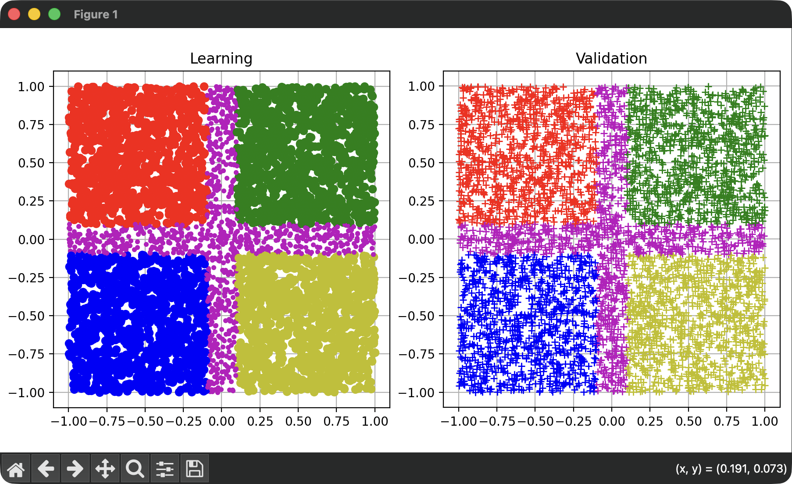

# Classification with the MLPN Library

(c) 2025-2026, Edo. Franzi, 2026-04-23

## Introduction

This example presents a complete neural network classifier demonstrating the full capabilities of µKOS-X. The objective is to show, step by step, how to design and implement such a classifier.

As an illustrative case, we build a model capable of classifying 2D coordinates (x, y), where both values range from -1 to 1, into five distinct classes:

- **Class A (red):** top-left cluster
- **Class B (green):** top-right cluster
- **Class C (blue):** bottom-left cluster
- **Class D (yellow):** bottom-right cluster
- **Inter-class (violet):** the regions between all clusters

This example demonstrates how a neural network using µKOS-X can learn and distinguish different geometric regions in a two-dimensional space.



## Dataset Creation and Classifier Generation

### Dataset creation

```bash
# Create the learning DB_L_file.txt and the validation DB_V_file.txt files
cd _Training
python3 DB_Creator.py
```

### Define the network

The file `config.py` contains the high-level description of the neural network architecture and its configuration. It defines the main components of the model, such as the number of layers, the type of neurons, activation functions, and other key parameters required to build the classifier. This file serves as the central place for configuring the network before training, making it easier to adjust the model structure and experiment with different settings.

```bash
# Application / Network configuration
#
# L1 - 2 inputs
# L1 - 12 output
# L2 - 12 input (the bias is automatically added)
# L2 - 24 output
# L3 - 24 input (the bias is automatically added)
# L3 - 5 output
#              I1  O1  O2  O3
KLAYERS     = [2,  12, 24, 5]
KNB_INPUTS  = 2
KNB_OUTPUTS = 5

# KMLPN_TAN0 = libm tanh
# KMLPN_TAN1 = Lambert's tanh approximation
# KMLPN_TAN2 = Ultrafast tanh approximation (~2% precision)
# KMLPN_TAN3 = Fastest tanh approximation (less precise)
# KMLPN_RELU = Ultrafast relu
# KMLPN_LINE = Ultrafast linear
# KMLPN_SMAX = Ultrafast softmax
#
KNON_LINEAR     = "KMLPN_TAN2"
KNON_LINEAR_OUT = "KMLPN_SMAX"

KGAIN     = 0.005
KMOMENTUM = 0.0
KEPOCHS   = 200000

# Some Input/Output samples for rapid validation
#
#               Input -x -y          Class -1 -2 -3
KVALIDATION = [
              [-0.988388,   0.867081,   0.98,   0.00    0.00,    0.00,    0.00],
              [0.757057,    0.295996,   0.00,   0.98    0.00,    0.00,    0.00],
              [0.327959,   -0.888219,   0.00,   0.00    0.00,    0.98,    0.00],
              [-0.478465,  -0.454157,   0.00,   0.00    0.98,    0.00,    0.00],
              [-0.561333,  -0.588802,   0.00,   0.00    0.98,    0.00,    0.00],
              [0.474768,   -0.188733,   0.00,   0.00    0.00,    0.98,    0.00]
              ]

```

For this example, we use a three-layer neural network with 2 input neurons and three successive layers of 12, 24, and 5 neurons, respectively.

The first two layers (L1 and L2) use a non-linear activation function based on an ultrafast approximation of the hyperbolic tangent (tanh). The final layer (L3) uses an ultrafast softmax function to produce normalized output probabilities for the three target classes.

### Create the Neural Network

```bash
# Create the Neural Network
cd _Training
./build.sh
```

At this step, the file **`network.c_inc`** is created. It contains the structure of the neural network as well as the set of weights associated with it.

This file must then be included in the application so that the network architecture and its trained parameters can be embedded directly into the program. In this way, the application can use the classifier without requiring any external model file at runtime.

