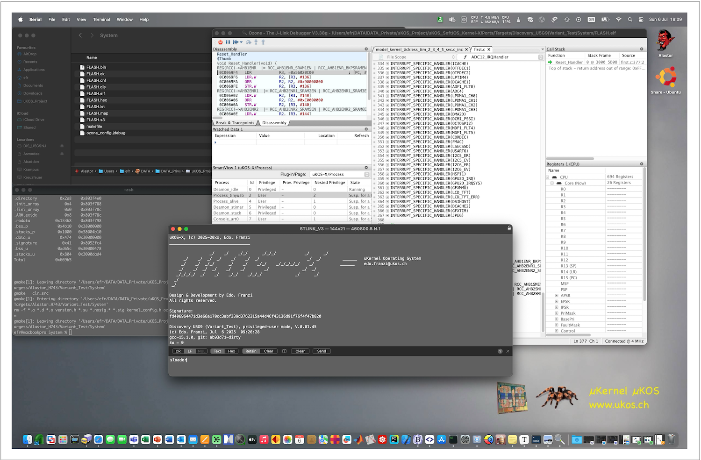
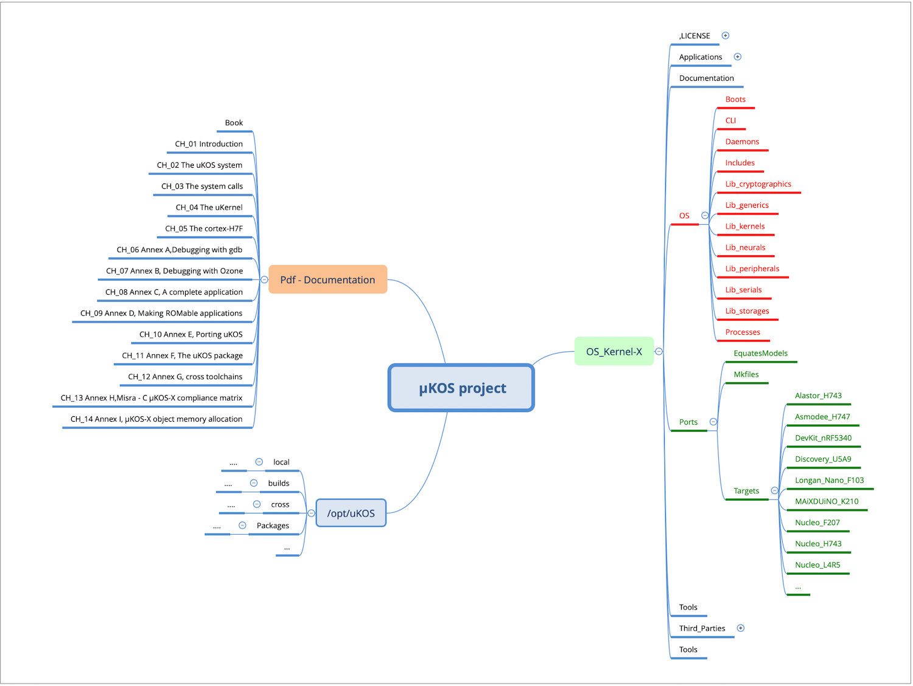

# 🧩  Introduction

## Introduction

**µKOS-X** is a **multitasking operating system** designed specifically for **small embedded microcontroller** and **DSP-based systems**. Its development traces back to **1984**, with the creation of **µKOS-0**. At the time, I developed a simple **scheduler** without any additional services, constrained by the **extremely limited memory** available. This early system ran on a **Motorola MC6809** processor operating at **1-MHz**.

The project gained momentum in 1992 during the development of the [Khepera mobile robot](https://en.wikipedia.org/wiki/Khepera_mobile_robot), an influential academic robotics platform. During this phase, I created **µKOS-I**, written in **CALM** assembler, a language developed by **LAMI-EPFL**. That experience raised a critical question that would shape the future of µKOS: **How should one write software to control such a compact, resource-limited robot?**

This challenge laid the conceptual foundation for what would become the **µKOS** family.

In 1996, I undertook a complete rewrite of **µKOS-I** in the **C programming language**, resulting in **µKOS-II**. Development was carried out on a **Macintosh running Mac OS 9**, using the **MPW (Macintosh Programmer’s Workshop)** environment, which offered a robust platform for embedded development at the time.

In 2002, following Apple’s transition to **Mac OS X** and the broader **UNIX ecosystem**, I chose to **revive, modernise, and extend** the µKOS project. This effort culminated in the creation of **µKOS-X** — a fully updated, feature-rich version of the operating system. My goal was to consolidate the ideas, insights, and experience accumulated over nearly two decades of embedded system design and to make them available to others working in the same domain.

When I designed **µKOS-I**, I was guided by the idea of establishing a connection between a target system — typically a microcontroller, DSP, or similar — that handles the real-time constraints of an application, and a workstation running advanced scientific software such as **Matlab**, **Sysquake**, **Mathematica**, or **LabVIEW**. The communication link between the target and the host could be as simple as an **RS-232** serial interface or something more sophisticated, such as **USB** or **Ethernet**.

The original concept was to facilitate the exchange of **high-level messages only** between the embedded target and the workstation. In its earliest incarnation, the connection relied on an RS-232 link, which proved particularly useful during debugging, as it allowed the target to be controlled directly via a **VT100-compatible text terminal**.

I consider this project to be **open source**, licensed under the **MIT** licence.

The **µKOS project** is described and distributed with full support for a wide range of **ARM Cortex microcontrollers**, including the **M3, M4, M7, M33 and M55** families, as well as for the **RISC-V** architectures — specifically **RV32** and **RV64**.

The purpose of this book — best described as a **project report** — is to present and document all the components that comprise an embedded microprocessor system: the **hardware**, the **operating system**, the **µKernel**, the **software libraries** (referred to as *managers*), and the accompanying **GNU development tools**.

This document is intended for readers with a **strong background in digital electronics and computer science**, particularly those with an interest in real-time embedded systems.

