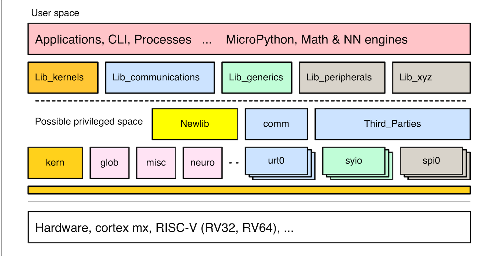
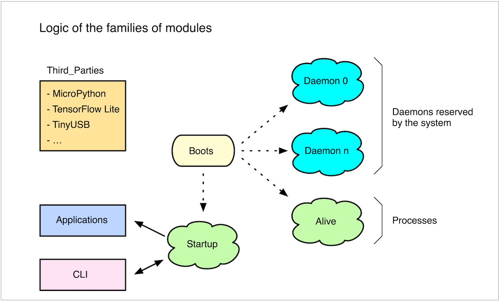
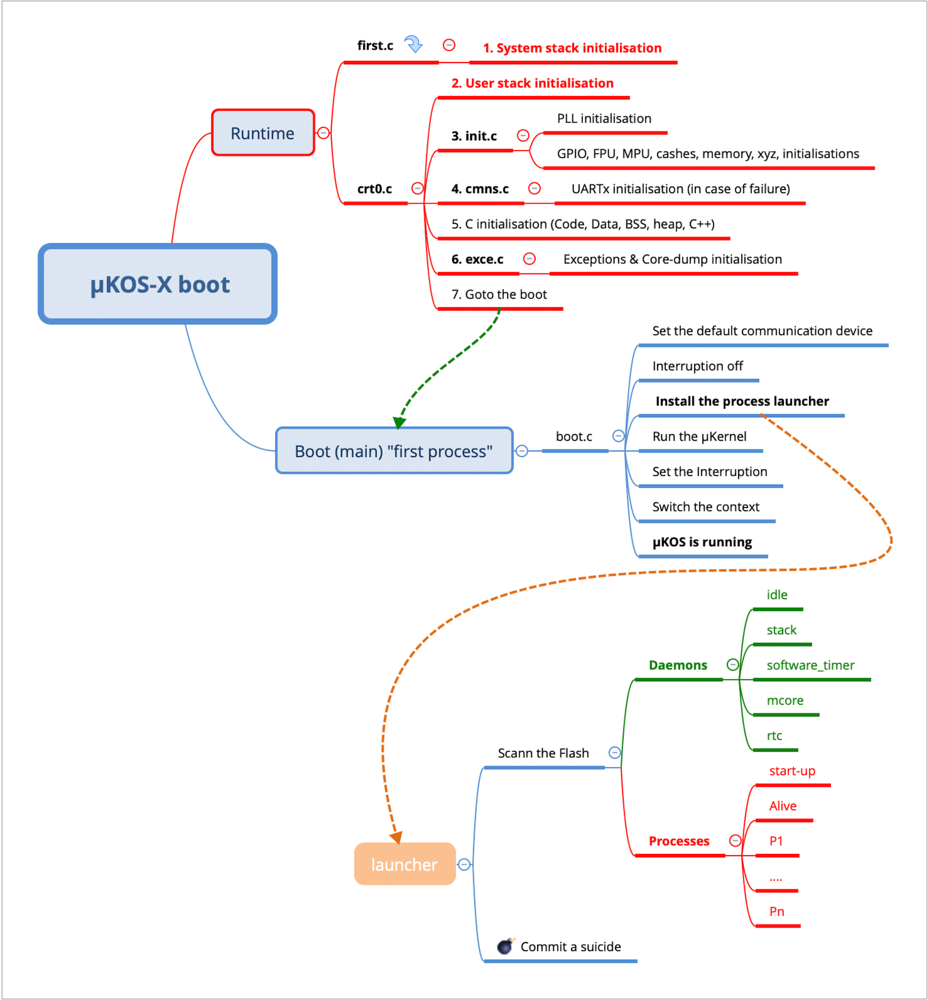
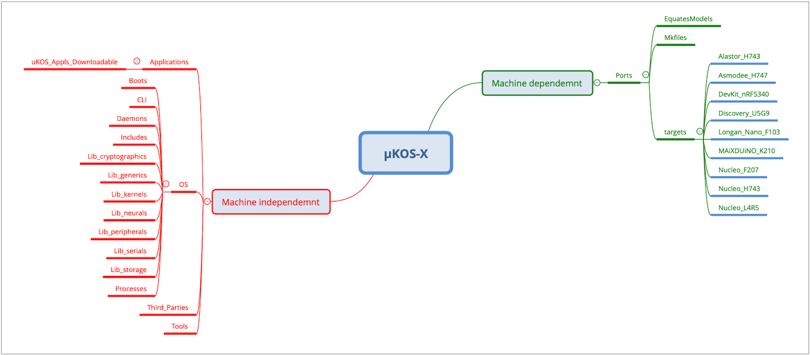

# 🧩  The µKOS System

## µKOS system architecture

The **µKOS-X** real-time operating system (RTOS) architecture is structured around **hierarchical layers of modules**, each serving a distinct role within the system.

At the top sits the **Application layer**, which encompasses all high-level modules designed to exploit both the hardware and software resources of the system. This layer is organised into families of modules, each tailored to specific functional domains or application needs.



Beneath the Application layer lies the **Library layer**, which acts as an intermediary, facilitating communication between the application modules and the system’s internal managers. It provides a consistent and simplified interface to lower-level system services.

Below this is the **Manager layer**, which functions as the system’s **Hardware Abstraction Layer (HAL)**. It implements the interface between system call functions and the physical hardware — such as microchips, communication interfaces, and other electronic components. This layer plays a crucial role in isolating hardware dependencies, thereby enabling the RTOS to be **ported across multiple platforms with minimal adaptation effort**.

This modular and layered architecture ensures both **scalability** and **portability**, making µKOS-X suitable for a wide range of embedded system applications.

## The application layer

The **Application layer** is composed of families of modules, each designed to exhibit a specific behaviour and address distinct functional roles within the system.

In the **µKOS-X** implementation, several such families are defined:

1. **Applications** – These are comprehensive user-defined modules that coordinate the system's overall behaviour. An application typically integrates multiple processes and tools to achieve a complete, functional embedded solution.
2. **Processes** – These represent autonomous, concurrent tasks responsible for carrying out specific operations, often involving real-time constraints. Processes leverage the RTOS’s multitasking features and are central to the execution of embedded logic.
3. **CLI (Command Line Interface)** – This family provides an interactive shell-like environment, allowing developers or users to communicate with the system in real time. The CLI is particularly useful for debugging, diagnostics, testing, and system control during development or maintenance.

By structuring the Application layer into these well-defined families, **µKOS-X** promotes a clear separation of concerns, modularity, and ease of maintenance — essential qualities for complex embedded system development.



### Bootstrap of µKOS-X



Depending on the **hardware architecture** of the system, **phases 1 and 2** — which involve **stack initialisations** — may differ slightly.

In a **multi-core system**, it is common practice for **only one core** to be responsible for **initialising the memory**, particularly when all cores share the same memory space. This approach avoids conflicts and ensures that the system's memory is correctly set up before parallel execution begins across multiple cores..

### The library layer

The Library layer **Lib_xyzs** serves as a straightforward redirection mechanism, mapping high-level system calls to their corresponding manager-level implementations.

In essence, it provides a clean and consistent interface for the Application layer, abstracting away the underlying complexity of the system managers and ensuring that high-level modules interact with the system in a uniform and portable manner.

### The manager layer (HAL)

The **Manager layer** in **µKOS-X** serves as the system’s **Hardware Abstraction Layer (HAL)**. It consists of families of functions specifically designed to interface either directly with hardware components or with higher-level processing elements of the system.

In the current **µKOS-X** implementation, the following **library families** are defined:

1. **Lib_kernels** – This library is responsible for implementing the system’s multitasking and synchronisation mechanisms. It manages scheduling, context switching, and event coordination. As such, it forms the **core foundation** of the real-time operating system.

2. **Lib_serials** – This library handles all input/output communication interfaces, such as **CDC**, **USART**, **SCI**, and others. Its role is to ensure consistent and coherent management of data exchange across various physical and logical channels.

3. **Lib_generics** – This library provides generic high-level services, such as text manipulation, memory management, and calendar management. It also includes support for multiprocessors.

4. **Lib_peripherals** – This library is for managing and interfacing with the system’s external peripherals. Devices such as **ADC** converters, **vision** sensors, **SPI**, **I²C**, and **imagers** are all controlled through this family.

5. **Lib_cryptographics** – This library implements security and cryptographic algorithms to support secure application development, including encryption, authentication, and secure data handling.

6. **Lib_neurals** – This library contains implementations of basic neural algorithms, in particular **feedforward networks**, enabling embedded systems to perform lightweight machine learning tasks.

7. **Lib_storages** – This library manages all devices capable of storing large amounts of data, such as SD cards, flash memories, etc. It works with the third-party package FatFs.

This layered and categorised approach provides a flexible and scalable structure for interacting with both hardware and system-level functionalities, while facilitating portability across platforms.

## The µKOS system organisation

### System



The system is organised into two main directory trees:

1. **µKOS-X** – Machine-independent.
2. **Ports** – Machine- or architecture-specific.

The **µKOS-X** directory contains all source files and definitions that are **independent of the target hardware or CPU architecture**. At this level, all system calls are defined and prepared before being redirected to the platform-specific layer for final hardware customisation. This separation ensures portability and reusability of core components across multiple platforms.

The **Ports** directory, on the other hand, includes all files and definitions that are **specific to a given hardware platform or processor architecture**. It encapsulates the full implementation of architecture-dependent functionalities, such as context switching, peripheral initialisation, low-level drivers, and startup routines.

Within the **Ports** structure, three main subdirectories form the backbone of the system's infrastructure:

1. **EquatesModels** – Contains model-specific constant definitions, equates, and parameters.
2. **Mkfiles** – Holds makefiles and build configuration scripts tailored to each target.
3. **Targets** – Defines the specific system configurations and startup routines for each supported hardware platform.

This clear division between portable and hardware-specific components supports a clean and maintainable codebase, and greatly simplifies the process of porting µKOS-X to new platforms.

### The ports

***EquatesModels***

This folder contains all the **equates** (such as chip definitions, macros, and constants) as well as the various **functional models** (e.g. UARTs, I²C interfaces, SD card drivers, etc.) used throughout the system. More specifically, it is organised into the following subdirectories:

1. **Cores** – This directory includes libraries that are **hardware-independent but specific to a particular processor core**. Examples include support for **Cortex-M4**, **Cortex-M7**, **Cortex-M33**, and **RISC-V cores** such as **RV64IMAFDC**. These libraries provide core-level functionality without tying it to a specific chip or board.
2. **Devices** – Contains the **definitions and configuration files for peripheral chips** used by the project. These include components such as external sensors, converters, and communication interfaces.
3. **Generic** – This folder provides **reusable models and services** that are common across multiple projects, such as **temperature sensing**, **SD card handling**, or other general-purpose modules. The focus here is on functional reusability and abstraction.
4. **SOCs** – Holds all definitions, macros, and models that are **specific to individual System-on-Chip (SoC) implementations**. These files provide the necessary low-level configuration to integrate with SoC-specific peripherals and architectural constraints.

This structure ensures a **clear separation of concerns** and promotes **modularity**, making it easier to maintain, extend, and reuse components across a wide range of embedded projects.

***Targets***

This folder contains all the source code required to **customise a specific target configuration**. It enables adaptation of the system to various hardware setups based on a common reference platform.

Within this folder, there are at least two key subdirectories:

1. **Base** – This directory includes the **default implementation** of all functionalities available on the main CPU board. It defines the standard hardware configuration, such as clock settings, memory layout, I/O interfaces, and peripheral support.
2. **Variant_1, Variant_2, … Variant_x** – These subdirectories represent **target-specific derivatives**, each reflecting a variation of the base platform. Such differences may include alternate crystal frequencies, changes in memory size, variations in I/O availability (e.g. fewer or additional LEDs), or board-specific adaptations.

This structure provides a **flexible and scalable approach** to target customisation, allowing the same core system to be deployed across multiple hardware configurations with minimal effort.

***Mkfile***

This folder contains all the **generic makefiles** used to **build and configure** the various components of the system. These makefiles are designed to be **reusable and platform-independent**, providing a consistent build process across multiple targets and configurations.

They serve as the foundation for compiling, linking, and managing dependencies within the µKOS-X project.

***Tools***

This folder contains various **tools** that support system creation and assist during the **development and debugging phases**. More specifically, it includes:

1. **FTDI_eeproms** – Contains configuration files for targets that utilise **FTDI chips**, enabling custom EEPROM settings for USB-to-serial converters.
2. **Ozone_Plugin** – Provides the **µKOS-X plugin for Ozone**, a powerful debugger and performance analyser by SEGGER.
3. **Scripts** – A collection of **Bash scripts** used to build essential development tools for µKOS-X, such as **GCC**, **LLVM**, **OpenOCD**, and others. These scripts streamline the setup of a fully functional toolchain.
4. **SQE_Viewer** – The **Sysquake Viewer**, a graphical utility designed to display images sent from µKOS-X targets equipped with imaging devices.
5. **TestRom** – A suite of **basic test routines** used to validate and explore specific chips or interfaces. This directory often serves as the **first entry point** when porting µKOS-X to a new target platform.
6. **UNIX_tools** – Contains various **UNIX terminal utilities** that are invoked by the makefiles or used during system compilation and automation.

This toolkit simplifies system deployment, aids in porting efforts, and supports low-level testing and verification, making it an essential resource during both development and integration.

## The µKOS system modules

### The CLI

The **CLI modules** are essential tools for interacting with the **µKOS-X environment** during development, debugging, and testing.

At the heart of this interface is the **console**, which is responsible for **collecting formatted command messages** received via a Serial Communication Manager — such as **cdc0**, **urt0**, or **wfi0** — and then invoking the corresponding module in the **Application layer**, passing along any associated parameters.

The console supports a set of **CLI modules**, each providing a specific command or service. These modules enable interaction with system components, control of application processes, and monitoring of runtime behaviour.

The following is a list of supported CLI modules (non-exhaustive), as µKOS-X is a **modular and extensible system**, allowing new modules to be added as needed to suit specific applications or development requirements.

<div class="full_width_table">

| **Tools**   |                                                              |
| :---------- | :----------------------------------------------------------- |
| bench       | Run some benchmarks                                          |
| console     | Multi-user Command Line Interpreter.                         |
| cycle       | Launch a tool or protocol cyclically as a background process |
| date        | Display the date corresponding to the Unix time              |
| dump        | Dump a memory region                                         |
| dumplog     | Dump the system logs                                         |
| dumptrace   | Dump the system debug trace                                  |
| dumpshared  | Dump the shared memory information (only on multi-core systems) |
| echo        | Echo from communication manager X to communication manager Y |
| esp32       | Management of the esp32                                      |
| fill        | Fill a memory region with a pattern                          |
| gdb         | Interact with GDB                                            |
| hexloader   | Intel hex format loader                                      |
| kill        | Force-stop (or kill) a module                                |
| list        | Display the list of available modules                        |
| man         | Display help for the selected module                         |
| memck       | Periodically check memory integrity                          |
| memory      | Display memory usage                                         |
| microPython | Run the embedded MicroPython engine                          |
| mutex       | Display the state of all system mutexes                      |
| object      | Display the details of an object's descriptor                |
| power       | Show the battery information                                 |
| process     | Display the list of running processes                        |
| restart     | Restart the OS                                               |
| rnd         | Generate a random number                                     |
| run         | Execute downloaded code                                      |
| semaphore   | Display the state of all system semaphores                   |
| sloader     | Motorola S format loader                                     |
| szkern      | Display the amount of memory used by the kernel              |
| test_malloc | Malloc test                                                  |
| test_mcore  | Perform a multi-core communication test                      |
| test_ram    | Ram test                                                     |
| test_sdcard | SDCard test                                                  |
| uKOS        | Show µKOS-X system information                               |
| viewer      | Display the captured image                                   |
| wki2c       | Use an i2c communication manager                             |
| wkserial    | Use a serial Communication Manager                           |
| wkspi       | Use a spi communication manager                              |
| X           | Read a 128-element temperature vector                        |

</div>

## Structure of the system & the application modules

Both the **µKOS-X system modules** and the **application modules** must declare a dedicated **data structure** — referred to as a **module descriptor** - which holds essential **metadata and properties** associated with the module.

This structure allows the operating system to identify, manage, and interface with each module in a consistent and extensible manner. It also facilitates module registration, introspection, and dynamic discovery.

Below is the typical format of a **module structure** in µKOS-X:

```C
struct module {
          uint32_t    oIdModule;           // Module identifier
    const char_t      *oStrApplication;    // Ptr on the application string
    const char_t      *oStrHelp;           // Ptr on the help string
          int32_t     (*oInit)             //
          (uint32_t   argc,                //
          char_t      *argv[]);            // Ptr on the init code
          int32_t     (*oExecution)        //
          (uint32_t   argc,                //
          char_t      *argv[]);            // Ptr on the execution code
          int32_t     (*oClean)            //
          (uint32_t   argc,                //
          char_t      *argv[]);            // Ptr on the clean code
          char_t      *oStrRevision;       // Program Revision
          uint8_t     oFlag;               // Module flag
          #define     BSHOW         0      // Visible in help
          #define     BEXE_CONSOLE  1      // Executable from the CLI
          #define     BCONFIDENTIAL 2      // No comment

          uint8_t     oExecutionCore;      // Execution cores
          #define     BCORE_0       0      // Only for core 0
          #define     BCORE_1       1      // Only for core 1
          #define     BCORE_2       2      // Only for core 2
          #define     BCORE_3       3      // Only for core 3
};

```

All key elements of the module descriptor include:

1. **oIdModule** – The module’s unique identifier encoded as a 32-bit value. The most significant word **(MSW) represents the module family,** while the least significant word **(LSW) denotes the specific module ID within that family**. Refer to modules.h for family and module ID definitions
2. **oStrApplication** – A pointer to a short, human-readable description of the module. This string is displayed when executing the **list tool**, helping users quickly identify the module’s purpose.
3. **oStrHelp** – A pointer to a self-contained help string providing usage information, syntax, and optional examples. This string is typically shown in response to commands such as **help module** or from within the CLI environment.
4. **oInit** – A pointer to the module’s **early initialisation routine**, called during system startup. This function is responsible for setting up any required resources before the module becomes active.
5. **oExecution** – A pointer to the module’s **main execution function**. This function typically contains the operational logic or the runtime behaviour of the module.
6. **oClean** – A pointer to the module’s **clean-up routine**, which is invoked when the module is unloaded or reset. It ensures that resources are released and the system state is restored appropriately.
7. **oStrRevision** – A pointer to the module’s revision string, which includes version information and optional change log references. This string is displayed by the **man** tool.
8. **oFlag** – This field defines **module behaviour flags**, such as startup behaviour, optional dependencies, or runtime execution modes. Flags can be bitwise combinations to express multiple properties.
9. **oExecutionCore** – Indicates the **CPU core** on which the module should be executed in a **multi-core system**. This allows precise distribution of workload across processing units and is particularly useful for real-time and parallel execution environments.

```bash
list
mem0  8  XBF_  v1.0   binfill   Raw binary loader.                             (c) EFr-2026
mem0  9  XDP_  v1.0   dump      Dump a memory area.                            (c) EFr-2026
mem0 10  XFI_  v1.0   fill      Fill a memory area with a pattern.             (c) EFr-2026
mem0 11  XHL_  v1.0   hexloader Intel hex+ (32-bit) loader.                    (c) EFr-2026
mem0 12  XKI_  v1.0   kill      Kill a running process.                        (c) EFr-2026
mem0 13  XLS_  v1.0   list      List the system modules.                       (c) EFr-2026
```

### Example, a system module

```c
/*
; man.
; ====

; SPDX-License-Identifier: MIT

;------------------------------------------------------------------------
; Author:     Edo. Franzi    The 2025-01-01
; Modifs:
;
; Project:    uKOS-X
; Goal:       Show the help of the module.
;
;   (c) 2025-2026, Edo. Franzi
;   --------------------------
;                                              __ ______  _____
;   Edo. Franzi                         __  __/ //_/ __ \/ ___/
;   5-Route de Cheseaux                / / / / ,< / / / /\__ \
;   CH 1400 Cheseaux-Noréaz           / /_/ / /| / /_/ /___/ /
;                                     \__,_/_/ |_\____//____/
;   edo.franzi@ukos.ch
;
;   See the MIT License (License_uKOS-X.txt)
;
;------------------------------------------------------------------------
*/

#include    "uKOS.h"

// uKOS-X specific (see the module.h)
// ===================================

STRG_LOC_CONST(aStrApplication[]) =
    "man          Show the help of the module.              (c) EFr-2026";

STRG_LOC_CONST(aStrHelp[]) =
    "Show the help of the module\n"
    "===========================\n\n"

    "This tool displays the help for a\n"
    "selected module.\n\n"

    "Input format:  man {moduleName}\n"
    "Output format: [result]\n\n";

    "Module built on "__DATE__"  "__TIME__" (c) EFr-2026\n\n";

static  int32_t prgm(uint32_t argc, const char_t *argv[]);

MODULE(
    Man,                              // Module name
    KID_FAM_CLI,                      // Family (defined in the module.h)
    KNUM_MAN,                         // Module id (defined in the module.h)
    NULL,                             // Address of the early pre-init
    prgm,                             // Address of the code
    NULL,                             // Address of the clean the module
    " 1.0",                           // Revision string (major . minor)
    ((1<<BSHOW) | (1<<BEXE_CONSOLE)), // Flags
    0                                 // Execution cores
);

// CLI tool specific
// =================

STRG_LOC_CONST(aStrLogo[])      = STRG_LOGO;
STRG_LOC_CONST(aStrCopyright[]) = STRG_COPYRIGHT_FRANZI

/*
 * \brief Main entry point
 *
 */
static int32_t prgm(uint32_t argc, char_t *argv[]) {
           uint16_t         index;
           int32_t          status;
           uint32_t         idModule;
           module_t         *module;
           bool             error = false;
    const  uKOS_module_t    *module;

    (void)dprintf(KSYST, "Module help.\n");

// Analyse the command line
// ------------------------
//
// Example:
//
// man
// man console

    if (argc == 2u) {

// man with parameters

        if (system_getModuleName(argv[1], &index, &module) != KERR_SYSTEM_NOERR) {
            error = true;
        }
        (void)dprintf(KSYST, "%s%s", module->oStrHelp, aStrCopyright);
    }

// man without parameter
// Display the logo and the tool list

    else {
        (void)dprintf(KSYST, "%s", aStrLogo);

// List the tools

        (void)dprintf(KSYST, "Tools\n\n");
        index = 0u;
        while (system_getModuleFamily(KIDTOOL, &idModule, &index, &module) \
            == KERR_SYSTEM_NOERR) {
            if ((module->oFlag & (1u<<BSHOW)) != 0u) {
                (void)dprintf(KSYST, "%s\n", module->oStrApplication);
            }
            index++;
        }
    }
    return (status);
}
```

### Example, an application module

```c
/*
; header.
; =======

; SPDX-License-Identifier: MIT

;------------------------------------------------------------------------
; Author:     Edo. Franzi    The 2025-01-01
; Modifs:
;
; Project:    uKOS-X
; Goal:       header for the uKOS-X applications.
;
;   (c) 2025-2026, Edo. Franzi
;   --------------------------
;                                              __ ______  _____
;   Edo. Franzi                         __  __/ //_/ __ \/ ___/
;   5-Route de Cheseaux                / / / / ,< / / / /\__ \
;   CH 1400 Cheseaux-Noréaz           / /_/ / /| / /_/ /___/ /
;                                     \__,_/_/ |_\____//____/
;   edo.franzi@ukos.ch
;
;   See the MIT License (License_uKOS-X.txt)
;
;------------------------------------------------------------------------
*/
#include    "uKOS.h"

extern int32_t      a_start(uint32_t argc, const char_t *argv[]);
extern uintptr_t    _lnApplication;
extern module_t     aUserAppl_Specifications;

__attribute__ ((section(".header")))
const  header_t     appHeader = {
                        KMEMU,
                        a_start,
                        (uintptr_t)&_lnApplication,
                        (module_t *)&aUserAppl_Specifications
                    };
```

```c
; crt0_App.
; =========

; SPDX-License-Identifier: MIT

;------------------------------------------------------------------------
; Author:     Edo. Franzi    The 2025-01-01
; Modifs:
;
; Project:    uKOS-X
; Goal:       crt0 for the uKOS-X applications.
;             Privileged only support
;
;   (c) 2025-2026, Edo. Franzi
;   --------------------------
;                                              __ ______  _____
;   Edo. Franzi                         __  __/ //_/ __ \/ ___/
;   5-Route de Cheseaux                / / / / ,< / / / /\__ \
;   CH 1400 Cheseaux-Noréaz           / /_/ / /| / /_/ /___/ /
;                                     \__,_/_/ |_\____//____/
;   edo.franzi@ukos.ch
;
;   See the MIT License (License_uKOS-X.txt)
;
;------------------------------------------------------------------------
*/

#include    "uKOS.h"
#include    <FLASH.ck>

#ifndef KSYSTEM_CRT0_CHECK_OS_VERSION_S
#define KSYSTEM_CRT0_CHECK_OS_VERSION_S    true
#endif

#define DO_NOT_DESTROY_S        // Do not destroy the C++ destructor;
                                // Some processes can still be in execution
                                // at the output of the main

// Runtime specific
// ================

extern uint8_t      linker_stBSS[];
extern uint8_t      linker_enBSS[];
extern uint8_t      linker_stInitArray[];
extern uint8_t      linker_enInitArray[];
extern uint8_t      linker_stFiniArray[];
extern uint8_t      linker_enFiniArray[];

       uintptr_t    *ptrInitArray;
       uintptr_t    *ptrFiniArray;

extern char_t       aEPROM_signature[];
extern uint32_t     vKern_nbIntImbrications;

// For the stack guard, only 32 and 64-bit machines are considered

extern uintptr_t    __stack_chk_guard;

#if (UINTPTR_MAX == 0xFFFFFFFFu)
#define KSTACK_GARD_VALUE    0xDeadBeefu

#else
#define KSTACK_GARD_VALUE    0xDeadBeeffeeBdaeDu;
#endif

/*
 * \brief _start
 *
 * - Copy the initialised data from the CODE to the DATA region.
 * - Initialise the BSS region.
 * - Call the main.
 *
 */
int32_t aStart(uint32_t argc, const char_t *argv[]) {
    int32_t    status;
    bool       gdb;
    uintptr_t  *ptrStInitArray;
    uintptr_t  *ptrEnInitArray;
    uintptr_t  *ptrStFiniArray;
    uintptr_t  *ptrEnFiniArray;

    PRIVILEGE_ELEVATE;
    gdb = (vKern_nbIntImbrications != 0u) ? (true) : (false);
    if (gdb == true) {
        kern_criticalSection(KEXIT_CRITICAL);
    }

// Initialise the BSS region

    memset(&linker_stBSS, 0x00u, \
          (size_t)((uintptr_t)&linker_enBSS - (uintptr_t)&linker_stBSS));

// Verify if the application is compatible with the burned OS

    #if (KSYSTEM_CRT0_CHECK_OS_VERSION_S == true)
    int32_t    i;

    for (i = 0u; i < 64u; i++) {
        if (aFLASH_signature[i] != aSignature[i]) {

            PRIVILEGE_RESTORE;
            return (EXIT_OS_FAILURE_CRT0);
        }

    }
    #endif

// Call all the init array

    ptrStInitArray = ALIGNED_PTR(uintptr_t, linker_stInitArray);
    ptrEnInitArray = ALIGNED_PTR(uintptr_t, linker_enInitArray);

    while (ptrStInitArray < ptrEnInitArray) {
        ((void (*)(void))*ptrStInitArray)();
    ptrStInitArray++;
    }
  
    __stack_chk_guard = KSTACK_GARD_VALUE;
    PRIVILEGE_RESTORE;

    RESERVE(SYSTEM, KMODE_READ_WRITE);
    status = (int32_t)main((int)argc, (const char **)argv);

// Call all the finit array

    #if (defined(DO_NOT_DESTROY_S))
    ptrStFiniArray = ALIGNED_PTR(uintptr_t, linker_stFiniArray);
    ptrEnFiniArray = ALIGNED_PTR(uintptr_t, linker_enFiniArray);

    while (ptrStFiniArray < ptrEnFiniArray) {
        ((void (*)(void))*ptrFiniArray)();
        ptrEnFiniArray++;
    }
    #endif
  
    if (gdb == true) {
        exit(EXIT_OS_SUCCESS);
    }

    return (status);
}

/*
 * \brief __wrap___stack_chk_fail
 *
 * - Stack smashing detection
 *   - Stop the system & display a message
 *
 * in the makefile add the following lines
 *
 *   CFLAGS  += -fstack-protector-strong
 *   LDFLAGS += -Wl,--wrap=__stack_chk_fail
 *
 */
void __attribute__ ((noreturn)) __wrap___stack_chk_fail(void) {

    PRIVILEGE_ELEVATE;
    INTERRUPTION_OFF;
    cmns_send(KSYST, “\nStack smashing!");
    exit(EXIT_OS_PANIC);
}

```

```c
; basic.
; ======

; SPDX-License-Identifier: MIT

;------------------------------------------------------------------------
; Author:     Edo. Franzi    The 2025-01-01
; Modifs:
;
; Project:    uKOS-X
; Goal:       Demo of a C application.
;             This application shows how to operate with the uKOS-X uKernel.
;
;   (c) 2025-2026, Edo. Franzi
;   --------------------------
;                                              __ ______  _____
;   Edo. Franzi                         __  __/ //_/ __ \/ ___/
;   5-Route de Cheseaux                / / / / ,< / / / /\__ \
;   CH 1400 Cheseaux-Noréaz           / /_/ / /| / /_/ /___/ /
;                                     \__,_/_/ |_\____//____/
;   edo.franzi@ukos.ch
;
;   See the MIT License (License_uKOS-X.txt)
;
;------------------------------------------------------------------------
*/

#define P0_PERIOD    100u
#define P1_PERIOD    100u

#include    "uKOS.h"

// uKOS-X specific (see the module.h)
// ===================================

STRG_LOC_CONST(aStrApplication[]) =
    "basic    Example of how to use a multi printf.     (c) EFr-2026";

STRG_LOC_CONST(aStrHelp[]) =
    "This is a ROMable C application\n"
    "===============================\n\n"

    "This user function module is a C written application.\n\n"

    "Input format:  basic\n"
    "Output format: [result]\n\n";
    "Module built on "__DATE__"  "__TIME__" (c) EFr-2026\n\n";

MODULE(
    UserAppl,                         // Module name
    KID_FAM_APPLICATIONS,             // Family (defined in the module.h)
    KNUM_APPLICATION,                 // Module id (defined in the module.h)
    NULL,                             // Address of the early pre-init
    a_start,                          // Address of the code
    NULL,                             // Address of the clean the module
    " 1.0",                           // Revision string (major . minor)
    ((1<<BSHOW) | (1<<BEXE_CONSOLE))  // Flags
    0                                 // Execution cores
);

/*
 * \brief aProcess 0
 *
 * - P0: Every Px_PERIOD ms
 *       - Display a message on the KSYST manager
 *
 */
static void __attribute__ ((noreturn)) aProcess_0(const void *argument) {
    int32_t    cpt = 0;

    UNUSED(argument);

    while (true) {
        kern_suspendProcess(P0_PERIOD);

        (void)dprintf(KSYST, \
        ”output on the KSYST Serial Communication Manager \
        (defined in the PROCESS macros) %"PRId32"\n", cpt++);

        led_toggle(KLED_0);
    }
}

static void __attribute__ ((noreturn)) aProcess_1(const void *argument) {
    int32_t    cpt = 0;

    UNUSED(argument);

    while (true) {
        kern_suspendProcess(P1_PERIOD);

        (void)dprintf(KSYST, \
        ”output on the KSYST Serial Communication Manager \
        (defined in the PROCESS macros) %"PRId32"\n", cpt--);
    }
}

/*
 * \brief main
 *
 * - Initialise the used libraries
 * - Launch all the processes
 * - Kill the "main". At this moment only the launched processes are executed
 *
 */
int main(uint32_t argc, const char_t *argv[]) {
    proc_t    *process_0, *process_1;

    STRG_LOC_CONST(aStrIden_0[]) = "Process_User_0";
    STRG_LOC_CONST(aStrIden_1[]) = "Process_User_1";
    STRG_LOC_CONST(aStrText_0[]) = "User 0 process,              (c) EFr-2026";
    STRG_LOC_CONST(aStrText_1[]) = "User 1 process,              (c) EFr-2026";

// Specifications for the processes

    PROC_SUPV(
        0,                         // Index
        vSpecification_0,          // Specifications (just use vSpecification_x)
        aStrText_0,                // Info string (NULL if anonymous)
        KKERN_SZ_STACK_MM,         // KSZSTACK_xx Stack size (number of words)
        process_0,                 // Code of the process
        aStrIden_0,                // Identifier (NULL if anonymous)
        KDEF0,                     // Default Serial Communication Manager
        KKERN_PRIORITY_NORMAL_00   // KHIGHPRIORITY < Priority < KLOWPRIORITY+15
    );

    PROC_SUPV(
        1,                         // Index
        vSpecification_1,          // Specifications (just use vSpecification_x)
        aStrText_1,                // Info string (NULL if anonymous)
        KKERN_SZ_STACK_MM,         // KSZSTACK_xx Stack size (number of words)
        process_1,                 // Code of the process
        aStrIden_1,                // Identifier (NULL if anonymous)
        KDEF0,                     // Default Serial Communication Manager
        KKERN_PRIORITY_NORMAL_00   // KHIGHPRIORITY < Priority < KLOWPRIORITY+15
    );

    if (kern_createProcess(&vSpecification_0, &vProcess_0) != KERR_KERN_NOERR) {
        exit(EXIT_OS_FAILURE);
    }

    if (kern_createProcess(&vSpecification_1, &vProcess_1) != KERR_KERN_NOERR) {
        exit(EXIT_OS_FAILURE);
    }

   LOG(KINFO_USER, "Application launched");
   return (EXIT_OS_SUCCESS_CLI);
}
```

```c
/*
; link_App.
; =========

; SPDX-License-Identifier: MIT

;------------------------------------------------------------------------
; Author:     Edo. Franzi    The 2025-01-01
; Modifs:
;
; Project:    uKOS-X
; Goal:       Linker description for uKOS-X applications.
;             Privileged only support
;
;   (c) 2025-2026, Edo. Franzi
;   --------------------------
;                                              __ ______  _____
;   Edo. Franzi                         __  __/ //_/ __ \/ ___/
;   5-Route de Cheseaux                / / / / ,< / / / /\__ \
;   CH 1400 Cheseaux-Noréaz           / /_/ / /| / /_/ /___/ /
;                                     \__,_/_/ |_\____//____/
;   edo.franzi@ukos.ch
;
;   See the MIT License (License_uKOS-X.txt)
;
;------------------------------------------------------------------------
*/

ENTRY(_start)

MEMORY {
    prgm_code (rx)  : ORIGIN = 0x70200000, LENGTH = 4096K
    prgm_data (rwx) : ORIGIN = 0x70600000, LENGTH = 2048K
}

_lnApplication = (linker_enDATA - linker_stTEXT);    /* Length of the application     */

SECTIONS {
    .text : {
        linker_stTEXT = ABSOLUTE(.);
        KEEP(*(.header))
        *(.text .text.*)
        linker_enTEXT = ABSOLUTE(.);

        _stCTOR = ABSOLUTE(.);
        KEEP(*(SORT(.init_array.*)))
        KEEP(*(.init_array))
        linker_enCTOR = ABSOLUTE(.);

        _stDTOR = ABSOLUTE(.);
        KEEP(*(SORT(.fini_array.*)))
        KEEP(*(.fini_array))
        linker_enDTOR = ABSOLUTE(.);
    } > prgm_code

    .init_array : {
        . = ALIGN(4);
        linker_stInitArray = ABSOLUTE(.);
        KEEP(*(.init .init.* .init*))
        linker_enInitArray = ABSOLUTE(.);
    } > prgm_code

    .fini_array : {
        . = ALIGN(4);
        linker_stFiniArray = ABSOLUTE(.);
        KEEP(*(.fini .fini.* .fini*))
        linker_enFiniArray = ABSOLUTE(.);
    } > prgm_code

    .ARM.exidx : {
        *(.ARM.exidx* .gnu.linkonce.armexidx.*)
    } > prgm_code

    .rodata : {
        linker_stRODATA = ABSOLUTE(.);
        *(.rodata .rodata.*)
        *(.srodata .srodata.*)
        . = ALIGN(8);
        linker_enRODATA = ABSOLUTE(.);
    } > prgm_code

    .data : {
        linker_stDATA = ABSOLUTE(.);
        *(.data .data.*)
        . = ALIGN(4);
        *(vtable)
        . = ALIGN(4);
        KEEP (*(.eh_frame))
        . = ALIGN(4);
        *(.ARM.extab*)
        . = ALIGN(4);
        *(.ARM.exidx*)
        linker_enDATA = ABSOLUTE(.);
    } > prgm_code

    .bss (NOLOAD) : {
        linker_stBSS = ABSOLUTE(.);
        *(.bss .bss.*)
        . = ALIGN(4);
        *(COMMON)
        . = ALIGN(4);
        linker_enBSS = ABSOLUTE(.);
    } > prgm_data

    /DISCARD/ : {
        *(.note .note.*)
        *(.eh_frame .eh_frame.*)
        *(.ARM.extab* .gnu.linkonce.armextab.*)
        *(.ARM.exidx*)
    }
}
```

## Hardware for supporting µKOS-X

The **µKOS-X operating system** is designed to be portable across a variety of hardware platforms. To ensure full support of the OS and its µKernel, the following **minimum hardware specifications** must be met:

🧠 **Processor:**

1. A **32-bit CPU** capable of supporting multiple interrupt priority levels.
2. The CPU must be supported by the GCC toolchain.
3. The CPU must include a mechanism for **software-triggered interrupts** (e.g. traps or supervisor calls).

💾 **Memory:**

1. **Non-volatile memory** (Flash, EEPROM, ROM, etc.) with a **minimum capacity of 64-KB** for program storage.
2. **RAM** with at least **64-KB** available for data, stack, heap, and runtime structures.

🧩 **Peripherals:**

1. The platform must include at minimum:
   1. 2 user-controllable LEDs.
   2. 2 hardware timers.
   3. 2 physical jumpers or switches.
   4. **1 RS232 interface** for serial communication.

⚙️ Interrupt Requirements

1. All peripherals must be capable of generating hardware interrupts.
2. The **two-timers used by the µKernel must be configured with lower interrupt priority** than any other peripheral. This is essential for maintaining reliable task scheduling and system timing.

Meeting these baseline requirements ensures a functional and responsive **µKOS-X** environment, suitable for real-time embedded applications.

## References

1. **Labrosse Jean J.,** "µC/OS-II, The Real-Time Kernel" Lawrence, Kansas, R&D Technical Books, 1998.
2. **Barr Michael,** "Programming Embeded Systems in C and C++" O’Reilly, 1999.
3. **Simon David E.,** "An Embedded Software Primer" Addison-Wesley, 2000.
4. **Van Sickle Ted,** "Programming Microcontrollers in C, 2nd ed." LLH, 2000.

## Links

[GNU](https://gcc.gnu.org)

[Newlib](https://sourceware.org/newlib/)

[Embedded](https://www.embedded.com)

[An Introduction to the GNU Compiler and Linker](https://gcc.gnu.org/wiki/Building_Cross_Toolchains_with_gcc?action=AttachFile&do=get&target=billgatliff-toolchains.pdf)
