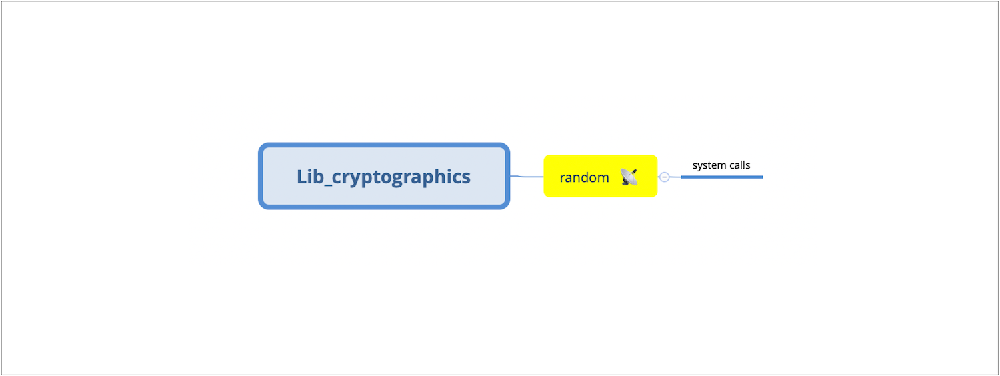
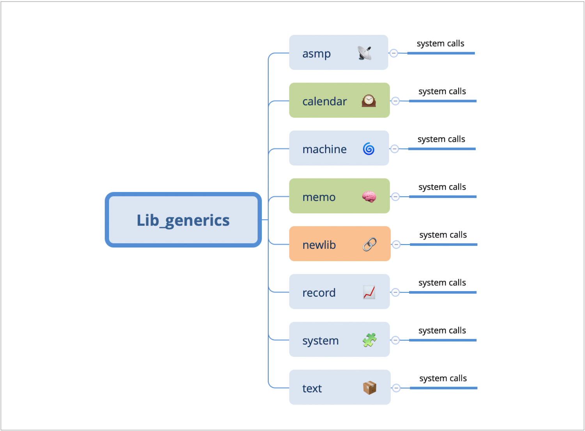
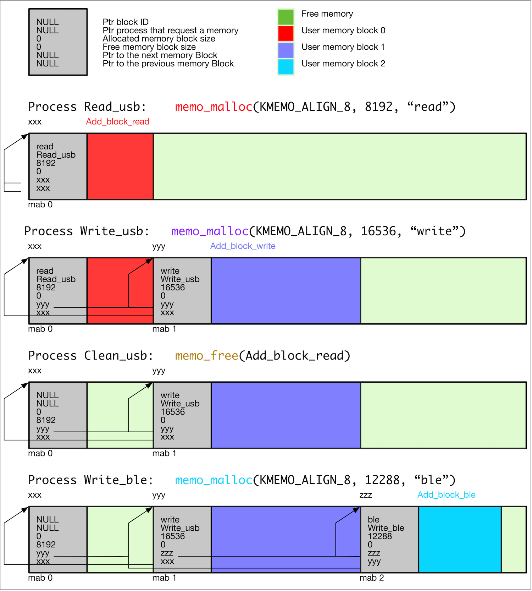
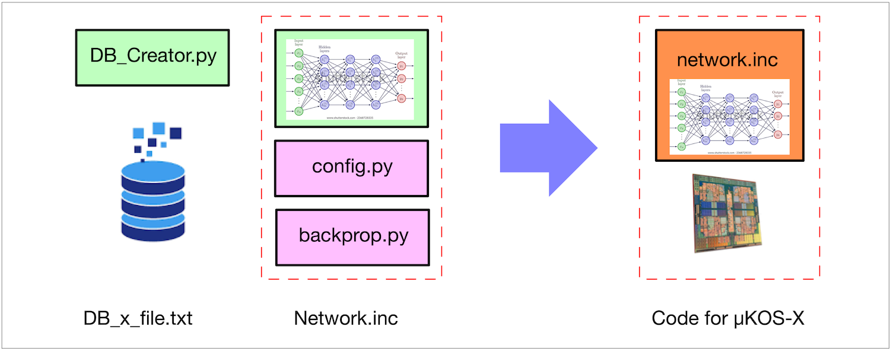
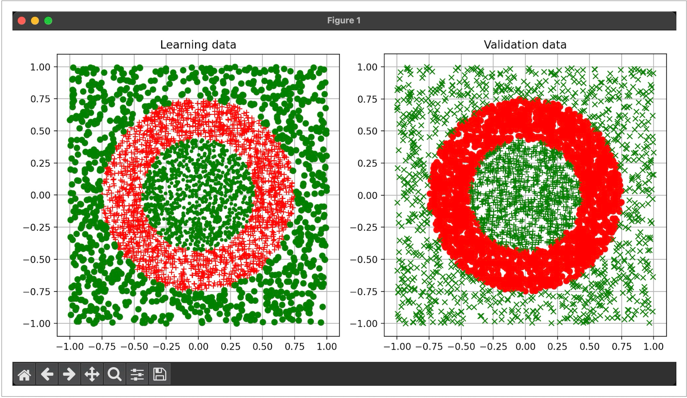
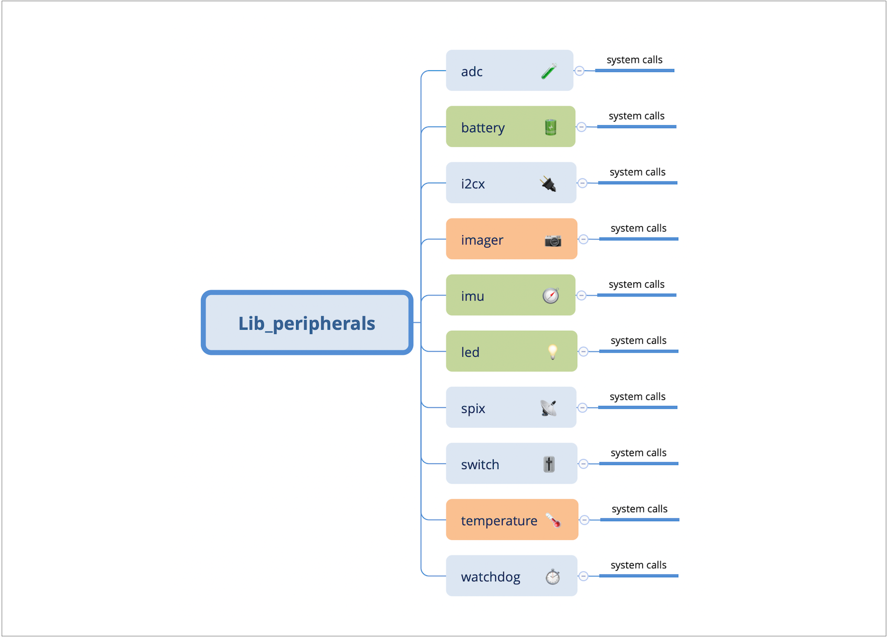
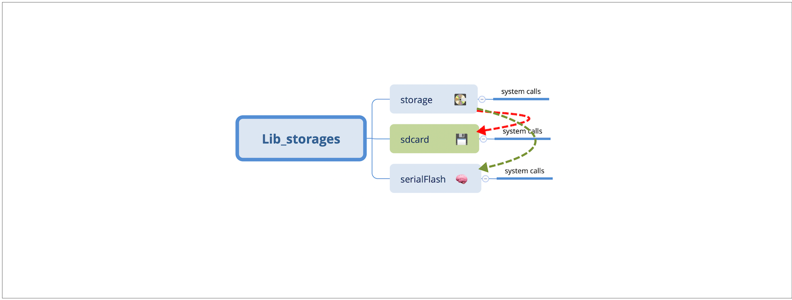

# 🧩  The system calls

## The µKOS-X system calls

The **µKOS-X system architecture** is built around a structured set of **libraries of system calls**, each organised into one or more **managers**. A single library may group together several related managers, providing a coherent and modular interface for system-level operations.

µKOS-X defines several **families of libraries**, each addressing a specific domain of functionality. The main library families include:

🔐 **Lib_cryptographics:**

This library is responsible for managing all cryptographic operations through dedicated managers. It supports the implementation of secure applications, including encryption, decryption, hashing, and authentication functionalities.

🧰 **Lib_generics:**

Lib_generics provides high-level utility system calls that simplify the development process. These include functions for text handling, memory management, and other frequently used services that enhance system usability and integration.

⚙️ **Lib_kernels:**

The kernel library forms the core of the µKOS-X system. This library encapsulates the µKernel, which is detailed separately in **Chapter 4** due to its foundational importance.

1. Multitasking.
2. CPU time allocation.
3. Task scheduling.
4. Event synchronisation.

🧠 **Lib_neurals:**

Dedicated to managing neural network functionality, this library provides system calls to initialise, run, and manage lightweight feed-forward neural algorithms, suitable for embedded applications requiring pattern recognition or decision-making capabilities.

🎛️ **Lib_peripherals:**

This library handles access to I/O peripherals, providing a clean interface to modules. Each peripheral is managed independently, enabling precise control and system scalability. It manages:

1. Imgx – Imager peripheral.
2. adcs – Analogue-to-Digital Converter.
3. visx – Vision sensor.
4. spix – spi peripheral.
5. i2cx – spi peripheral.

🔌 **Lib_serials:**

This library handles all the serial communication-related operations and manages routing between software and the supported hardware interfaces. By abstracting hardware access through this library, µKOS-X enables developers to easily switch between communication interfaces with minimal code changes, facilitating modularity and portability. Examples of supported Serial Communication Managers include:

1. sci0 – SCI (Serial Communication Interface).
2. urt0 – Universal Asynchronous Receiver/Transmitters (UARTs).
3. cdc0 – Communication Device Class (USB profile).

💽 **Lib_storages:**

This library handles all mass storage–related operations. It manages the interface with devices such as SD cards, serial flash memories, and other non-volatile storage units. Designed for seamless integration with the third-party FatFs package, it provides efficient file system management, including file creation, deletion, and directory handling. In addition, the library ensures reliable data read/write operations, wear-levelling support for flash memories, and consistent performance across different storage media.

This library-manager architecture supports a clean separation of concerns, improves maintainability, and allows for modular extensions as the system evolves.

## Rules and constraints

Before delving into the details of the various **libraries and managers**, it is essential to introduce the **principles** underlying the implementation of the **system call mechanism** in µKOS-X.

This foundational understanding ensures a clearer perspective on how system calls are structured, dispatched, and executed across the different layers of the operating system.

```c
Prototype:     int32_t  xyzt_function(type param1, type param2, ..)
Call:          status = xyzt_function(param1, param2, ..);
```

In µKOS-X, **xyzt** represents the name of a manager. All functions associated with a manager follow a consistent return convention:

1. Each function returns an **int32_t** status code.
2. **A return value of 0** indicates successful execution (no error).
3. **A negative return** value signifies a special condition or error. These values are typically defined as named constants to improve readability and maintainability.
    0x80 FF MM ee
    with 0x80 (negative number) indicates error.
    with FF  Family ID.
    with MM Manager ID.
    with ee  Error ID.

This convention provides a uniform error-handling mechanism across all system calls and allows applications to respond appropriately to both normal and exceptional situations.

## The library Lib_serials

This library is responsible for managing all communication I/O operations within the µKOS-X system. A user may interact directly with a specific Serial Communication Manager — such as:

1. **sci0** – Serial Communication Interface.
2. **urt0, urt1** – UART (Universal Asynchronous Receiver/Transmitter).
3. **cdc0** – USB CDC (Communications Device Class) interface.

Alternatively, the user can use the generic manager named **serial**, which acts as a flexible abstraction layer. In this case, the system automatically redirects system calls to the appropriate Serial Communication Manager based on the value provided in the **serialManager** parameter.

This design allows developers to:

1. Quickly switch between communication interfaces without changing application logic.
2. Maintain a high degree of portability and modularity in the system.

Example:
1. During system construction, the default Serial Communication Manager is **cdc0**.
2. At process creation, the Serial Communication Manager used is **urt8**.

```C
KURT0    serial_xyz(KURT0, ...);    redirect the call to        urt0_xyz(...);
KCDC1    serial_xyz(KCDC1, ...);    redirect the call to        cdc1_xyz(...);
KDEF0    serial_xyz(KDEF0, ...);    redirect the call to        cdc0_xyz(...);
KSYST    serial_xyz(KSYST, ...);    redirect the call to        urt8_xyz(...);
```

All Serial Communication Managers in µKOS-X expose the same standardised set of system calls, using identical function signatures and I/O parameters. This unified interface allows for interchangeable use of different communication interfaces — such as **urtx**, **scix**, **cdcx**, etc. — without modifying the surrounding application code.

The configuration of each manager, however, is handled through its own specific configuration structure, which defines parameters such as baud rate, data format, buffer sizes, and operational modes.

```c
// Generic configuration structure

const urtxCnf_t    configure;

configuration.oBaudRate = KSERIAL_BAUDRATE_460800;
configuration.oKernSync = (1<<BSERIAL_SEMAPHORE_RX);
configuration.oNBBits   = KSERIAL_NB_BITS_8;
configuration.oStopBits = KSERIAL_STOPBITS_1;
configuration.oParity   = KSERIAL_PARITY_NONE;
...

This call ...
serial_configure(KURT0, (void *)&configure);

... is equivalent to this one.
urt0_configure(&configure);
```


<div class="full_width_table">

| **serial System Calls**             |                                                              |
| :---------------------------------- | :----------------------------------------------------------- |
| serial_reserve                      | Reserve the serial communication manager                     |
| serial_release                      | Release the serial  communication manager                    |
| serial_configure                    | Configure the serial  communication manager                  |
| serial_write                        | Write a buffer to the serial  communication manager          |
| serial_read                         | Read a buffer from the serial  communication manager         |
| serial_flush                        | Flush the serial  communication manager                      |
| serial_getIdSemaphore               | Get the RX-TX semaphore id of the serial  communication manager |
| serial_getDefSerialManager          | Get the default serial  communication manager                |
| serial_setDefSerialManager          | Set the default serial  communication manager                |
| serial_getFatherSerialManager       | Get the father (or older) serial  communication manager      |
|                                     |                                                              |
| **xyzt = urtx, cdcx, System Calls** |                                                              |
| xyzt_reserve                        | Reserve the xyzt Serial Communication Manager                |
| xyzt_release                        | Release the xyzt Serial Communication Manager                |
| xyzt_configure                      | Configure the xyzt Serial Communication Manager              |
| xyzt_write                          | Write a buffer to the xyzt Serial Communication Manager      |
| xyzt_read                           | Read a buffer on the xyzt Serial Communication Manager       |
| xyzt_flush                          | Flush of the xyzt Serial Communication Manager               |
| xyzt_getIdSemaphore                 | Get the RX-TX semaphore id of the xyzt Serial Communication Manager |

</div>

To **facilitate safe and consistent control** of the Serial Communication Managers — particularly in a **multitasking environment** — µKOS-X provides a set of **helper macros**. These macros ensure that the flow of communication remains **coherent and thread-safe**, especially during **context switching** managed by the µKernel.

This is crucial when **multiple processes** share the **same serial communication manager** for output, as it prevents data collisions and preserves message integrity.

```c
#define    RESERVE_SERIAL(serialManager, reserveMode) \
           serial_reserve(serialManager, reserveMode, KWAIT_INFINITY);

#define    RELEASE_SERIAL(serialManager, reserveMode) \
           serial_release(serialManager, reserveMode);

/*
 * Process 0
 *
 * - Every 1000-ms
 *   Reserve the serial communication manager in write mode
 *   Print a string
 */
static void __attribute__ ((noreturn)) process_0(const void *argument) {

    UNUSED(argument);

    while (true) {
        kern_suspendProcess(1000);
        RESERVE_SERIAL(KDEF0, KMODE_WRITE);
        serial_write(KDEF0, “String of the process 0\n”, 24);
        RELEASE_SERIAL(KDEF0, KMODE_WRITE);
    }
}

/*
 * Process 1
 *
 * - Every 879-ms
 *   Reserve the Serial Communication Manager specified
 *      during the process creation (KSYST) in write mode
 *   Print a string
 */
static void __attribute__ ((noreturn)) process_1(const void *argument) {

    UNUSED(argument);

    while (true) {
        kern_suspendProcess(879);
        RESERVE_SERIAL(KSYST, KMODE_WRITE);
        serial_write(KSYST, “String of the process 1\n”, 24);
        RELEASE_SERIAL(KSYST, KMODE_WRITE);
    }
}
```

## The library Lib_cryptographics

The **Lib_cryptographics** library in **µKOS-X** provides a framework for integrating essential cryptographic services into embedded applications. It is designed to host a collection of general-purpose cryptographic managers, each responsible for a specific aspect of system security, such as encryption, authentication, key management, or secure random number generation.



📡 **random – Random Number Generator Manager:**

This manager handles the random number generator. If the hardware platform implements a dedicated interface (usually **NIST-certified**), it will be used. The initial seed is computed at system restart, taking advantage of the random memory pattern present in RAM when power is switched on. This seed is fairly good, although it is not suitable for high-security applications. For applications requiring cryptographically secure random numbers, it is recommended to combine this seed with additional entropy sources or to use a hardware-based true random number generator when available.

$$

$$

$$
X_{n+1} = \left( K_a \cdot X_n + K_c \right) \bmod(K_m)
$$

$$
K_a = 1103515245, K_c = 12345, K_m = 2^{31} - 1
$$

$$
X_0 = \text{initial seed}
$$

<div class="full_width_table">

| **random System Calls** |                                                              |
| :-------------------- | :----------------------------------------------------------- |
| random_read          | Generate a pool containing between one and *n* random numbers |

</div>

## The library lib_generics

The **Lib_generics** library in **µKOS-X** provides a collection of general-purpose managers that support essential OS services and utility functions. It includes twelve (or more) managers, each responsible for a specific domain of functionality.



📡 **asmp – Asymmetric Multi-Process Communication Manager:**
Handles inter-core messaging in multi-core environments, enabling synchronisation and data exchange between CPU cores. It provides mechanisms for message queues, signalling, and load balancing across heterogeneous processing units.

🕰️ **calendar – Calendar Manager:**
Manages the system’s date and time using UTC format, including timekeeping, date calculations, and timestamp services. It also supports alarm scheduling, periodic timers, and conversion utilities between human-readable formats and system ticks.

🌀 **machine – Low-Level Machine Manager:**
Provides various core operating system utilities, including support for compiler facilities. It also offers abstraction layers for low-level hardware operations, CPU-specific optimisations, and essential services required by higher-level managers.

🧠 **memo – Memory Manager:**
Implements the main dynamic memory allocator, offering services such as memory allocation, deallocation, and heap monitoring. Additional features include fragmentation control, memory usage statistics, and support for multiple heaps in complex systems.

🔗 **newlib – Newlib Interface Manager:**
Facilitates the integration between µKOS-X and the Newlib C standard library, ensuring compatibility for standard I/O and libc functions. It provides seamless access to common APIs while maintaining efficiency in embedded environments.

📈 **record – Logging and Tracing Manager:**
Manages runtime logs, event tracing, and system diagnostics, useful for debugging and system monitoring. It supports configurable verbosity levels, circular logging buffers, and trace hooks for performance analysis.

🧩 **system – System Module Manager:**
Enables module discovery and management. It allows runtime searching and referencing of system modules by name or identifier, while also supporting dynamic registration, dependency resolution, and system integrity checks.

📦 **text – Argument Parser Manager:**
Extracts command-line style parameters (e.g., argc, argv) from ASCII input buffers, useful in CLI and command parsing. It also validates input arguments, handles quoting/escaping, and supports flexible parsing schemes for embedded shells.

This comprehensive library ensures that the **µKOS-X** system is equipped with all the fundamental **OS services** needed for embedded applications, while also maintaining modularity and portability.

### The memory allocator

The **memory allocator** is one of the most critical managers in **µKOS-X**, as it is responsible for managing **dynamic memory** across the system. It handles both **allocation** and **deallocation** requests and ensures the **integrity** of memory heaps throughout the lifetime of the system.

#### Allocation Mechanism

Memory management is based on a **chained list of small descriptors**, each representing a slice of memory that has been either reserved or freed. These descriptors form the backbone of the allocator’s internal bookkeeping and serve several key purposes:

1. Tracking allocated and free blocks.
2. Identifying the requesting entity (process or module).
3. Maintaining the structure and consistency of the heap.
4. Facilitating integrity checks and debugging.

Whenever a memory allocation or deallocation occurs, the chained list is updated to reflect:

1. The new state of memory.
2. The **environmental context** (e.g., ownership and size).
3. The location and order of memory blocks.

#### Descriptor structure

Each allocation includes a small **metadata block** (the descriptor), which µKOS-X embeds alongside the allocated memory. This descriptor typically includes the following fields:

```c
// Mandatory:
// Some CPUs (like cortex m) need to have the stack 8-byte aligned.
// CPUs with caches need 32-byte alignments

struct memoMab {
    const    char_t        *oIdentifier;    // Mab user identifier
    volatile proc_t        *oProcess;       // Ptr on the process who has
                                            // reserved the memory bloc
             uint32_t      oMabSignature;   // Mab signature
             uint32_t      oSzAllocated;    // Block size (allocated)
             uint32_t      oSzAvailable;    // Block size (available)
             uint32_t      oAlign0          // Alignament
             memoMab_t     *oPtrPreBlock;   // Ptr on the previous block
             memoMab_t     *oPtrNexBlock;   // Ptr on the next block
             uintptr_t     oCkSum;          // Mab checksum
             uint32_t      oAlign1          // Alignament
};
```

#### Key features

1. Ensures safe and efficient memory usage in real-time environments.
2. Enables leak detection and heap analysis.
3. Provides a foundation for multi-context memory tracking.
4. Supports heap integrity verification through internal checks.

This manager is essential for enabling µKOS-X to run on constrained embedded platforms while still supporting **dynamic, multi-process applications** with reliability and traceability.



<div class="full_width_table">

| **asmp System Calls**         |                                                              |
| :---------------------------- | :----------------------------------------------------------- |
| asmp_send                     | Send data to core 0..3                                       |
| asmp_receive                  | Receive data from core 0..3                                  |
| asmp_getRunningCore           | Get the running core                                         |
| asmp_getReferenceCore         | Get the reference of a core                                  |
| asmp_getSemaphoreRXFull       | Get the handle of the RX full semaphore                      |
| asmp_getSemaphoreTXEmpty      | Get the handle of the TX empty semaphore                     |
| asmp_waitingForReady          | Waiting for ASMP ready                                       |
|                               |                                                              |
| **calendar System Calls**     |                                                              |
| calendar_setUTCLocation       | Set the UTC location                                         |
| calendar_writeUnixTime        | Write the unix time                                          |
| calendar_readUnixTime         | Read the unix time                                           |
|                               |                                                              |
| **machine System Calls**      |                                                              |
| machine_readPC                | Read the program counter (PC) of a process                   |
| machine_readFunctionName      | Read the pointer to the function name                        |
| machine_restart               | Restart the system                                           |
|                               |                                                              |
| **memo System Calls**         |                                                              |
| memo_malloc                   | Memory allocation with an identifier                         |
| memo_realloc                  | Memory reallocation with an identifier                       |
| memo_readBlocInfo             | Read information about the allocated block                   |
| memo_free                     | Release a memory block                                       |
| memo_delayedFree              | Free the memory allocation in a delayed manner               |
|                               |                                                              |
| **record System Calls**       |                                                              |
| record_trace                  | Record the execution trace of a program                      |
| record_log                    | Record the system evolution log                              |
|                               |                                                              |
| **system System Calls**       |                                                              |
| system_reserve                | Reserve the syos manager                                     |
| system_release                | Release the syos manager                                     |
| system_getModuleId            | Get the pointer to the module header by its identifier       |
| system_getFamilyId            | Get the pointer to the family module header by its identifier |
| system_getModuleName          | Get the pointer to the module header by its name             |
| system_getModuleFamily        | Get the pointer to the module system family identifier       |
| system_getSystemId            | Get the pointer to the system identifier                     |
| system_systemSignature        | Get the pointer to the system signature                      |
| system_systemVersion          | Get the pointer to the system version                        |
| system_setDownloadCodeAddress | Set the address of the downloaded code                       |
| system_getDownloadCodeAddress | Get the address of the downloaded code                       |
|                               |                                                              |
| **text System Calls**         |                                                              |
| text_readArgs                 | Get the arguments (argc and argv) from the command line      |
| text_copyAsciiBufferZ         | Copy two ASCII buffers (including the null terminator \0)    |
| text_copyAsciiBufferN         | Copy two ASCII buffers (excluding the null terminator \0)    |
| text_checkAsciiBuffer         | Check if two ASCII buffers are identical                     |
| text_waitString               | Waiting for a string from a communication manager            |

</div>

## The library Lib_neurals

This library has been developed to streamline the integration of neural network functionalities into broader computational systems. It provides a lightweight yet flexible framework for executing **feedforward neural networks**, making it particularly useful in embedded systems, control applications, or any environment requiring efficient deployment of pre-trained models.


To make use of this library, the neural network must first be designed and trained using a high-level programming environment such as **MATLAB, Sysquake, Python**, or any other platform that supports numerical computing and machine learning. The training phase, which involves adjusting the network's weights to minimise error on a given dataset, must be completed externally, outside the scope of this library.



Once the training process has successfully converged to a satisfactory solution, the resulting model must be exported as a **network.inc** file. This file encapsulates both the network’s architecture and the full set of learned weights, formatted in a way that is compatible with the internal structures of the library. It serves as the bridge between the high-level training environment and the low-level deployment environment in which the feedforward computations will be executed.

The library relies on this file to carry out forward propagation through the network. All inference operations — i.e., the prediction or evaluation steps — are performed based on the data defined in **network.inc**.

### A classifier example

For ease of use, a fully functional example is included within the package. This example illustrates the complete workflow, from model training and export to integration with the library and execution of feedforward operations. Users are strongly encouraged to consult this example to familiarise themselves with the expected file format and typical usage patterns.

In this example, the objective is to distinguish between two distinct classes — the green and the red — by effectively separating them based on their features.

#### Generate the database

```bash
cd ../Applications/uKOS_Appls_Downloadable/l_Neural/class_Py/_Training
python3 DB_Creator.py
Prepare the config.py for the learning step.
```



The **config.py** file is utilised during the learning phase. It defines the architecture of the neural network as well as the parameters required for training, such as the number of epochs, batch size, learning rate, and optimisation method. This configuration ensures consistency and reproducibility throughout the training process.

```python
# Application / Network configuration
#
# L1 - 2 inputs
# L1 - 52 output
# L2 - 52 input (the bias is automatically added)
# L2 - 73 output
# L3 - 73 input (the bias is automatically added)
# L3 - 2 output
#                 I1 O1  O2  O3
KLAYERS        = [2, 52, 73, 2]
KNB_INPUTS     = 2
KNB_OUTPUTS    = 2

# KMLPN_TAN0 = libm tanh
# KMLPN_TAN1 = Lambert's tanh approximation
# KMLPN_TAN2 = Ultrafast tanh approximation
#
KNON_LINEAR    = "KMLPN_TAN2"

KGAIN          = 0.005
KMOMENTUM      = 0.0
KEPOCHS        = 1000000

# Some Input/Output samples for rapid validation
#
#                      Input x     Input y      Class 1   Class 2
KVALIDATION    = [
                      [0.490344,    0.051584,    0.98,    -0.98],
                      [0.458057,   -0.458232,    0.98,    -0.98],
                      [0.266116,    0.944208,   -0.98,     0.98],
                     [-0.002230,   -0.117944,   -0.98,     0.98]
                 ]

```

#### Training step

```bash
cd ../Applications/uKOS_Appls_Downloadable/l_Neural/class_Py/_Training
sh build.sh
network.c_inc is created and contains the NN model description and with the weight-set.
```

The result of the training phase is a C source file (**network.c_inc**) that is ready to be embedded into the application. This file defines the neural network architecture and includes the trained weights for all layers, enabling the network to perform inference without requiring additional external resources.

```c
// MLPN description
// ----------------

// Layer 1

#define    KMLPN_L1_NB_IN     3
#define    KMLPN_L1_NB_OUT    52

static          float32_t    vInput_L1[KMLPN_L1_NB_IN];
static          float32_t    vActivation_L1[KMLPN_L1_NB_OUT];
static          float32_t    vOutput_L1[KMLPN_L1_NB_OUT + 1];
static const    float32_t    vWeight_L1[KMLPN_L1_NB_OUT][KMLPN_L1_NB_IN] = {
                                 { 4.834236f, -0.297750f, 2.434499f },
                                 { 4.576709f, 2.125155f, -2.364352f },
                                 { 1.647897f, 1.076677f, -0.753766f },
                                 ...
                                 { -0.959326f, 0.039206f, -0.011750f },
                             };

static mlpnLayer_t     aLayer_L1 = {
                           KMLPN_TAN2,
                           KMLPN_L1_NB_IN,
                           KMLPN_L1_NB_OUT,
                           &vInput_L1[0],
                           &vActivation_L1[0],
                           &vOutput_L1[0],
                           &vWeight_L1[0][0]
                       };

// Layer 2

#define    KMLPN_L2_NB_IN     53
#define    KMLPN_L2_NB_OUT    73

static          float32_t    vActivation_L2[KMLPN_L2_NB_OUT];
static          float32_t    vOutput_L2[KMLPN_L2_NB_OUT + 1];
static const    float32_t    vWeight_L2[KMLPN_L2_NB_OUT][KMLPN_L2_NB_IN] = {
                                 { 1.089468f, -0.555754f, ... , 0.199735f  },
                                 { -0.206732f, 0.342678f, ... , -0.644606f },
                                 { -0.305727f, 0.037768f, ... , -0.257604f },
                                 ...
                                 { 0.313270f, 1.834653f,  ... , 0.224265f  },
                             };

static mlpnLayer_t     aLayer_L2 = {
                           KMLPN_TAN2,
                           KMLPN_L2_NB_IN,
                           KMLPN_L2_NB_OUT,
                           &vOutput_L1[0],
                           &vActivation_L2[0],
                           &vOutput_L2[0],
                           &vWeight_L2[0][0]
                       };

// Layer 3

#define    KMLPN_L3_NB_IN     74
#define    KMLPN_L3_NB_OUT    2

static          float32_t    vActivation_L3[KMLPN_L3_NB_OUT];
static          float32_t    vOutput_L3[KMLPN_L3_NB_OUT + 1];
static const    float32_t    vWeight_L3[KMLPN_L3_NB_OUT][KL3_NB_IN] = {
                                 { 1.447221f, 0.413932f,   ... , -0.704893f },
                                 { -1.315357f, -0.809255f, ... , 1.526794f  },
                             };

static mlpnLayer_t     aLayer_L3 = {
                           KMLPN_TAN2,
                           KMLPN_L3_NB_IN,
                           KMLPN_L3_NB_OUT,
                           &vOutput_L2[0],
                           &vActivation_L3[0],
                           &vOutput_L3[0],
                           &vWeight_L3[0][0]
                       };

// The full network

#define    KMLPN_NB_LAYERS    3

static const    mlpnNetwork_t     aNetwork = {
                                      KMLPN_NB_LAYERS,
                                      &aLayer_L1,
                                      &aLayer_L2,
                                      &aLayer_L3,
                                      NULL,
                                      NULL
                                  };
```

#### The feedforward program

```c
/*
; class_Py.
; =========

; SPDX-License-Identifier: MIT

;------------------------------------------------------------------------
; Author:     Edo. Franzi    The 2025-01-01
; Modifs:
;
; Project:    uKOS-X
; Goal:       Demo of a C application.
;             This application shows how to operate with the uKOS-X uKernel.
;
;             Launch 1 processes in C++:
;
;             - P0: Every 1000-ms
;                   Compute the inference
;                   Display the classes
;
;   (c) 2025-20xx, Edo. Franzi
;   --------------------------
;                                              __ ______  _____
;   Edo. Franzi                         __  __/ //_/ __ \/ ___/
;   5-Route de Cheseaux                / / / / ,< / / / /\__ \
;   CH 1400 Cheseaux-Noréaz           / /_/ / /| / /_/ /___/ /
;                                     \__,_/_/ |_\____//____/
;   edo.franzi@ukos.ch
;
;   See the MIT License (License_uKOS-X.txt)
;
;------------------------------------------------------------------------
*/

#include    "uKOS.h"
#include    <stdlib.h>
#include    <math.h>

// MLP model generated by Py

#include    "./_Training/network.c_inc"

LOC_CONST_STRG(aStrApplication[]) =
    "class_Py    Py 4 layer MLP test.                      (c) EFr-2025";

LOC_CONST_STRG(aStrHelp[]) =
    "This is a ROMable C application\n"
    "===============================\n\n"

    "This user function module is a C written application.\n\n"

    "Input format:  class_Py\n"
    "Output format: [result]\n\n";
    "Module built on "__DATE__"  "__TIME__" (c) EFr-2025\n\n";

MODULE(
    UserAppl,                           // Module name
    KID_FAM_APPLICATION,                // Family (defined in the module.h)
    KNUM_APPLICATION,                   // Module id (defined in the module.h)
    NULL,                               // Address of the early pre-init
    aStart,                             // Address of the code
    NULL,                               // Address of the clean the module
    " 1.0",                             // Revision string (major . minor)
    ((1<<BSHOW) | (1<<BEXE_CONSOLE))    // Flags
    0                                   // Execution cores
);

/*
 * \brief aProcess 0
 *
 * - P0:  Configure the mlp
 *        Every 1000-ms
 *        - Simple 4 layer MLP (2 hidden layers)
 *        - Display the result
 *
 */
static    void    __attribute__ ((noreturn)) aProcess_0(const void *argument) {
    float32_t    x, y, gain = 2.0f;
    uint64_t     time[2];
    uint32_t     delta = 0u;
    char_t       *result;

    UNUSED(argument);

    mlpn_configure(&aNetwork);

    while (true) {
        kern_suspendProcess(1000);

// Prepare the inputs

        x = (((float32_t)rand() / (float32_t)(RAND_MAX)) - 0.5f) * gain;
        y = (((float32_t)rand() / (float32_t)(RAND_MAX)) - 0.5f) * gain;
        vInput_L1[0] = x;
        vInput_L1[1] = y;

        kern_readTickCount(&time[0]);
        mlpn_compute(&aNetwork);
        kern_readTickCount(&time[1]);
        delta = (uint32_t)(time[1] - time[0]);

// Display the results

        result = "Undetermined";
        result = ( (vOutput_L3[0] >  0.2f) && (vOutput_L3[1] < -0.2f))    \
               ? ("Class C1 (ring)")        : (result);
        result = ( (vOutput_L3[0] < -0.2f) && (vOutput_L3[1] >  0.2f))    \
               ? ("Class C2 (inner-outer)") : (result);
        result = (((vOutput_L3[0] > -0.2f) && (vOutput_L3[0] <  0.2f)) || \
                  ((vOutput_L3[1] > -0.2f) && (vOutput_L3[1] <  0.2f)))   \
               ? ("Not well classified ")   : (result);

        (void)dprintf(KSYST, "In-0 %6.3f, In-1 %6.3f, "
                             "result: Out-0 %6.3f, Out-1 %6.3f "
                             "    %s "
                             "Exec time %"PRIu32" [us]\n”,
                             x, y,
                             vOutput_L3[0], vOutput_L3[1],
                             result,
                             delta);
    }
}

/*
 * \brief main
 *
 * - Initialise the used libraries
 * - Launch all the processes
 * - Kill the "main". At this moment only the launched processes are executed
 *
 */
int main(uint32_t argc, const char_t *argv[]) {
    proc_t    *process_0;

    LOC_CONST_STRG(aStrIden_0[]) = "Process_User_0";
    LOC_CONST_STRG(aStrText_0[]) = "Process user 0           (c) EFr-2025";

// Specifications for the processes

    PROCESS_STACKMALLOC(
        0,                           // Index
        vSpecification_0,            // Specifications (just use vSpecification_x)
        aStrText_0,                  // Info string (NULL if anonymous)
        KKERN_SZ_STACK_MM,           // Stack size (number of words)
        process_0,                   // Code of the process
        aStrIden_0,                  // Identifier (NULL if anonymous)
        KSYST,                       // Default Serial Communication Manager
        KKERN_PRIORITY_NORMAL_00,    // HIGH PRIORITY < Priority < LOW PRIORITY+15
    );

    if (kern_createProcess(&vSpecification_0, NULL, &vProcess_0) != \
        KERR_KERN_NOERR) { exit(EXIT_OS_FAILURE); }

    LOG(KINFO_USER, "Application launched");
    return (EXIT_OS_SUCCESS_CLI);
}

```

<div class="full_width_table">

| **mlpn System Calls**    |                                          |
| :----------------------- | :--------------------------------------- |
| mlpn_reserve             | Reserve the mlpn manager                 |
| mlpn_release             | Release the mlpn manager                 |
| mlpn_configure           | Configure the mlpn manager               |
| mlpn_compute             | Compute the NN network (feed forward)    |

</div>

## The library Lib_peripherals

This library includes a suite of peripheral managers that abstract and control various hardware components. It includes twelve (or more) managers, each responsible for a specific domain of functionality.



🧪 **adc – Analogue-to-Digital Converter Manager:**
Handles acquisition from analogue sensors by converting signals into digital values. Supports multi-channel sampling, configurable resolution, oversampling, and DMA-based transfers for efficient data capture.

🔋 **battery – Battery Management and Monitoring Manager:**
Monitors battery level, charging status, and power consumption. Provides APIs for health estimation, low-power notifications, and safe shutdown procedures, ensuring reliable energy management in embedded systems.

🔌 **i2cx – I²C Communication Bus Manager:**
Implements the I²C protocol for master and slave devices. Supports multi-device addressing, fast/standard modes, error detection, and transaction queuing, enabling reliable communication with sensors and peripherals.

📷 **imager – Image Acquisition Manager:**
Interfaces with cameras and vision sensors. Provides services for frame capture, buffering, and preprocessing (e.g., grayscale conversion, downscaling), enabling integration with vision-based applications.

🧭 **imu – Inertial Measurement Unit and Sensor Fusion Manager:**
Manages accelerometers, gyroscopes, and magnetometers. Implements sensor fusion algorithms (e.g., complementary or Kalman filters) to estimate orientation, motion, and heading for navigation and stabilisation tasks.

💡 **led – LED Management Manager:**
Controls onboard or external LEDs. Supports simple on/off control, blinking patterns, PWM-based dimming, and status indication for diagnostics or user feedback.

📡 **spix – SPI Communication Bus Manager:**
Implements the SPI protocol for high-speed synchronous communication. Supports master/slave modes, multiple chip selects, DMA transfers, and optimised throughput for sensors, displays, or memory chips.

🎚️ **switch – Switch Input Manager:**
Handles user or system switches (buttons, toggles). Provides debouncing, event detection (press, long press, release), and mapping to system events or interrupts.

🌡️ **temperature – Temperature Sensing Manager:**
Interfaces with temperature sensors to provide thermal monitoring. Offers periodic sampling, threshold-based alarms, and compensation utilities for system thermal management.

⏱️ **watchdog – Watchdog Timer Manager:**
Provides system reliability through timeout monitoring. Automatically resets the system in case of software lockups, with configurable timeout intervals and optional windowed watchdog operation.

Depending on the specific hardware platform supported by **µKOS-X**, additional managers can be implemented to interface with other peripheral types such as **ethx**, **can0**, or custom hardware blocks.

#### *Design Consistency and Extensibility*

All managers that control **similar types of hardware** (e.g. multiple SPI or I²C channels) are designed to expose a **consistent set of system calls**, ensuring a uniform software interface across platforms. They also adopt **standardised I/O naming conventions** such as:

1. i2c0, i2c1.
2. spi0, spi1, etc.

This consistency simplifies system integration, improves maintainability, and facilitates portability across µKOS-X - based projects.

<div class="full_width_table">

| **adc System Calls**          |                                                              |
| :---------------------------- | :----------------------------------------------------------- |
| adc_reserve                   | Reserve the adcx manager                                     |
| adc_release                   | Release the adcx manager                                     |
| adc_read                      | Read an analog value                                         |
|                               |                                                              |
| **battery System Calls**      |                                                              |
| battery_reserve               | Reserve the battery manager                                  |
| battery_release               | Release the battery manager                                  |
| batx_getBatteryInfo           | Read the battery information                                 |
|                               |                                                              |
| **i2c System Calls**          |                                                              |
| i2c_reserve                   | Reserve the i2c manager                                      |
| i2c_release                   | Release the i2c manager                                      |
| i2c_configure                 | Configure the i2c manager                                    |
| i2c_read                      | Read a buffer                                                |
| i2c_write                     | Write a buffer                                               |
|                               |                                                              |
| **xyzt = i2cx, System Calls** |                                                              |
| xyzt_reserve                  | Reserve the xyzt manager                                     |
| xyzt_release                  | Release the xyzt manager                                     |
| xyzt_configure                | Configure the xyzt manager                                   |
| xyzt_read                     | Read a buffer                                                |
| xyzt_write                    | Write a buffer                                               |
|                               |                                                              |
| **imager System Calls**       |                                                              |
| imager_reserve                | Reserve the imgx manager                                     |
| imager_release                | Release the imgx manager                                     |
| imager_configure              | Configure the imgx manager                                   |
| imager_acquisition            | Acquire an image on the imgx manager                         |
| imager_read                   | Read the image ptr                                           |
| imager_readRegister           | Read the value of an imager register                         |
| imager_writeRegister          | Write a value into an imager register                        |
| imager_standby                | Control the standby mode of the imager (only in KIMAGER_SNAP mode) |
| imager_exposure               | Write the exposure time                                      |
|                               |                                                              |
| **imu System Calls**          |                                                              |
| imu_reserve                   | Reserve the imux manager                                     |
| imu_release                   | Release the imux manager                                     |
| imu_configure                 | Configure the imux manager                                   |
| imu_read                      | Read the IMU data (accelerometer, gyroscope, magnetometer)   |
|                               |                                                              |
| **led System Calls**          |                                                              |
| led_on                        | Turn on a led                                                |
| led_off                       | Turn off a led                                               |
| led_toggle                    | Toggle a led                                                 |
| led_mute                      | Mute control of all the leds                                 |
|                               |                                                              |
| **spi System Calls**          |                                                              |
| spi_reserve                   | Reserve the spix manager                                     |
| spi_release                   | Release the spix manager                                     |
| spi_configure                 | Configure the spix manager                                   |
| spi_writeRead                 | Write - read a byte                                          |
| spi_multipleWriteRead         | Multiple writes - reads                                      |
|                               |                                                              |
| **xyzt = spix, System Calls** |                                                              |
| xyzt_reserve                  | Reserve the xyzt manager                                     |
| xyzt_release                  | Release the xyzt manager                                     |
| xyzt_configure                | Configure the xyzt manager                                   |
| xyzt_writeRead                | Write - read a byte                                          |
| xyzt_multipleWriteRead        | Multiple writes - reads                                      |
|                               |                                                              |
| **switch System Calls**       |                                                              |
| switch_read                   | Read the configuration mode                                  |
|                               |                                                              |
| **tmperature System Calls**   |                                                              |
| temperature_reserve           | Reserve the temperature manager                              |
| temperature_release           | Release the temperature manager                              |
| temperature_read              | Read the temperature                                         |
| temperature_write             | Write the temperature                                        |
|                               |                                                              |
| **watchdog System Calls**     |                                                              |
| watchdog_arm                  | Arm the watchdog                                             |

</div>

## The library Lib_storages

This library provides a suite of storage managers that abstract and control multiple non-volatile media. It exposes a uniform block-device interface and hides device-specific details to simplify upper-layer code (file systems, bootloaders, and applications). The suite comprises at least three managers, each responsible for a specific device class, and can be extended as needed.



💽 **storage – Storage Access Layer:**
Acts as the abstraction boundary for all mass-storage devices. All interactions with physical media (e.g., SD cards, serial flashes, USB MSC) pass through this layer. It exposes a uniform block-device API (open/mount, read/write, erase/trim, ioctl), handles media detection, hot-plug, mount/unmount, caching, and power-loss–safe write policies. Designed for seamless integration with third-party file systems (e.g., FatFs) through a thin adapter.

💾 **sdcard – SD Card Storage Management:**
Implements SD/MMC/SDHC/SDXC support over SPI or SDIO, including card initialization, CSD/CID parsing, block addressing, and high-speed modes. Provides proper device access via DMA, multi-block transfers, card-detect and write-protect handling, error recovery/retries, and optional TRIM/ERASE. Integrates with FatFs (including exFAT when enabled) and offers performance hints (alignment, prefetch, burst length).

🧠 **serialFlash – Serial Flash Storage Management:**
Manages serial NOR flash over SPI/QSPI with JEDEC ID auto-detection, 3/4-byte addressing, page program, sector/block erase, chip erase, and status-polling (WIP/WEL). Supports quad-I/O enable, memory-mapped/XIP modes (when supported by the MCU), deep power-down, and power-safe update flows (A/B image slots). Provides hooks for wear-leveling and logical-to-physical mapping; optional ECC/bad-block handling when targeting SPI-NAND variants.

#### *Design Consistency and Extensibility*

All managers that control **similar types of hardware** (e.g. multiple sdcard or serialFlash channels) are designed to expose a **consistent set of system calls**, ensuring a uniform software interface across platforms.

This consistency simplifies system integration, improves maintainability, and facilitates portability across µKOS-X - based projects.

<div class="full_width_table">

| **storage System Calls**     |                                                     |
| :--------------------------- | :-------------------------------------------------- |
| storage_reserve              | Reserve the storage manager                         |
| storage_release              | Release the storage manager                         |
| storage_initialise           | Initialise the storage manager                      |
| storage_readStatus           | Read the status of the storage manager              |
| storage_read                 | Read 1 or more sectors from the storage manager     |
| storage_write                | Write 1 or more sectors to the storage manager      |
| storage_ioctl                | Get some storage parameters by ioctl                |
|                              |                                                     |
| **sdcard System Calls**      |                                                     |
| sdcard_reserve               | Reserve the sdcard manager                          |
| sdcard_release               | Release the sdcard manager                          |
| sdcard_initialise            | Initialise the sdcard manager                       |
| sdcard_readStatus            | Read the status of the sdcard manager               |
| sdcard_read                  | Read 1 or more sectors from the sdcard manager      |
| sdcard_write                 | Write 1 or more sectors to the sdcard manager       |
| sdcard_ioctl                 | Get some sdcard parameters by ioctl                 |
|                              |                                                     |
| **serialFlash System Calls** |                                                     |
| serialFlash_reserve          | Reserve the serialFlash manager                     |
| serialFlash_release          | Release the serialFlash manager                     |
| serialFlash_initialise       | Initialise the serialFlash manager                  |
| serialFlash_readStatus       | Read the status of the serialFlash manager          |
| serialFlash_read             | Read 1 or more sectors from the serialFlash manager |
| serialFlash_write            | Write 1 or more sectors to the serialFlash manager  |
| serialFlash_ioctl            | Get some serialFlash parameters by ioctl            |

</div>

## References

1. **Motorola,** "Programmer’s Reference Manual" M68000PM/AD Rev.1, 1992.
2. **Motorola,** "16/32-bit Application Manual" AD55, 1990.
3. **Red Hat Software, Inc,** "Official redhat 5.2 Linux OS" Red Hat, 1998.
4. **Van Sickle Ted,** "Programming Micro-controllers in C, 2nd ed." LLH, 2000.

## Links

[GNU](https://gcc.gnu.org)

[Newlib](https://sourceware.org/newlib/)

[Embedded](https://www.embedded.com)

[An Introduction to the GNU Compiler and Linker](https://gcc.gnu.org/wiki/Building_Cross_Toolchains_with_gcc?action=AttachFile&do=get&target=billgatliff-toolchains.pdf)

[Sysquake](https://calerga.com)
