# 🧩  The µKernel

## Introduction

Modern operating systems such as Linux, macOS, UNIX, or high-performance embedded systems like RTEMS, TRON, or eCos are often built around **µKernels**. These kernels are responsible for managing and optimising CPU time allocation, thereby ensuring optimal system responsiveness and efficiency. Unlike monolithic kernels, µKernels aim to keep only the most essential services (such as scheduling, memory management, and inter-process communication) in kernel space, while delegating other components (like device drivers and file systems) to user space. This architectural separation enhances system stability, security, and modularity.

The fundamental concept behind multitasking kernels is to allow a CPU to execute many programs **concurrently**, creating the illusion of simultaneous execution. Each program, or task, is granted a small-time slice during which it can run. Once that time expires, the task is **descheduled**, and another is selected for execution. This context-switching process repeats thousands of times per second, giving the impression that all processes are running at once, even though only one task is actively using the CPU at any given moment.

In this environment, when a program must wait for specific conditions — such as user input, file access, or data from a peripheral — it should **yield control** back to the µKernel. This approach avoids **busy waiting**, a situation in which a task repeatedly checks for a condition in a tight loop, thereby wasting valuable CPU cycles. By yielding, the CPU remains free to perform useful work for other tasks until the waiting condition is met.

The multitasking paradigm is also highly advantageous from a software design perspective. It encourages the decomposition of complex problems into smaller, clearer tasks, improving code **modularity**, **maintainability**, and **reusability**. This structure is particularly well-suited to embedded systems and real-time applications, where tasks often have distinct, well-defined responsibilities and may need to respond within strict timing constraints.

However, this model introduces its own set of challenges. Issues such as **race conditions**, **deadlocks**, **priority inversion**, and **starvation** can arise if proper synchronisation mechanisms (e.g., semaphores, mutexes, or message queues) are not used carefully. Debugging such issues can be particularly tricky, as they are often non-deterministic and may only occur under specific timing conditions that are hard to reproduce.

The following is an example of code for an RS232 terminal application, illustrating how multitasking can be implemented in practice:

```c
// In a classical implementation (1 loop)

int main(uint32_t argc, const char_t *argv[]) {

    while (true) {
        if (getReceiverStatus() == FULL) {
            display(getRX_RS232());
        }

        if (getTransmitterStatus() == EMPTY) {
            if (getKeyboardStatus() == KEYPRESSED) {
                putTX_RS232(getKeyboardData());
            }
        }
    }
}

// In a multitasking implementation (2 independent processes)

static void __attribute__ ((noreturn)) process_receiver(const void *argument) {

    while (true) {

// Waiting for a char on the serial

        kern_waitSynchro(KSYNC_SC0R);
        display(getRX_RS232());
    }
}

static void __attribute__ ((noreturn)) process_transmitter(const void *argument) {

    while (true) {

// Waiting for a free transmitter
// Waiting for a char on the keyboard
// Send the keyboard data to the RS232

        kern_waitSynchro(KSYNC_SC0T);
        kern_waitSynchro(KSYNC_KEYB);
        putTX_RS232(getKeyboardData());
    }
}
```

## Basic concepts

### One CPU but many processes

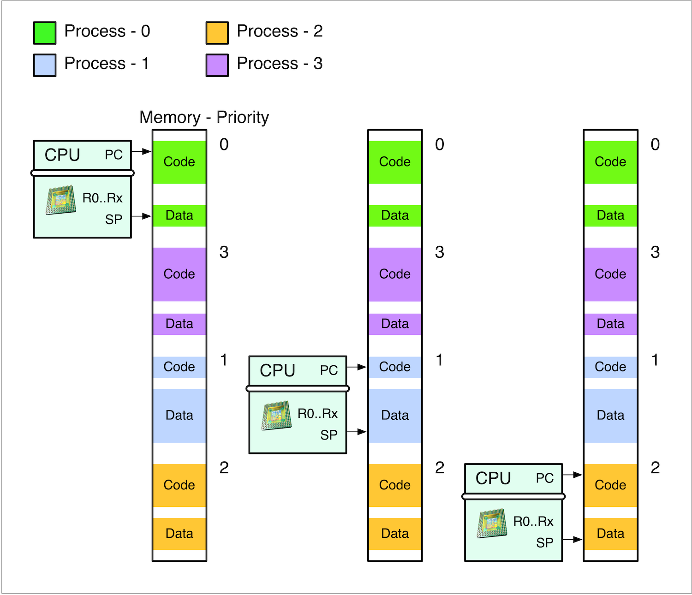

The system’s memory contains both the **code** and **data** (including the data segment and the stack) for all created processes. When the µKernel decides to perform a **context switch** — that is, to temporarily suspend the execution of one process and resume another — it saves the current process’s state (or **context**) onto its stack. It then restores the context of the newly selected process by retrieving the saved information from that process’s stack.

At this point, the newly scheduled process resumes execution **exactly from the point** at which it was previously interrupted, with its registers, stack pointer, and program counter restored as they were.

The most essential information for each process is stored in a data structure known as a **process descriptor**. This structure typically contains the process ID, scheduling information (such as priority and state), memory pointers, register values, and other context-specific data. All process descriptors are maintained in a dedicated area of memory managed by the µKernel, ensuring efficient and secure access during task switching and scheduling operations.

The next picture illustrates the mechanism used by the µKernel for the context switching. In this example, 2 processes are scheduled and share the CPU bandwidth.

Picture “a” shows how the context of the process P1 is saved. Picture “b” shows how to restore the context of the process P2. Sequentially, here are the different steps:

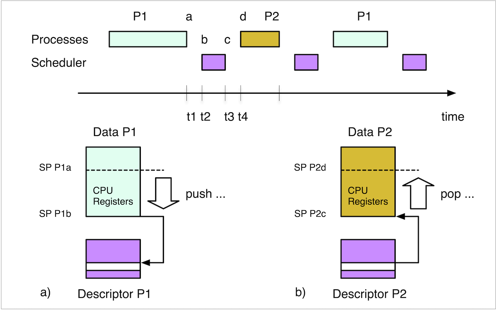

1. At time **t1** the µKernel stops the execution of P1 and saves its context (all the CPU registers) on the stack of the process.
2. At time **t2** the µKernel saves the new stack **SP P1b** inside the process descriptor P1.
3. During **t2** and **t3** the scheduler of the µKernel determines which process has the highest priority (in this case P2).
4. At time **t3** the µKernel sets the stack pointer register of the CPU with the value of the stack **(SP P2c)** stored inside the process descriptor P2.
5. At time **t4** the context (all the CPU registers) is restored. The process P2 can now continue to execute its code from the state as it was before it was previously switched.

In a more concrete way, here is the switching mechanism for the **cortex -M3 -M4 -M7 -M33 -M55**, and for for the **RISC-V -RV32 IMAC** cores:

#### Change of the context for cortex -M3 cores

```c
/*
 * \brief Time slice timeout
 *
 * - Save the context
 * - Save the context stack
 * - Change the context
 * - Give another timeout to the process
 * - Recover another context
 *
 * - Save the full stack frame (uKOS-X like)
 *
 *        ->    xPSR
 *        ->    PC
 *        ->    LR
 *        ->    R12
 *        ->    R3..R0         Block stacked by an exception
 *
 *        ->    R11..R4
 *        ->    BASEPRI
 *        —>    alt stack      psp or msp
 *        ->    LR(R14)        Block stacked manually
 *
 * !!! Do not generate prologue/epilogue sequences
 *
 */
void TIM2_IRQHandler(void) __attribute__ ((naked));
void TIM2_IRQHandler(void) {

// Save the registers r4..r11 and the basepri
// r0 contains the stack

    __asm__ volatile (
    “tst        lr,#0x4                        \n”    //
    “ite        eq                             \n”    //
    “mrseq      r0,msp                         \n”    //
    “mrsne      r0,psp                         \n”    //
    "mrs        r1,basepri                     \n"    // r1 = basepri
    "stmdb      r0!,{r1,r4-r11}                \n"    // Save the register list
    "stmdb      r0!,{lr}                       \n"    // Save the EXCEPTION return
    “tst        lr,#0x4                        \n”    //
    “ite        eq                             \n”    //
    “msreq      msp,r0                         \n”    //
    “msrne      psp,r0                         \n”    //
    “ldr        r3,=vKern_stackProcess         \n”    //
    “str        r0,[r3]                        \n”    //
    );

    _newContextTOU();

    __asm__ volatile (
    “ldr        r3,=vKern_stackProcess         \n"    //
    “ldr        r0,[r3]                        \n"    //
    "ldmia      r0!,{lr}                       \n"    // Restore the EXCEPTION return
    "ldmia      r0!,{r1,r4-r11}                \n"    // Restore the register list
    “tst        lr,#0x4                        \n”    //
    “ite        eq                             \n”    //
    “msreq      msp,r0                         \n”    //
    “msrne      psp,r0                         \n”    //
    "msr        basepri,r1                     \n"    // Restore the basepri
    );

    __asm__ volatile (
    "cpsie      i                              \n"    //
    "dmb                                       \n"    //
    "dsb                                       \n"    //
    "isb                                       \n"    //
    "bx         lr                             \n"    // Return
    );
}

/*
 * \brief local_newContextTOU
 *
 * - Change the context due to a timeout
 *   - INT acknowledge and new time for the next process
 *   - Change the context and prepare the next process
 *     - Stop time of the process
 *     - Clear the interruption
 *     - Disable the timer
 *     - Change the context
 *     - Start time of the process
 *
 */
static void __attribute__ ((noinline))local_newContextTOU(void) {

    local_timeStop();
    TIM2->CR1 &= (uint32_t)~TIM_CR1_CEN;
    TIM2->SR  &= (uint32_t)~TIM_SR_UIF;
    NVIC->ICPR[TIM2_IRQn / 32] = (1u<<(TIM2_IRQn % 32));

    INTERRUPTION_SET_PERIPH;
    INTERRUPTION_ON_HARD;
    CHECK_STACK_SANITY;

    scheduler_callBackSlow();
    local_timeStart();
}
```

#### Change of the context for cortex -M4 -M7 -M33 -M55 cores

```c
/*
 * \brief Time slice timeout
 *
 * - Save the context
 * - Save the context stack
 * - Change the context
 * - Give another timeout to the process
 * - Recover another context
 *
 * - Save the full stack frame (uKOS-X like)
 *
 *        Normal stack frame    Stack frame with FPU
 *
 *        ->                    FPSCR
 *        ->                    S15..S0
 *        ->    xPSR            xPSR
 *        ->    PC              PC
 *        ->    LR(R14)         LR(R14)
 *        ->    R12             R12
 *        ->    R3..R0          R3..R0         Block stacked by an exception
 *
 *        ->    R11..R4         R11..R4
 *        ->    BASEPRI         BASEPRI
 *        —>    alt stack       psp or msp
 *        ->                    S31..S16
 *        ->    LR(R14)         LR(R14)        Block stacked manually
 *
 * !!! Do not generate prologue/epilogue sequences
 *
 */
void TIM3_IRQHandler(void) {

// Save the registers r4..r11 and the basepri
// r0 contains the stack

    __asm__ volatile (
    “tst        lr,#0x4                        \n”    //
    “ite        eq                             \n”    //
    “mrseq      r0,msp                         \n”    //
    “mrsne      r0,psp                         \n”    //
    "mrs        r1,basepri                     \n"    // r1 = basepri
    "stmdb      r0!,{r1,r4-r11}                \n"    // Save the register list
    “tst        lr,#0x4                        \n”    //
    “ite        eq                             \n”    //
    "vstmdbeq   r0!,{s16-s31}                  \n"    // Save the fp registers
    "stmdb      r0!,{lr}                       \n"    // Save the EXCEPTION return
    “tst        lr,#0x4                        \n”    //
    “ite        eq                             \n”    //
    “msreq      msp,r0                         \n”    //
    “msrne      psp,r0                         \n”    //
    “ldr        r3,=vKern_stackProcess         \n”    //
    “str        r0,[r3]                        \n”    //
    );

    _newContextTOU();

    __asm__ volatile (
    “ldr        r3,=vKern_stackProcess         \n"    //
    “ldr        r0,[r3]                        \n"    //
    "ldmia      r0!,{lr}                       \n"    // Recover the EXCEPTION return
    "tst        lr,#0x10                       \n"    //
    "it         eq                             \n"    //
    "vldmiaeq   r0!,{s16-s31}                  \n"    // Restore the fp registers
    "ldmia      r0!,{r1,r4-r11}                \n"    // Restore the register list
    “tst        lr,#0x4                        \n”    //
    “ite        eq                             \n”    //
    “msreq      msp,r0                         \n”    //
    “msrne      psp,r0                         \n”    //
    "msr        basepri,r1                     \n"    // Restore the basepri
    );

    __asm__ volatile (
    "dmb                                       \n"    //
    "dsb                                       \n"    //
    "isb                                       \n"    //
    "bx         lr                             \n"    // Return
    );
}

/*
 * \brief local_newContextTOU
 *
 * - Change the context due to a timeout
 *   - INT acknowledge and new time for the next process
 *   - Change the context and prepare the next process
 *     - Stop time of the process
 *     - Clear the interruption
 *     - Disable the timer
 *     - Change the context
 *     - Start time of the process
 *
 */
static void __attribute__ ((noinline))local_newContextTOU(void) {

    local_timeStop();
    TIM3->CR1 &= (uint32_t)~TIM_CR1_CEN;
    TIM3->SR  &= (uint32_t)~TIM_SR_UIF;
    NVIC->ICPR[TIM3_IRQn / 32u] = (1u<<(TIM3_IRQn % 32u));

    INTERRUPTION_SET_PERIPH;
    CHECK_STACK_SANITY;

    scheduler_callBackSlow();
    local_timeStart();
}
```

#### Change of the context for RISC-V IMAC cores

```c
/*
 * \brief Time slice timeout
 *
 * - Save the context
 * - Save the context stack
 * - Change the context
 * - Give another timeout to the process
 * - Recover another context
 *
 * - Save the full stack frame (uKOS-X like)
 *
 *        Normal stack frame
 *
 *        ->    “uKOS”
 *        ->    mepc
 *        ->    cause
 *        ->    status
 *        ->    ECLIC->mth
 *        ->    t6..t3
 *        ->    s11..s2
 *        —>    a7..a0
 *        —>    s1..s0
 *        —>    t2..t0
 *        —>    tp
 *        ->    gp
 *        ->    ra
 *        ->    void (for alignment)
 *
 * !!! Do not generate prologue/epilogue sequences
 *
 */
void TIMER2_IRQHandler(void) __attribute__ ((naked, optimize("Os")));
void TIMER2_IRQHandler(void) {

// Save all the context

    __asm__ volatile ("                        \n \
    addi        sp,sp,-136                     \n \
    sw          x1,4(sp)                       \n \
    sw          x3,8(sp)                       \n \
    sw          x4,12(sp)                      \n \
    sw          x5,16(sp)                      \n \
    sw          x6,20(sp)                      \n \
    sw          x7,24(sp)                      \n \
    sw          x8,28(sp)                      \n \
    sw          x9,32(sp)                      \n \
    sw          x10,36(sp)                     \n \
    sw          x11,40(sp)                     \n \
    sw          x12,44(sp)                     \n \
    sw          x13,48(sp)                     \n \
    sw          x14,52(sp)                     \n \
    sw          x15,56(sp)                     \n \
    sw          x16,60(sp)                     \n \
    sw          x17,64(sp)                     \n \
    sw          x18,68(sp)                     \n \
    sw          x19,72(sp)                     \n \
    sw          x20,76(sp)                     \n \
    sw          x21,80(sp)                     \n \
    sw          x22,84(sp)                     \n \
    sw          x23,88(sp)                     \n \
    sw          x24,92(sp)                     \n \
    sw          x25,96(sp)                     \n \
    sw          x26,100(sp)                    \n \
    sw          x27,104(sp)                    \n \
    sw          x28,108(sp)                    \n \
    sw          x29,112(sp)                    \n \
    sw          x30,116(sp)                    \n \
    sw          x31,120(sp)                    \n \
    lui         t0,%%hi(%1)                    \n \
    lbu         t1,%%lo(%1)(t0)                \n \
    andi        t1,t1,0xFF                     \n \
    sw          t1,124(sp)                     \n \
    csrr        t0,mstatus                     \n \
    sw          t0,128(sp)                     \n \
    csrr        t0,mcause                      \n \
    sw          t0,132(sp)                     \n \
    csrr        t0,mepc                        \n \
    sw          t0,136(sp)                     \n \
    add         %0,x0,sp"                         \
    : "=r" (vKern_stackProcess)                   \
    : "i" (&ECLIC->mth)                           \
    :                                             \
    );

    _newContextTOU();

    __asm__ volatile ("                        \n \
    add         sp,x0,%0                       \n \
    lw          x1,4(sp)                       \n \
    lw          x3,8(sp)                       \n \
    lw          x4,12(sp)                      \n \
    lw          x7,24(sp)                      \n \
    lw          x8,28(sp)                      \n \
    lw          x9,32(sp)                      \n \
    lw          x10,36(sp)                     \n \
    lw          x11,40(sp)                     \n \
    lw          x12,44(sp)                     \n \
    lw          x13,48(sp)                     \n \
    lw          x14,52(sp)                     \n \
    lw          x15,56(sp)                     \n \
    lw          x16,60(sp)                     \n \
    lw          x17,64(sp)                     \n \
    lw          x18,68(sp)                     \n \
    lw          x19,72(sp)                     \n \
    lw          x20,76(sp)                     \n \
    lw          x21,80(sp)                     \n \
    lw          x22,84(sp)                     \n \
    lw          x23,88(sp)                     \n \
    lw          x24,92(sp)                     \n \
    lw          x25,96(sp)                     \n \
    lw          x26,100(sp)                    \n \
    lw          x27,104(sp)                    \n \
    lw          x28,108(sp)                    \n \
    lw          x29,112(sp)                    \n \
    lw          x30,116(sp)                    \n \
    lw          x31,120(sp)                    \n \
    lw          t1,124(sp)                     \n \
    andi        t1,t1,0xFF                     \n \
    lui         t0,%%hi(%1)                    \n \
    sb          t1,%%lo(%1)(t0)                \n \
    lw          t0,128(sp)                     \n \
    csrw        mstatus,t0                     \n \
    lw          t0,132(sp)                     \n \
    csrw        mcause,t0                      \n \
    lw          t0,136(sp)                     \n \
    csrw        mepc,t0                        \n \
    lw          x5,16(sp)                      \n \
    lw          x6,20(sp)                      \n \
    addi        sp,sp,136                      \n \
    mret"                                         \
    :                                             \
    : "r" (vKern_stackProcess), "i" (&ECLIC->mth) \
    :                                             \
    );

/*
 * \brief local_newContextTOU
 *
 * - Change the context due to a timeout
 *   - INT acknowledge and new time for the next process
 *   - Change the context and prepare the next process
 *     - Stop time of the process
 *     - Clear the interruption
 *     - Disable the timer
 *     - Change the context
 *     - Start time of the process
 *
 */
static void __attribute__ ((noinline))local_newContextTOU(void) {

    local_timeStop();

    CHECK_STACK_SANITY;

    TIMER2->INTF &= ~TIMER_INTF_UPIF;
    TIMER2->CTL0 &= ~TIMER_CTL0_CEN;

    INTERRUPTION_SET_PERIPH;
    INTERRUPTION_ON_HARD;

    scheduler_callBackSlow();
    local_timeStart();
}
```

### Temporal aspects

Each process is allowed to use the CPU for a limited period of time, known as a **time slice**. Once this time has elapsed (a **process timeout**), the µKernel halts the execution of the current process and invokes the **scheduler** to determine which process should run next.

The scheduler typically selects the next **highest-priority** process that is ready to run. If multiple processes share the same priority level, the scheduler chooses the one that has been waiting the longest, thereby ensuring **fairness** and avoiding starvation.

Choosing an appropriate time slice is critical for overall system performance. It must be **short enough** to allow responsive behaviour across all active processes, particularly for time-sensitive tasks. At the same time, it must be **long enough** to prevent excessive overhead caused by frequent **context switching**, which can degrade CPU efficiency and system throughput.

### Reentrancy

If a section of code can be executed by more than **one process concurrently**, it is crucial to avoid the use of static variables, unless appropriate protection mechanisms are in place. Static variables maintain their value between function calls and are shared across all instances of the function, making them particularly vulnerable to race conditions in multitasking environments.

When the use of static variables is unavoidable, they must be protected to ensure thread-safe access. The following mechanisms can be employed to achieve this:

1. **Exclusion semaphores** to control concurrent access and ensure mutual exclusion.
2. The system call **kern_criticalSection(xxx)**, which temporarily disables task switching within the defined critical section.
3. Encapsulation of the critical region using the macros **INTERRUPTION_OFF** and **INTERRUPTION_RESTORE**, which disable and then restore interrupts, thereby preventing pre-emption for the duration of the protected code.

Proper synchronisation is essential to avoid undefined behaviour, data inconsistency, or system instability — especially in real-time or safety-critical applications, where reliability and predictability are paramount.

#### Interruption control for cortex Mx cores

```c
#define    INTERRUPTION_OFF         volatile uint32_t    saveBASEPRI;           \
                                    __asm__ volatile(“                       \n \
                                    mrs          r0,basepri                  \n \
                                    str          r0,%0                       \n \
                                    mov          r0,%1                       \n \
                                    msr          basepri,r0”                    \
                                    :                                           \
                                    : "m" (saveBASEPRI),                        \
                                      "i" (KINT_IMASK_OFF<<KNVICPRIORITYSHIFT)  \
                                    : “r0"                                      \
                                    );

#define    INTERRUPTION_RESTORE     __asm__ volatile (“                      \n \
                                    ldr          r0,%0                       \n \
                                    msr          basepri,r0”                    \
                                    :                                           \
                                    : "m" (saveBASEPRI)                         \
                                    : “r0"                                      \
                                    );
```

#### Interruption control forRISC-V IMAC cores

```c
#define    INTERRUPTION_OFF         volatile    uint8_t    saveMSK;             \
                                    __saveMSK = ECLIC->mth;                     \
                                    ECLIC->mth = KINT_IMASK_OFF;

#define    INTERRUPTION_RESTORE     ECLIC->mth = saveMSK
```

### Pre-emption

When necessary, the µKernel can interrupt the execution of a process in order to schedule and run another process with a higher priority. This behaviour is a fundamental feature of **pre-emptive multitasking**, allowing the system to respond promptly to time-critical tasks.

Such pre-emption occurs naturally in various situations, for example:

1. **After a process timeout**, when the current task has consumed its allocated time slice.
2. **In response to a hardware interrupt**, such as input from a peripheral device or the expiry of a timer.

In these cases, the µKernel evaluates which process should run next, based on priority and system state, ensuring that high-priority tasks are always given precedence when required.

### Inversion of priority

**Priority inversion** is a condition in which a low-priority process inadvertently prevents a high-priority process from executing, typically by holding a shared resource (such as a semaphore) that the high-priority process also requires. As a result, the high-priority process becomes blocked until the lower-priority process releases the resource, effectively **inverting** their intended priorities.

This situation undermines the purpose of the priority system. Low-priority processes are usually assigned that status because their timely completion is not critical. In contrast, high-priority processes are often subject to **strict timing constraints** and require immediate or predictable execution. By allowing a low-priority task to delay a high-priority one, the system may experience **reduced responsiveness**, degraded real-time performance, or even **missed deadlines** in time-sensitive applications.

In some cases, priority inversion may go unnoticed, particularly if the delay is short or infrequent. However, in real-time systems, even brief priority inversions can lead to serious consequences, such as **failure to meet response time guarantees** or **instability in control systems**.

To mitigate this issue, many operating systems implement **priority inheritance** or **priority ceiling protocols**. These techniques temporarily raise the priority of the low-priority task holding the resource, allowing it to complete its critical section more quickly and release the resource to the high-priority task, thus restoring correct priority order.

### Critical resources

As with static variables, access to peripherals and shared memory structures must be carefully synchronised to avoid race conditions and ensure data integrity. This can be achieved using one of the following protection mechanisms:

1. An **exclusion semaphore**, which allows controlled access by multiple processes.
2. The system call **kern_criticalSection**, which defines a critical section during which task switching is temporarily disabled.
3. The macros **INTERRUPTION_OFF** and **INTERRUPTION_RESTORE**, which disable and then re-enable interrupts. These macros are only suitable for code executed in supervisor mode (privileged execution space).

When access to a critical resource is brief and time-sensitive, the use of **kern_criticalSection** or the interrupt control macros is typically the fastest and most efficient method, as it minimises overhead and latency.

However, in all other cases — especially when access may take longer or involve blocking operations — the use of an exclusion semaphore is mandatory to maintain system stability and to ensure proper coordination between concurrent tasks.

```c
// Example of a simple protection of a critical resource

#define KSZ_BUF     10u

static uint8_t    vBuffer[KSZ_BUF];     // Critical resource

static void __attribute__ ((noreturn)) process_1(const void *argument) {
    uint8_t    i, result;

    UNUSED(argument);

    while (true) {
        for (i = 0u; i < KSZ_BUF; i++) {
            INTERRUPTION_OFF;
            vBuffer[i] = 2u * i; result = summBuff(vBuffer);
            ...
            INTERRUPTION_RESTORE;
        }
    }
}

static void __attribute__ ((noreturn)) process_2(const void *argument) {
    uint8_t    i, result;

    UNUSED(argument);

    while (true) {
        for (i = 0u; i < KSZ_BUF; i++) {
            INTERRUPTION_OFF;
            buffer[i] = 3u * i; result = summBuff(vBuffer);
            ...
            INTERRUPTION_RESTORE;
        }
    }
}

uint8_t summBuff(uint8_t *buffer) {
    uint8_t    i, result = 0u;

    for (i = 0u; i < KSZ_BUF; i++) { result += *buffer++; }
    return (result);
}
```

## The µKOS-X µKernel implementation

The **µKOS-X µKernel** implements all the fundamental concepts found in modern µKernel architectures. Its design prioritises **static implementation** of all kernel primitives, with the specific goal of enabling deployment in **ASICs** and other resource-constrained embedded environments, where memory and processing capabilities are often limited.

All parameters of the µKernel are fully **configurable**, allowing developers to tailor the system to achieve an optimal balance between **resource usage**, **performance**, and **application-specific requirements**. This flexibility makes µKOS-X particularly well-suited for embedded systems that demand high efficiency, reliability, and predictable behaviour.

### Basic features of the µKOS-X µKernel

1. µKOS-X µKernel implements the following basic features:
2. Up to 65535 static processes or overlays.
3. Up to 254 dynamic priorities.
4. Pre-emptive multitasking.
5. Each process can run in supervisor or user spaces.
6. Time management:
   1. Process timeout.
   2. Process suspension.
   3. Action waiting under timeout.
7. Up to 65535 static semaphores.
8. Up to 65535 static mutexes.
9. Up to 65535 interprocess mailboxes / queues.
10. Up to 65535 software timers.
11. Up to 65535 memory pools.
12. Up to 65535 precise temporal timers with signals.
13. Process synchronisation (n-to-n signals).
14. CPU usage statistics.
15. Portable to any CPUs via stubs.
16. ROMable.

### State of a process

Each process in the system can exist in one of **four well-defined states**. The **scheduler algorithm** is responsible for selecting the appropriate process that is in the **ready** state and eligible to use the CPU (**State A**).

System calls to the µKernel manage **state transitions** based on the resource or condition currently controlling the process. These transitions occur in response to various system features such as **semaphores**, **synchronisation mechanisms**, or **timing events** (represented as **States B to E**). Each of these features may suspend the process until a particular condition is met, after which the process can return to the ready state and eventually be rescheduled by the kernel.

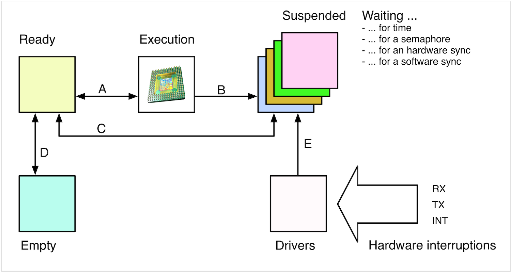

1. **The empty state:** all the free (usable) processes.
2. **The ready state:** all the processes that can use the CPU at the next context switching are in this state.
3. **The execution state:** only the process using the CPU can be in this state.
4. **The suspended state:** all the processes waiting for a particular event are in this state.

**External hardware interrupts** have an **indirect impact** on the µKernel. To achieve **optimal system reactivity**, interrupt service routines (executed outside the µKernel) should handle part — or, in some cases, the entirety — of the interrupt processing independently, without relying on the kernel for immediate intervention.

When needed, the user can choose to **communicate or synchronise** interrupt events with the µKernel using a **synchronisation event**. Upon receiving such an event, the kernel will transition any processes that were **suspended and waiting** on that specific event into the **ready state**, making them eligible for execution by the scheduler.

This approach enables a clean separation between time-critical hardware handling and process-level task management, allowing for **efficient, low-latency responses** while preserving the stability and predictability of the system.

### Process descriptors and lists

**Process descriptors** are specialised memory structures that hold essential information about each process, including its **current state**, **execution context**, and **environment**. In the µKOS-X µKernel, these descriptors are **linked into lists**, which represent the various states a process can occupy — such as **Empty**, **Ready**, **Suspended**, and so on.

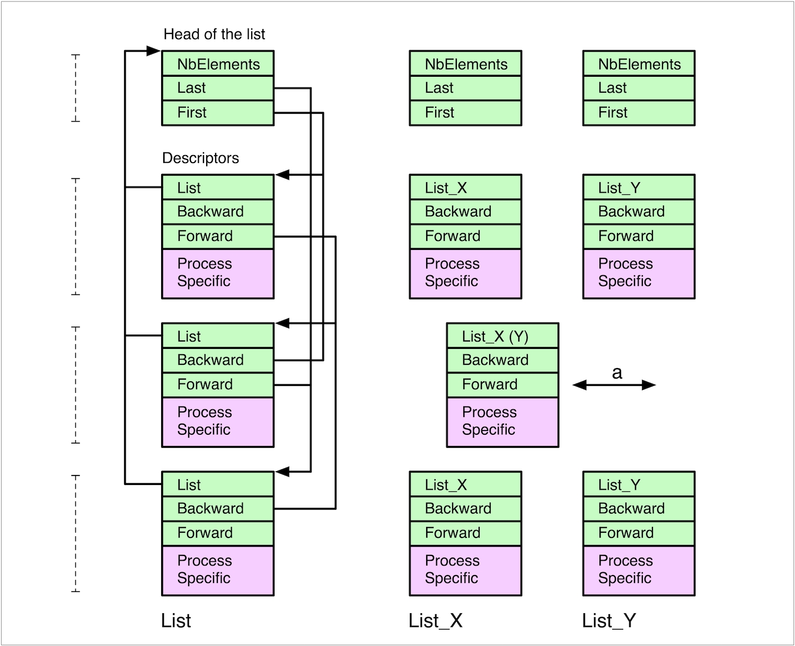

Each list employs a doubly linked (forward/backward) chaining scheme, which enables fast and efficient insertion and removal (connection/disconnection) of process descriptors from specific state lists (e.g. List_X, List_Y). This bidirectional linking significantly improves the performance of list management operations, which is a core function of the µKOS-X scheduler.

As previously mentioned, the process descriptor stores not only the state of the process but also key metadata that reflects its **temporal** and **logical evolution** over time. These descriptors are vital for correct task scheduling, context switching, and synchronisation.

Below is the structure used in µKOS-X to define a process descriptor:

```c
struct proc {
             obje_t           oObject;                      // Process object
             spec_t           oSpecification;               // Process specification
             work_t           oInternal;                    // Process internal stuff
             stts_t           oStatistics;                  // Kernel statistic
};

struct list {
             proc_t           *oFirst;                      // Ptr on the first
             proc_t           *oLast;                       // Ptr on the last
             uint16_t         oNbElements;                  // # of elements
};

// Structure for the process specification
// ---------------------------------------

struct spec {
    const    char_t           *oIdentifier;                 // Process identifier
    const    char_t           *oText;                       // Ptr on the Id text

    volatile uintptr_t        *oStkSupBegin;                // Ptr on the the stack
    volatile uintptr_t        *oStkSup;                     // Process stack (sup)
    volatile uintptr_t        *oStkUsr;                     // Process stack (user)
             uint32_t         oSzStk                        // Size of the stack
             void             (*oCode)
                              (const void *arg);            // Process code
             uint8_t          oStackMode;                   // Stack mode
             uint8_t          oKind;                        // Process kind
             uint8_t          oMode;                        // Process run mode
             priority_t       oPriority;                    // Process priority
             serialManager_t  oSerialManager;               // Default I/O channel
             void             (*oScheduleHook)
                              (proc_t *handle,              // Ptr on the process handler
                              bool scheduled);              // Flag scheduled/de-scheduled
};

// Stacks (oStackMode)

enum {
             KPROC_STACK_STATIC = 0u,                       // KSTKSTATIC = static stack
             KPROC_STACK_DYNAMIC                            // KSTKDYNAMIC = dynamic stack
};

enum {
             KPROC_NORMAL = 0u,                             // KPROCNORMAL = normal
             KPROC_DAEMON,                                  // KPROCDAEMON = daemon
};

enum {
             KUSER = 0u,                                    // User mode
             KSUPERVISOR                                    // Privileged mode
};

// Structure for the uKernel working states
// ----------------------------------------

struct work {
    volatile list_t         *oListDebg;                     // Ptr on the list
    volatile proc_t         *oProcFather;                   // Ptr on the father process
             uint16_t       oStateDebg;                     //
             uint16_t       oState;                         // Process state
             #define        BPROC_FIRST           0u        // First
             #define        BPROC_INSTALLED       1u        // Installed
             #define        BPROC_RUNNING         2u        // Running
             #define        BPROC_SUSP_TIME       3u        // Susp for a time
             #define        BPROC_SUSP_SIGN       4u        // Susp for a sign
             #define        BPROC_SUSP_SEMA       5u        // Susp for a sema
             #define        BPROC_SUSP_MUTX       6u        // Susp for a mutx
             #define        BPROC_SUSP_MBOX_E     7u        // Susp for a mbox (empty)
             #define        BPROC_SUSP_MBOX_F     8u        // Susp for a mbox (full)
             #define        BPROC_SUSP_DEBG       9u        // Susp for a debg
             #define        BPROC_LIKE_ISR        10u       // Like ISR
             #define        BPROC_PRIV_ELEVATED   11u       // Elevate

             int32_t        oStatus;                        // Status
             uint32_t       oTimeout;                       // A timeout
             uint32_t       oSkip;                          // Number of skip
             priority_t     oDynamicPriority;               // Dyn Priority
    const    void           *oLocal;                        // General Ptr
};

// Structure for the statistics
// ----------------------------

struct stts {
             uint64_t       oNbExecutions;                  // # of scheduled
             uint64_t       oNbKernCalls;                   // # of calls

             uint32_t       oAvStkSup;                      // Available stack
             uint16_t       oTimePMin;                      // Min CPU time P
             uint16_t       oTimePMax;                      // Max CPU time P
             uint16_t       oTimePAvg;                      // Avg CPU time P
             uint64_t       oTimePCum;                      // Cum CPU time P
             uint16_t       oTimeKMin;                      // Min CPU time K
             uint16_t       oTimeKMax;                      // Max CPU time K
             uint16_t       oTimeKAvg;                      // Avg CPU time K
             uint64_t       oTimeECum;                      // Cum CPU time K
             uint16_t       oTimeEMin;                      // Min CPU time E
             uint16_t       oTimeEMax;                      // Max CPU time E
             uint16_t       oTimeEAvg;                      // Avg CPU time E
             uint64_t       oTimeECum;                      // Cum CPU time E
};
```

The main structure, proc_t, is composed of five distinct sections, each serving a specific purpose within the µKOS-X µKernel.

1. The first section includes elements from both the **list_t** and **proc_t** structures, which are used to link the process descriptor into a specific state list (e.g. Ready, Suspended). This enables efficient insertion and removal operations using the µKernel’s double-chaining mechanism.
2. The remaining **three sections** hold additional information required by the µKernel:
   1. **spec_t** – This section contains all the user-defined parameters, such as the stack pointer, initial execution address, priority level, and other attributes that define how the process should be created and executed.
   2. **work_t** – This section holds the µKernel’s internal state and control data related to the process. It includes information about the process’s current status, context, and runtime evolution. It is exclusively used by the µKernel and hidden from user-level code.
   3. **stts_t** – This section stores execution statistics for the process, such as the amount of µKernel overhead incurred, the number of times the process has been scheduled, and timing information useful for performance analysis or debugging.

Together, these sections provide a **comprehensive representation of a process**, enabling the µKernel to manage scheduling, context switching, synchronisation, and performance monitoring efficiently.

### Daemons

**Daemons** are background processes that continuously monitor or manage specific components of the system or the µKernel. In the **µKOS-X** implementation, the µKernel relies on at least **four essential daemons**, each with a distinct role in maintaining system stability and responsiveness:

1. **Idle Daemon**
    The **idle daemon** is a special low-priority process that is scheduled only when **no other process is ready to run**(i.e. all active processes are in a suspended state). In this case, the scheduler assigns CPU time to the idle daemon until another process becomes available. This daemon ensures that the CPU is never left entirely idle and can also be used for low-priority background tasks such as power management.
2. **Timeout Daemon**
    The **timeout daemon** operates with **medium priority**. It is responsible for scanning all process lists that contain **suspended processes**. If a timeout condition is detected for one or more processes, the daemon triggers a transition by **moving the affected processes back into the ready list**, and signals a **timeout error**. This ensures that processes waiting on time-sensitive events do not remain blocked indefinitely.
3. **Stack Sanity Daemon**
    The **stack sanity daemon**, which has a **very low priority**, periodically inspects the **stack usage** of all processes. It verifies the depth of each stack to detect potential overflows or near-overflow conditions. The **available stack space** is tracked and recorded in each process’s **descriptor**, allowing the system to identify stack-related anomalies before they result in crashes or unpredictable behaviour.
4. **Software Timer Daemon**
    The **software timer daemon** is responsible for managing all **software timers** used by the system or user applications. It updates timer counters, triggers time-based events, and interacts with other parts of the kernel (e.g. process wake-up, callback execution) based on timing logic.

These daemons form a critical part of the µKOS-X runtime, providing foundational services that support **task scheduling**, **resource monitoring**, and **system integrity**.

### Interruptions

To perform its operations reliably and efficiently, the **µKOS-X µKernel** requires one **software interrupt (SWI)** and **two hardware timer interrupts**.

1. The **software interrupt** is used to pass messages from kernel managers or internal µKernel functions to the **scheduler**. This mechanism ensures that scheduling decisions can be triggered from within kernel-level operations in a controlled manner.
2. The **TS timer** is responsible for generating the **process timeout** event, also known as the **time slice**. In the default µKOS-X implementation, this interval is set to **20 milliseconds** on slower CPUs. It defines how long a process may run before the scheduler evaluates the need for a context switch.
3. The **TF timer** handles precise **temporal operations** within the µKernel. It is used to manage delays, sleeping processes, and timeout events for synchronisation primitives. Its resolution typically ranges from **1 to 5 milliseconds**, depending on the performance of the target CPU.

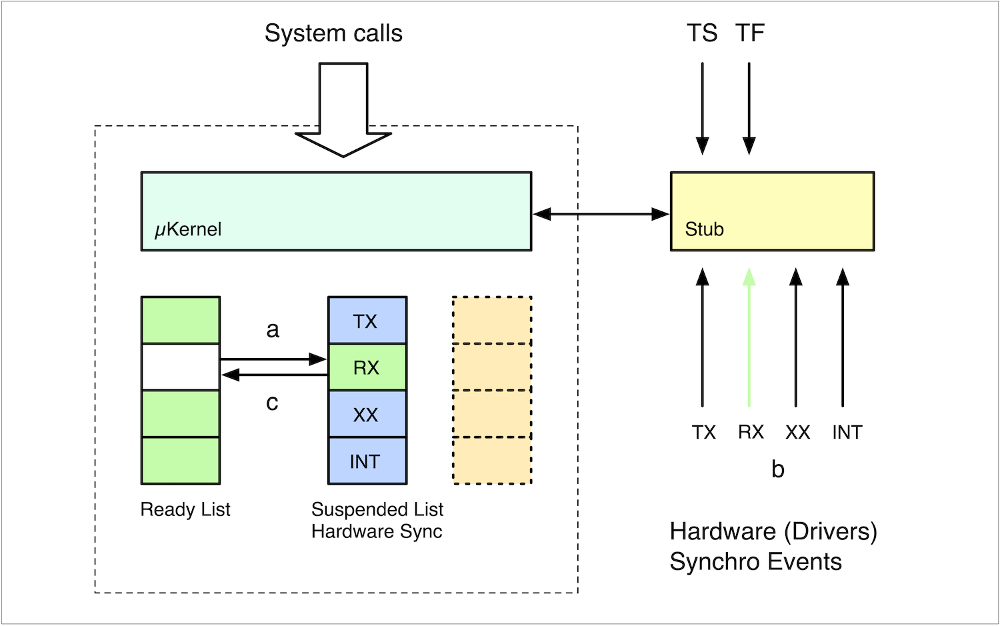

In addition, a **free-running hardware timer** is used to maintain **statistical information**, such as the **CPU usage** of each process and of the µKernel itself. This timer operates **without generating interrupts**, avoiding unnecessary overhead while still supporting accurate performance monitoring.

All **other hardware interrupts** are **not managed directly by the µKernel**. Instead, interrupt processing is delegated to **dedicated managers** (e.g. device drivers), which handle the interrupt logic independently. This design ensures **maximum responsiveness** to time-critical events. When necessary, a manager can **trigger the µKernel** by posting a **semaphore**, thereby waking a process that is suspended and waiting on a particular event.

For example, when a process needs to be synchronised upon receiving a character via the **RS232 manager**:

1. the process is placed into the **suspended list**, waiting on a semaphore (e.g. RS232_RX).
2. once the character is received, the manager signals the event by posting the semaphore.
3. the process is then moved into the **ready list**, making it eligible for execution.

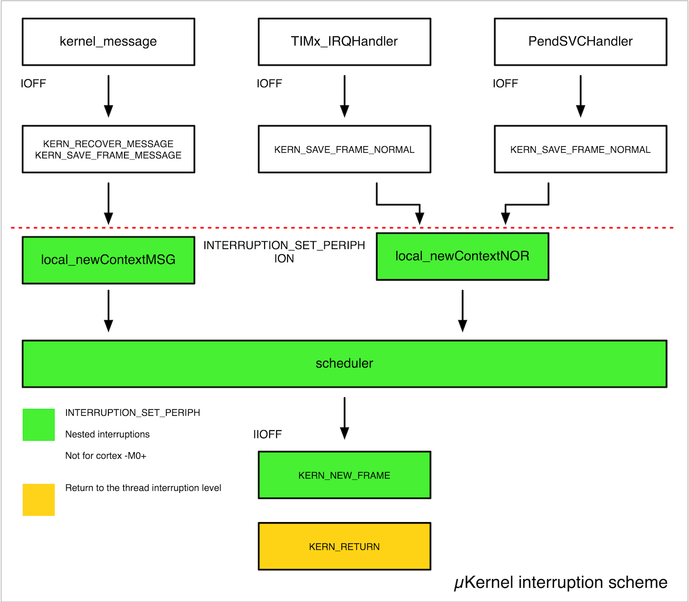

To maintain system responsiveness — even during internal kernel operations — **access to critical resources must be carefully controlled**. µKOS-X supports two operational models:

1. Without nested interrupts.
2. **With nested interrupts** (available only on certain CPUs).

In both models, µKernel entry routines immediately place the CPU into **IOFF** mode using **INTERRUPTION_OFF**, disabling all peripheral interrupts to protect critical sections.

If nested interrupt support is enabled (currently available only for ARM Cortex-Mx CPUs), the µKernel may re-enable non-blocking peripheral interrupts after completing atomic operations using **INTERRUPTION_SET_PERIPH**. This allows peripheral interrupts that do not trigger context switches to be serviced, improving system reactivity.

For all other CPUs, the system remains in **IOFF mode** throughout µKernel execution to preserve consistency and prevent re-entrance issues.

In all cases, µKOS-X is designed to **minimise the duration** in which the system remains in IOFF mode, thus maintaining **maximum reactivity** while ensuring the atomicity of critical kernel operations.

### The scheduler

The **scheduler** is responsible for determining which process will gain access to the **CPU** following the next **context switch**. The selection is based on a dynamic priority mechanism, which ensures fairness while maintaining responsiveness for high-priority tasks. The scheduling logic is as follows:

1. **Identify the process with the highest dynamic priority**, where a lower numerical value indicates higher priority (i.e. **0** is the highest).
2. If **multiple processes share the same dynamic priority**, the scheduler selects the one that has been **waiting the longest** in the ready list. This prevents starvation and ensures fair scheduling.
3. Once the process is selected, the **dynamic priority of all other ready processes is improved** by **decreasing their dynamic priority value** (i.e. incrementing their relative priority). This mechanism helps balance responsiveness with fairness.
4. The **selected process’s dynamic priority** is then **reset to its static priority value**, ensuring that its original importance is preserved across scheduling cycles.

Below is an illustration involving three processes: **P1**, **P2**, and **P3**. The **bold parameters** in the figure indicate the key elements the scheduler uses to determine which process will execute next. The point marked **t(k+x)** represents a **process timeout**, i.e. the moment when the scheduler is invoked to make a new decision. In this example, the **green-highlighted process** is the one selected to run at that time.

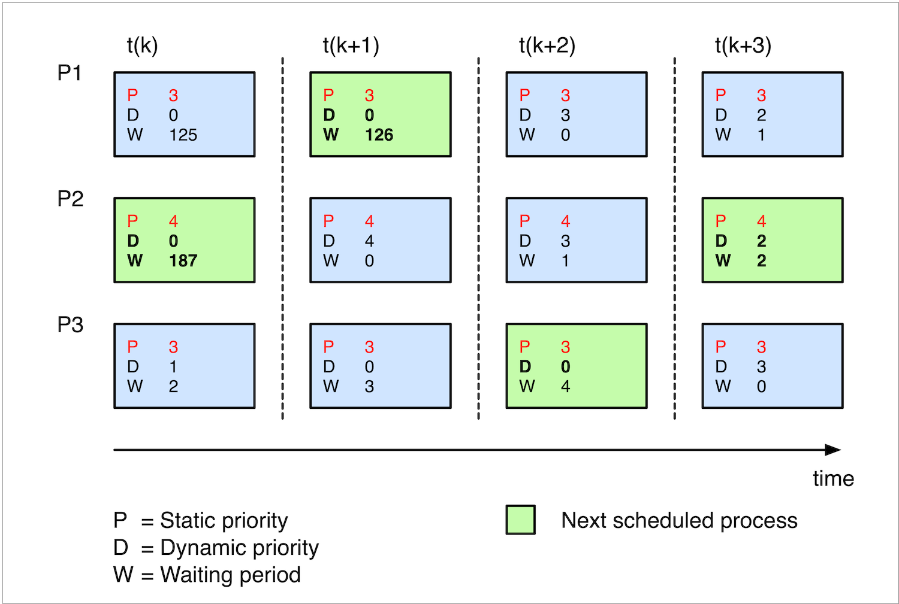

### Semaphores

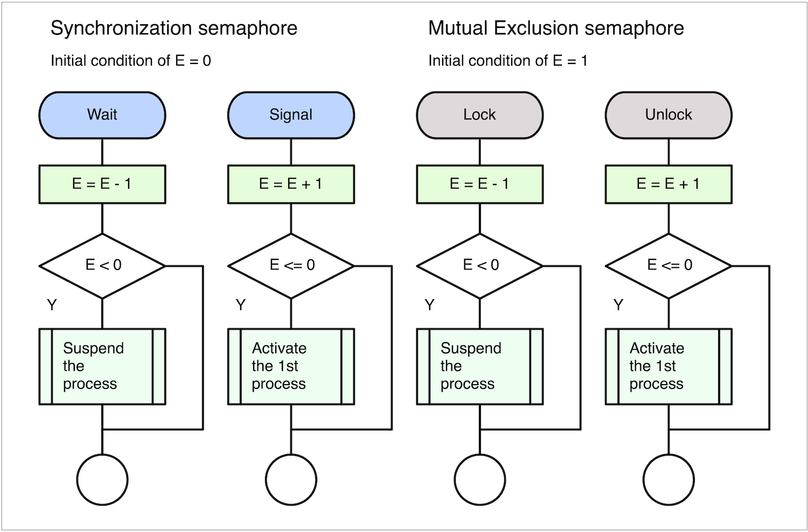

A semaphore is a general-purpose synchronisation primitive used to protect critical resources or to coordinate execution between processes. In µKOS-X, the semaphore mechanism is implemented using an internal **counter E**, which determines the behaviour of the semaphore.

The initial value of **E** defines the semaphore’s operating mode:

1. If **E = 0**, the semaphore functions as a synchronisation semaphore (or synchro semaphore). It is typically used to block a process until a specific event occurs (e.g. data arrival, signal from an interrupt or another task).
2. If **E = 1**, the semaphore behaves as a mutual exclusion semaphore (mutex), used to ensure that only one process at a time can access a shared resource (e.g. peripheral register, memory buffer).

This flexible implementation allows the same semaphore structure to serve multiple purposes, depending on the context and initial configuration, while maintaining simplicity and efficiency in the kernel's synchronisation logic.

```c
// Synchronisation and mutual exclusion semaphore primitives

void kern_createSyncSemaphore(“sema”, &handle) {
    static int32_t    E = 0;
    ...
}

void kern_createMutxSemaphore(“sema”, &handle) {
    static int32_t    E = 1;
    ...
}

void kern_waitSemaphore(...) {
void kern_lockSemaphore(...) {

    E = E - 1;
    if (E < 0) suspendProcess(...);
}

void kern_signalSemaphore(...) {
void kern_unlockSemaphore(...) {

    E = E + 1;
    if (E <= 0) scheduleProcess(...);
}
```

In µKOS-X, a semaphore is used not only to control access to shared resources but also to store and manage events through its internal **counter E**. This mechanism ensures reliable and efficient synchronisation between processes and system components.

For example, in the case of a **synchronisation semaphore**:

1. The **RS232 manager** uses a semaphore to **signal the reception of a character**. When a new character is received, the manager **posts** (increments) the semaphore, indicating that data is available.
2. The process **P1**, which is waiting to read incoming data, performs a **wait** operation on the same semaphore. If no character is available, **P1** is placed in the **suspended list**. As soon as the RS232 manager signals the event, the semaphore counter increases, and **P1 is moved to the ready list** to resume execution.

This model ensures that **no events are lost**, even if they occur while the process is not actively polling. It also avoids busy waiting and contributes to **low-latency, event-driven execution**.

```c
// Example of a synchronisation semaphore (interruption synchronise P1)

static void __attribute__ ((noreturn))

static sema_t    *vSemaphore;

void kern_createSyncSemaphore(“int synchro”, &vSsemaphore);
...
interruption_RS232() {
    ...
    if ((*QSM_SCSR & (1<<RDRF)) != 0u)
        kern_signalSemaphore(vSsemaphore);
    ...
}

static void __attribute__ ((noreturn)) process_1(const void *argument) {

    UNUSED(argument);
    ...
    while (true) {

// Suspend P1
// waiting for the manager sig with a timeout infinite
// Read and display the data

        kern_waitSemaphore(vSsemaphore, KWAIT_INFINITY);
        display(getRX_RS232());
    }
}
```

```c
// Example of a mutual exclusion mutes

#define KSZ_BUF     10u

static uint32_t    vBuffer[KSZ_BUF];
static mutx_t      *vMutex;

void kern_createMutxSemaphore(“buffer protection”, &vMutex);
```

A mutual exclusion semaphore (or mutex) is used to protect access to critical resources that must not be shared simultaneously between multiple processes. In this example, a global buffer is accessed by three processes: **P1, P2**, and **P3**. The routine **computeBuffer** operates on this buffer and must be executed by only one process at a time to avoid data corruption.

To enforce mutual exclusion:

1. Each process must acquire the semaphore before entering the critical section by calling **kern_lockMutex**.
2. Once the process has completed the operation on the shared buffer, it releases the semaphore using **kern_unlockMutex**.

```c
static void __attribute__ ((noreturn)) process_1(const void *argument) {
    ...
    kern_lockMutex(vMutex, KWAIT_INFINITY);    // Lock the resource
    computeBuffer(&vBuffer[0]);                // Reserved for process_1
    kern_unlockMutex(vMutex);                  // Unlock the resource
}

static void __attribute__ ((noreturn)) process_2(const void *argument) {
    ...
    kern_lockMutex(vMutex, KWAIT_INFINITY);    // Lock the resource
    computeBuffer(&vBuffer[0]);                // Reserved for process_2
    kern_unlockMutex(vMutex);                  // Unlock the resource
}

static void __attribute__ ((noreturn)) process_3(const void *argument) {
    ...
    kern_lockMutex(vMutex, KWAIT_INFINITY);    // Lock the resource
    computeBuffer(&vBuffer[0]);                // Reserved for process_3
    kern_unlockMutex(vMutex);                  // Unlock the resource
}
```

In this example, it is assumed that the **order of access** to the critical resource is: **P3** **→** **P2** **→** **P1**.

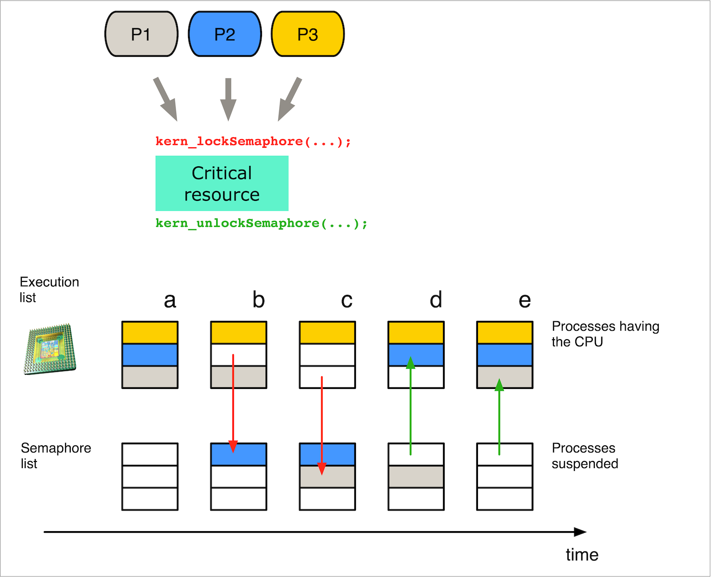

The following sequence illustrates the **chronological behaviour** of a mutual exclusion semaphore when multiple processes request access to the same **critical resource**. The semaphore ensures that only **one process** at a time can enter the critical section, while others are suspended and queued in a **waiting list** until the resource becomes available.

#### Step-by-step sequence:

1. **Process P3** locks the semaphore using kern_lockSemaphore().
    → The semaphore is free, so **P3** gains access to the critical resource immediately.
2. **Process P2** attempts to lock the semaphore.
    → Since the semaphore is already held by **P3**, **P2 is unscheduled** and moved to the **waiting list** of the semaphore.
3. **Process P1** also attempts to lock the semaphore.
    → As the semaphore is still held by **P3**, **P1 is likewise unscheduled** and placed **after P2** in the semaphore's waiting list.
4. **Process P3** completes its use of the critical resource and calls kern_unlockSemaphore().
    → The semaphore is then granted to **P2**, the first process in the waiting list.
    → **P2** is re-scheduled and placed in the ready list to resume execution.
5. **Process P2** completes its task and unlocks the semaphore.
    → The semaphore is then **granted to P1**, which was next in the queue.
    → **P1 is re-scheduled** and placed in the **ready list** for execution.

This sequence demonstrates how **fairness and exclusivity** are maintained through the semaphore’s **FIFO-based waiting mechanism**, ensuring that processes gain access to the critical resource **in the order they requested it**, and that **no two processes** execute the critical section simultaneously.

### Mailboxes & queues

**Inter-process communication (IPC)** in µKOS-X can be achieved using either **mailboxes** or **queues**, both of which are **FIFO (First-In, First-Out)** data structures designed to manage asynchronous data exchange between processes.

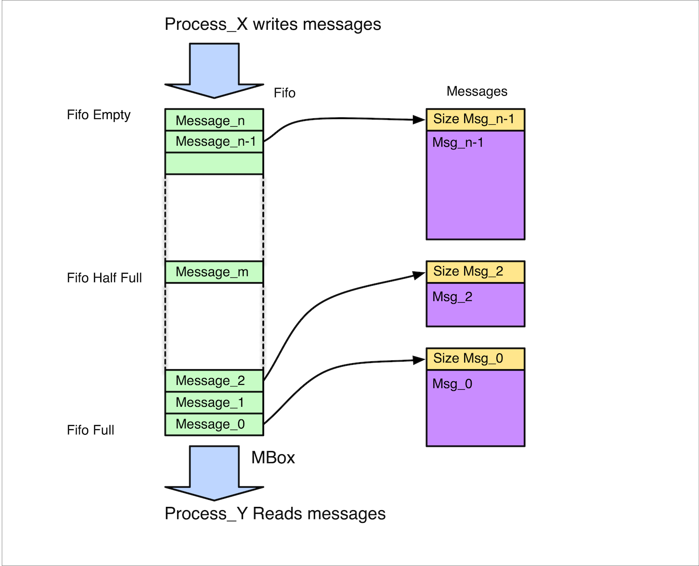

#### Mailboxes

A **mailbox** is a FIFO structure that stores **message pointers** or **data packets**. The default depth of the mailbox is configured to hold **up to 32 messages**. Each entry in the mailbox points to a memory location that contains a **message of arbitrary type and size**.

The FIFO message structure includes:

1. A **pointer** to the actual message data.
2. The **size** of the message, allowing the receiver to handle messages of variable length appropriately.

Mailboxes are suitable when processes need to exchange **complex data structures**, strings, or binary blobs, and when the receiver must know the exact size of the message.

#### Queues

A **queue** operates in a similar manner to a mailbox but is designed for more lightweight communication. Instead of handling pointers and variable-length messages, each entry in a queue consists of a single **32-bit word**. This makes queues ideal for transmitting **simple values**, such as command codes, status flags, or integer parameters, with minimal overhead.

Mailboxes and queues both enable **safe and decoupled communication** between tasks, allowing the sender and receiver to operate **independently and asynchronously**, without requiring direct synchronisation.

```c
// Example of a mailbox (PX sends a buffer, PY receives it)

static void __attribute__ ((noreturn)) process_X(const void *argument) {
    uint8_t     *bufSnd;
    uint16_t    sizeSnd;
    uint32_t    counterSnd = 0u;
    mcnf_t      configure;
    int32_t     status;
    mbox_t      *mailBox;

    UNUSED(argument);

// Create and configure the mailbox

    configure.oNbMaxPacks    = 10u;
    configure.oDataEntrySize = 0u;

    status = kern_createMailbox("Mailbox X to Y", &mailBox);
    if (status != KERR_KERN_NOERR) {
        (void)dprintf(KSYST, "No Mailbox X to Y\n”);
        exit(EXIT_OS_FAILURE);
    }

    status = kern_setMailbox(mailBox, &configure);
    if (status != KERR_KERN_NOERR) {
        (void)dprintf(KSYST, "No Mailbox X to Y\n”);
        exit(EXIT_OS_FAILURE);
    }

    while (true) {

// Send the message

        bufSnd  = (uint8_t *)memo_malloc(KMEMO_ALIGN_4, sizeof(uint32_t) * 1000u, "test");
        if (bufSnd == 0) {
            (void)dprintf(KSYST, "Error malloc X\n”);
            exit(EXIT_OS_FAILURE);
        }

        *bufSnd = counterSnd++;
        if (kern_writeMailbox(mailBox, bufSnd, sizeSnd, 1000u) == KERR_KERN_TIMEO) {
            (void)dprintf(KSYST, "Timeout write\n");
            memo_free(bufRec);
            exit(EXIT_OS_FAILURE);
        }

    }
}

static void __attribute__ ((noreturn)) process_Y(const void *argument) {
    uint8_t     *bufRec;
    uint16_t    sizeRec;
    mbox_t      *mailBox;

    UNUSED(argument);

// Waiting for the creation of the X to Y mailbox

    while (kern_getMailboxById(“Mailbox x to y", &mailBox) != KERR_KERN_NOERR) {
        kern_suspendProcess(1u);
    }

    while (true) {

// Receive a the message

        if (kern_readMailbox(mailBox, &bufRec, &sizeRec, 1000u) == KERNTIMEO) {
            (void)dprintf(KSYST, "Timeout write\n");
            exit(EXIT_OS_FAILURE);
        }

        memo_free(bufRec);
    }
}
```

### Software timers

**Software timers** in µKOS-X are implemented as **down counters** that trigger specific actions when their counter reaches **zero**. These timers are particularly useful for scheduling **delayed or periodic tasks** without blocking the main application flow.

The user defines the desired action through a **callback function** — a user-declared function that is automatically invoked when the timer expires. Callback functions are well suited for handling **repetitive or time-based operations**, such as polling sensors, toggling LEDs, or sending periodic messages.

⚠️ Important: Callback functions must not contain any blocking system calls, such as **kern_suspendProcess** or **kern_switchFast**. Doing so may disrupt the timer logic or lead to unexpected behaviour within the microkernel.

The **resolution** of software timers is **1-ms**, providing a fine granularity suitable for most embedded real-time applications.


```c
// Example of software timer (single shot and continuous modes)

static void __attribute__ ((noreturn)) process(const void *argument) {
          int32_t     status;
          tspc_t      configure_0, configure_1;
          stim_t      *softwareTimer_0, *softwareTimer_1;
    const uint32_t    argument_0[] = { 5u }, argument_1[] = { 2u };

    UNUSED(argument);

    configure_0.oMode        = KSTIM_SINGLE_SHOT;
    configure_0.oInitialTime = 200u;
    configure_0.oTime        = 1234u;
    configure_0.oCode        = local_changeStateLed;
    configure_0.oArgument    = &argument_0[0];

    configure_1.oMode        = KSTIM_CONTINUOUS;
    configure_1.oInitialTime = 1345u;
    configure_1.oTime        = 34u;
    configure_1.oCode        = local_changeStateLed;
    configure_1.oArgument    = &argument_1[0];

    status = kern_createSoftwareTimer("Blink Led 0", &softwareTimer_0);
    if (status != KERR_KERN_NOERR) {
        exit(EXIT_OS_FAILURE);
    }

    status = kern_createSoftwareTimer("Blink Led 1", &softwareTimer_1);
    if (status != KERR_KERN_NOERR) {
        exit(EXIT_OS_FAILURE);
    }

// Start the timer 0 in one shot mode
// Start the timer 1 in a continuous mode

    status = kern_setSoftwareTimer(softwareTimer_0, &configure_0);
    if (status != KERR_KERN_NOERR) {
        exit(EXIT_OS_FAILURE);
    }

    status = kern_setSoftwareTimer(softwareTimer_1, &configure_1);
    if (status != KERR_KERN_NOERR) {
        exit(EXIT_OS_FAILURE);
    }
    ...
}

// The callback routine

static void local_changeStateLed(const void *argument) {
          uint32_t    led;
    const uint32_t    *pack;

    pack = argument;
    led = *pack;
    led_toggle(led);
}
```

### Signals

**Signals** are used when a process needs to synchronise with the occurrence of **multiple events**, enabling a flexible and efficient form of inter-process communication. A process may be synchronised to resume execution as soon as **any one** of a set of events occurs — this is known as **disjunctive synchronisation**, or a **logical OR** condition.

The µKOS-X signalling mechanism supports **multiple n-to-n synchronisation**, allowing **several processes and/or interrupt service routines (ISRs)** to signal one or more waiting processes. This is particularly useful in complex systems where various sources may need to notify a shared task.

Signals are **organised in 32-bit groups**, with **each bit representing one individual signal**. This compact representation allows efficient evaluation and processing of multiple signals in a single operation.

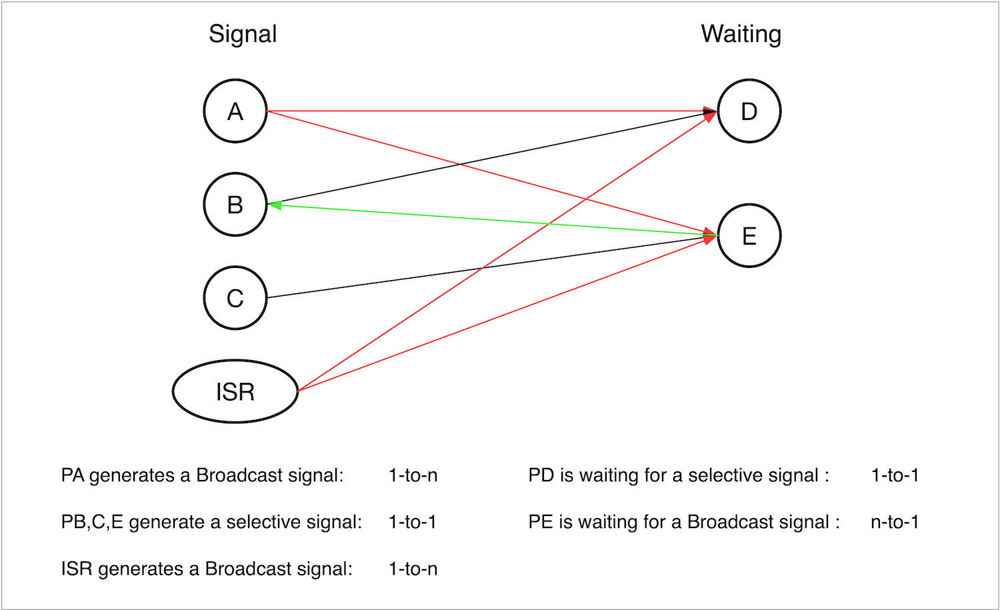

A signal can be managed in the context of a specific process in one of two ways:

1. **Targeted synchronisation:** A signal can be sent **to or from a specific process** by referencing its **process handle**. This allows fine-grained control over which processes are involved in the signalling operation.
2. **Broadcast or ISR context:** Two special handles are reserved to indicate:
   1. A **broadcast** situation, where a signal is sent to **all relevant processes**.
   2. An **ISR context**, where a signal is generated by an **interrupt service routine**, allowing hardware-triggered synchronisation with user processes.

This design ensures that signals are a **lightweight, scalable, and real-time friendly** mechanism for managing synchronisation in systems with complex interdependencies.

```c
// Example of signal usage (referred to the figure)

static void __attribute__ ((noreturn)) Process_A(const void *argument) {
    int32_t      status;
    uint32_t     signal_usb;
    sign_t       *group_usb;

    UNUSED(argument);

    status = kern_createSignalGroup("Group Usb", &group_usb);
    if (status != KERR_KERN_NOERR) {
        exit(EXIT_OS_FAILURE);
    }

    signal_usb = 0x00000001u;

    while (true) {
        kern_suspendProcess(1000u);
        kern_signalSignal(group_usb, signal_usb,
                          KKERN_HANDLE_BROADCAST, \
                          KSIGN_SIGNALE_WITH_CONTEXT_SWITCH);
    }
}

static void __attribute__ ((noreturn)) Process_B(const void *argument) {
    int32_t      status;
    uint32_t     signal_key, signal_mouse;
    sign_t       *group_key, *group_mouse;

    UNUSED(argument);

    while (kern_getSignalGroupById("Group mouse", &group_mouse) != KERR_KERN_NOERR) {
        kern_suspendProcess(1u);
    }
    status = kern_createSignalGroup("Group Key", &group_key);
    if (status != KERR_KERN_NOERR) {
        exit(EXIT_OS_FAILURE);
    }

    signal_key = 0x00000001u;

    while (true) {
        kern_suspendProcess(1000u);
        kern_signalSignal(group_key, signal_key, handle_PD, \
                          KSIGN_SIGNALE_WITH_CONTEXT_SWITCH);
        ...
        signal_mouse = 0x00008000u;
        status = kern_waitSignal(group_mouse, &signal_mouse, handle_PE, 10000u);
    }
}

static void __attribute__ ((noreturn)) Process_C(const void *argument) {
    int32_t      status;
    uint32_t     signal_alarm;
    sign_t       *group_usb;

    UNUSED(argument);

    while (kern_getSignalGroupById("Group Usb", &group_usb) != KERR_KERN_NOERR) {
        kern_suspendProcess(1u);
    }
    signal_alarm = 0x02000000u;

    while (true) {
        kern_suspendProcess(1000);
        kern_signalSignal(group_usb, signal_alarm, handle_PE, \
                          KSIGN_SIGNALE_WITH_CONTEXT_SWITCH);
    }
}

static void __attribute__ ((noreturn)) Process_D(const void *argument) {
    int32_t      status;
    uint32_t     signal_key;
    sign_t       *group_key;

    UNUSED(argument);

    while (kern_getSignalGroupById("Group Key", &group_key) != KERR_KERN_NOERR) {
        kern_suspendProcess(1u);
    }

    while (true) {
        signal_key = 0x0000000u1;
        status = kern_waitSignal(group_key, &signal_key, handle_PB, 10000u);
    }
}

static void __attribute__ ((noreturn)) Process_E(const void *argument) {
    int32_t      status;
    uint32_t     signals;
    sign_t       *group_usb;

    UNUSED(argument);

    while (kern_getSignalGroupById("Group Usb", &group_usb) != KERR_KERN_NOERR) {
        kern_suspendProcess(1u);
    }

    while (true) {
        signals = 0x00008000u | 0x02000000u;
        status = kern_waitSignal(group_usb, &signals, KKERN_HANDLE_BROADCAST, 10000u);
    }
}
```

### Precise signals

In some applications, **software timers** or conventional **waiting mechanisms** do not provide sufficient precision — particularly when dealing with **sub-millisecond delays** or high-frequency events. To address this limitation, **precise signals** are used in µKOS-X, combining the accuracy of a **hardware timer** with the flexibility of the **signal-based synchronisation system**.

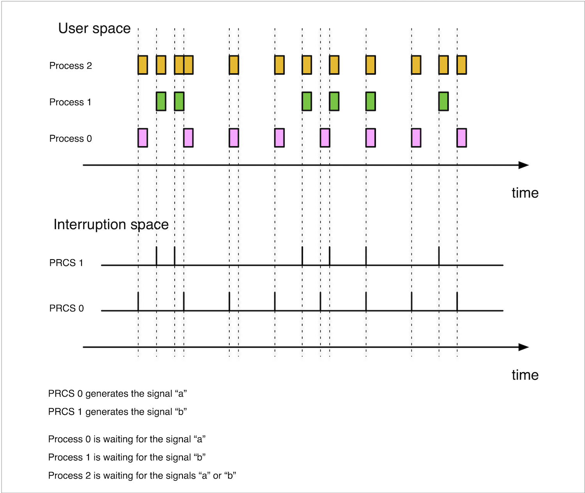

A **precise signal** leverages a **dedicated hardware timer** to trigger a standard µKOS-X **signal**, allowing processes to benefit from both **high-resolution timing** and the **power of the signal infrastructure**. This approach ensures that processes can be synchronised with exact timing, without relying on **interrupt-context callbacks**, which are often discouraged due to their complexity and restrictions. The **signal implementation itself serves as the timing barrier**, ensuring clean and safe synchronisation.

As with software timers, a precise signal can be configured to generate:

1. A **one-shot** signal (single occurrence).
2. A **repeating** signal (continuous synchronisation at a defined interval).

This makes precise signals especially suitable for real-time tasks requiring **deterministic timing**, such as control loops, precise pulse generation, or timed peripheral access.

```c
// Example of signal usage (referred to the figure)
// Use the default signal group (*sigGroup = NULL)

#define KSIGNAL_A   0x1u
#define KSIGNAL_B   0x2u

static prcs_t    *vPrecise_0, *vPrecise_1;

static void __attribute__ ((noreturn)) Process_main(const void *argument) {
    int32_t      status;
    uint32_t     time;
    sign_t       *sigGroup_0, *sigGroup_1;

    UNUSED(argument);

// Create the 2 precise signals

    status = kern_createPreciseSignal(“PRCS 0”, &vPrecise_0);
    if (status != KERR_KERN_NOERR) {
        exit(EXIT_OS_FAILURE);
    }

    status = kern_createPreciseSignal(“PRCS 1”, &vPrecise_1);
    if (status != KERR_KERN_NOERR) {
        exit(EXIT_OS_FAILURE);
    }

// Generate continuous synchros

    *sigGroup_0 = NULL;
    kern_setPreciseSignal(precise_0,
                          sigGroup_0,
                          KKERN_HANDLE_BROADCAST,
                          200u,
                          KPRCS_CONTINUOUS,
                          KSIGNAL_A);

    while (true) {
        ...

// Generate one-shot synchros

        time = xyz
        *sigGroup_1 = NULL;
        kern_setPreciseSignal(precise_0,
                              sigGroup_1,
                              KKERN_HANDLE_BROADCAST,
                              time,
                              KPRCS_SINGLE_SHOT,
                              KSIGNAL_B);
    }
}

static void __attribute__ ((noreturn)) Process_0(const void *argument) {
    uint32_t     signal;
    sign_t       *sigGroup = NULL;

    UNUSED(argument);

    while (true) {
        signal = KSIGNAL_A;
        kern_waitSignal(sigGroup, &signal, KKERN_HANDLE_FROM_ISR, KWAIT_INFINITY);

// Do the precise job
        ...
    }
}

static void __attribute__ ((noreturn)) Process_1(const void *argument) {
    uint32_t     signal;
    sign_t       *sigGroup = NULL;

    UNUSED(argument);

    while (true) {
        signal = KSIGNAL_B;
        kern_waitSignal(sigGroup, &signal, KKERN_HANDLE_FROM_ISR, KWAIT_INFINITY);

// Do the precise job
        ...
    }
}

static void __attribute__ ((noreturn)) Process_2(const void *argument) {
    uint32_t     signal;
    sign_t       *sigGroup = NULL;

    UNUSED(argument);

    while (true) {
        signal = KSIGNAL_A | KSIGNAL_B;
        kern_waitSignal(sigGroup, &signal, KKERN_HANDLE_FROM_ISR, KWAITINFINITY);

// Do the precise job
        ...
    }
}
```

### Statistics and µKernel performances

#### Statistics

The µKOS-X microkernel provides the ability to **measure the actual CPU time** consumed by each process during its normal execution, as well as the time spent by the **µKernel itself during context switching** and other internal operations. This feature enables precise monitoring of **CPU resource distribution** across the system.

Combined with the count of how many times each process has been **scheduled**, this information provides valuable insights into the **real CPU load** and system behaviour under different operating conditions. It can be used for:

1. Performance profiling.
2. Load balancing.
3. Bottleneck analysis.
4. Real-time deadline verification.

All of this runtime data is stored directly within each **process descriptor**, ensuring efficient access and minimal overhead.

```c
struct stts {
    uint64_t    oNbExecutions;    // # of time the process was scheduled
    uint64_t    oNbKernCalls;     // # of time that the kernel was called

    uint32_t    oAvstkSup;        // Available size in the sup. stack
    uint16_t    oTimePMin;        // Min CPU time used by the Process
    uint16_t    oTimePMax;        // Max CPU time used by the Process
    uint16_t    oTimePAvg;        // Avg CPU time used by the Process
    uint64_t    oTimePCum;        // Cum CPU time used by the Process
    uint16_t    oTimeKMin;        // Min CPU time used by the kernel
    uint16_t    oTimeKMax;        // Max CPU time used by the kernel
    uint16_t    oTimeKAvg;        // Avg CPU time used by the kernel
    uint64_t    oTimeECum;        // Cum CPU time used by the kernel
    uint16_t    oTimeEMin;        // Min CPU time used by the Exceptions
    uint16_t    oTimeEMax;        // Max CPU time used by the Exceptions
    uint16_t    oTimeEAvg;        // Avg CPU time used by the Exceptions
    uint64_t    oTimeECum;        // Cum CPU time used by the Exceptions
    };
```

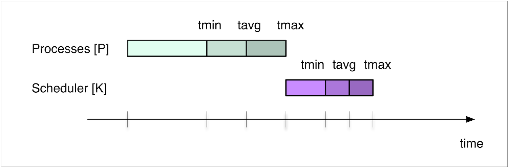
<div class="full_width_table">

| Time                  |                                                       |                                          |
| :-------------------- | :---------------------------------------------------- | :--------------------------------------- |
| Total time CPU in [s] | $$CPUt[s] = \sum_{i=0}^P{(Ptavg_i + Ktavg_i).nexec}$$ | **Ptmin**    min. CPU time used by the P |
| P time CPU in [%]     | $$PCPU[\%] = \frac{(Ptavg.nexec)}{CPUt}.100$$         | **Ptavg**    avg. CPU time used by the P |
| K time CPU in [%]     | $$KCPU[\%] = \frac{(Ktavg.nexec)}{CPUt}.100$$         | **Ptmax**    max. CPU time used by the P |
| P efficiency in [%]   | $$E[\%] = \frac{Ptavg}{Ptavg+Ktavg}.100$$             | **Ktmin**    min. CPU time used by the K |
|                       |                                                       | **Ktavg**    avg. CPU time used by the K |
|                       |                                                       | **Ktmax**    max. CPU time used by the K |
|                       |                                                       | **nexec**    nb. of executions           |

</div>

Sometimes it is useful to measure the CPU time used by a portion of the code. The system call **kern_getTiccount** can be used for this purpose. Here is an example:

```c
static void __attribute__ ((noreturn)) process_1(const void *argument) {
    uint64_t    time[2];
    uint32_t    duration;

    UNUSED(argument);

    while (true) {
        kern_getTiccount(&time[0]);                //
        routineToBeMeasured();                     //
        kern_getTiccount(&time[1]);                //
        duration = (uint32_t)(time[1] - time[0];   // Measure the time
        ...
    }
}
```

#### µKernel performances / measurements

To achieve **optimal system performance**, the **time spent internally by the µKernel** must be kept as **short and deterministic** as possible. The efficiency of µKernel operations directly affects the overall responsiveness and predictability of the system, especially in real-time applications.

The internal execution time of the µKernel is influenced by several key factors:

1. The **algorithms** used for scheduling, synchronisation, and resource management.
2. The **CPU frequency**, which determines the execution speed of all instructions.
3. The **hardware architecture**, including bus width, memory access latency, and the presence of features such as **DMA controllers**.
4. The **interrupt scheme and system activity**, which affect how frequently the µKernel is invoked and how much overhead is introduced by context switches and interrupt handling.

In the µKOS-X implementation, the most critical internal timings of the µKernel are:

1. **Process switching time** – the time required to perform a full context switch from one process to another.
2. **Interrupt Service Routine (ISR) latency** – the delay between a hardware interrupt request and the start of the ISR execution.
3. **Event handling time** – the time taken to post or process a kernel event.
4. **Semaphore/Mutex management time** – the time required to process semaphore acquisition and release (including queue management and scheduling).

These performance metrics were measured on STM32F407 and STM32F746 microcontrollers, running at 168 MHz and 216 MHz, respectively.

##### *The process switching time*

The **µKernel** is responsible for allocating **CPU time slots** to the various processes listed in the **execution (ready) list**. When a condition arises that requires a **context switch** — such as a **process timeout**, **synchronisation event**, or **external signal** — the µKernel determines which process should be granted CPU access during the **next time slice**.

Under normal circumstances, the µKernel selects:

1. The process with the **highest priority** (where a lower numerical value indicates higher priority).
2. If multiple processes share the same priority, the µKernel selects the one that has been **waiting the longest**, ensuring fairness and responsiveness.

To monitor system performance, µKOS-X includes an optional statistics feature, handled by the routine **statistics_statistic()**. This routine collects data such as CPU usage, context switch counts, and execution times.

However, on systems with **limited performance** or **tight real-time constraints**, this feature can be **disabled at compile-time** using a configuration flag. Disabling statistics reduces the **context switching overhead**, thereby improving the system’s reactivity and execution efficiency.

<div class="full_width_table">

| **Routine**             | **Function**         | **cortex-M4F (168-MHz)** | **cortex-M4F (168-MHz)** | **cortex-M7F (216-MHz)** | **cortex-M7F (216-MHz)** |
| :---------------------- | :------------------- | :----------------------- | :----------------------- | :----------------------- | :----------------------- |
|                         |                      | **t [µs]**               | **t [µs]**               | **t [µs]**               | **t [µs]**               |
| Save the context        |                      | 0.16                     | 0.3                      | 0.11                     | 0.21                     |
| scheduler_changeContext |                      | 2.9                      | 2.9                      | 1.2                      | 1.2                      |
|                         | _nextAction          |                          |                          |                          |                          |
|                         | _getPriority         |                          |                          |                          |                          |
|                         | statistics_statistic |                          |                          |                          |                          |
| Restore the context     |                      | 0.16                     | 0.3                      | 0.11                     | 0.21                     |
| Total tsw               |                      | 3.22                     | 3.5                      | 1.42                     | 1.62                     |

</div>

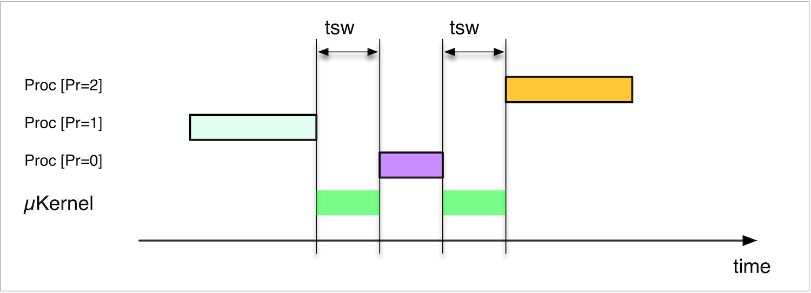

##### *The ISR latency time*

**Interrupt latency** refers primarily to the **software interrupt handling latency** — the time elapsed between the occurrence of an **external hardware interrupt** and the start of its actual servicing by the appropriate **Interrupt Service Routine (ISR)**.

In µKOS-X, **peripheral interrupts** are assigned a **higher priority** than µKernel-level interrupts. This design choice ensures that **peripheral devices** receive prompt attention, allowing faster **reaction times** and fulfilling real-time hardware requirements more effectively.

When necessary, a peripheral ISR can interact with the µKernel by sending **messages via synchronisation events or semaphores**. This allows hardware events to **trigger higher-level process behaviour** in a safe and efficient way.

To maintain such responsiveness, it is important to **avoid globally masking all interrupt levels**. Under normal operating conditions, **interrupt latency is kept very low** — typically just the time needed to:

1. Save scratch (volatile) registers.
2. **Enter and execute** the appropriate ISR code.

In the following example, taken from the **urt0** manager, the interrupt routine is broken down into two main phases:

1. The **first dashed block** highlights the **overhead section**, which is responsible for recovering the necessary context (e.g. registers, state) prior to executing the main ISR logic.
2. The **second dashed block** shows the **exit phase**, where the system **restores the used registers** and returns from the interrupt, allowing the main system or µKernel to resume execution.

<div class="full_width_table">

|         | **cortex-M4F (168-MHz)** |               | **cortex-M7F (216-MHz)** |               |
| :------ | :----------------------- | :------------ | :----------------------- | ------------- |
|         | **tint min [µs]**        | **tret [µs]** | **tint min [µs]**        | **tret [µs]** |
| Latency | >= 0.04                  | >= 0.04       | >= 0.02                  | >= 0.02       |

</div>

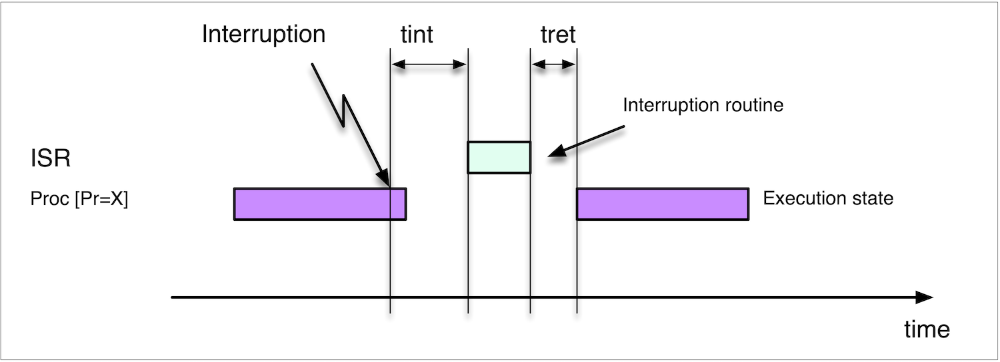

It is evident that the latency time **tint** can be higher, if for any reason, the current process is under **INTERRUPTION_OFF** state.

##### *The the semaphore and the mutex shuffling time*

In a **real-time operating system (RTOS)**, **semaphores** and **mutexes** are commonly used to protect **critical resources** and to manage **synchronisation** between concurrent tasks. These primitives ensure that only one process at a time accesses shared data or hardware, preventing race conditions and data corruption.

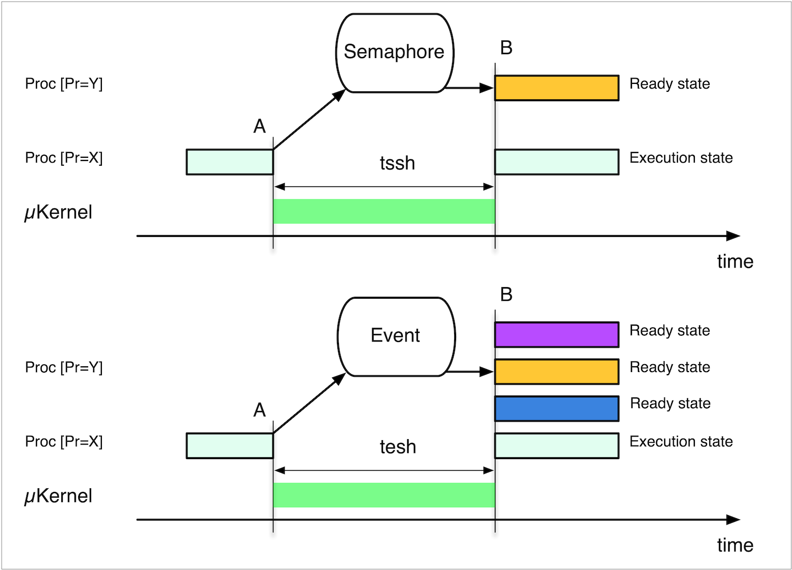

In parallel, **events** serve as a lightweight and efficient mechanism for **fast synchronisation** between **hardware (e.g. interrupt service routines)** or other processes, and **one or more waiting processes**. Events are particularly useful when immediate responsiveness is required without the overhead of complex locking mechanisms.

In both scenarios — whether using a semaphore/mutex or an event — the **shuffling time** refers to the time taken by the µKernel to:

1. **Process the synchronisation request** (e.g. semaphore release or event signal).
2. **Move the waiting processes** from the **suspended list** to the **ready (execution) list**, allowing them to be scheduled by the kernel.

<div class="full_width_table">

| **Shuffling**        | **cortex-M4F (168-MHz)** |               | **cortex-M7F (216-MHz)** |               |
| :------------------- | :----------------------- | :------------ | :----------------------- | :------------ |
| **Functions**        | **tesh [µs]**            | **tssh [µs]** | **tesh [µs]**            | **tssh [µs]** |
| Semaphores / Mutexes | 6.5                      | 6.5           | 4.9                      | 4.9           |

</div>

<div class="full_width_table">

| Shuffling                                              | **cortex-M4F (168-MHz)** |             | **cortex-M7F (216-MHz)** |             |
| :----------------------------------------------------- | :----------------------- | :---------- | :----------------------- | :---------- |
| **Functions**                                          | **t [µs]**               | **CPU [%]** | **t [µs]**               | **CPU [%]** |
| Interruption Fast (1-ms)                               | 1.2                      | 0.12        | 0.9                      | 0.09        |
| Timeout process (20-ms)                                | 3.22                     | 0.016       | 2.5                      | 0.0123      |
| Daemon Timeout processes (5-ms)                        | 3.2                      | 0.064       | 2.48                     | 0.048       |
| Daemon Stack sanity (500-ms) Stack size 800 long words | 3.5                      | ~ 0         | 2.52                     | ~ 0         |

</div>

### Customisation by stubs

The µKOS-X **µKernel** is designed to be **easily portable** to other **platforms or CPU architectures** through the use of a single **stub module**, which encapsulates all the necessary **low-level operations**. This stub is responsible for handling key platform-dependent features such as:

1. Timer interrupts.
2. Stack frame initialisation.
3. Trap-based synchronisation mechanisms.

To support this customisation, the µKOS-X µKernel exposes **seven dedicated routines**, which must be implemented or adapted for each target platform. These routines form the essential interface between the hardware and the kernel core.

Functions prefixed with **kernel_xyz** represent model-specific implementations and are not intended to be called directly. Instead, developers should use the corresponding **kern_xyz** functions as defined in the µKernel API. This abstraction ensures consistent usage and compatibility across different platforms and configurations.

```c
    void model_kernel_init(void)
        Some initialisations.

    void model_kernel_runKernel(void)
        Initialize all the timers (1-ms & 20-ms and time-stamp).
        Enable the time sharing and all the uKernel interruptions.

    void model_kernel_setLowPower(void)
        Set the low power mode.

    void model_kernel_setPreciseSignal(prcs_t *handle)
        Generate precisely a signal (1-µs resolution).

    void kernel_getTicCount(uint64_t *tickCount)
        Initialize and prepare the stack frame for a process.

    void model_kernel_newProcessTimeout(void)
        Start a new process timeout.

    void model_kernel_stopProcessTimeout(void)
        Stop the process timeout.
```

### Groups of functions of the µKernel (families of system calls)

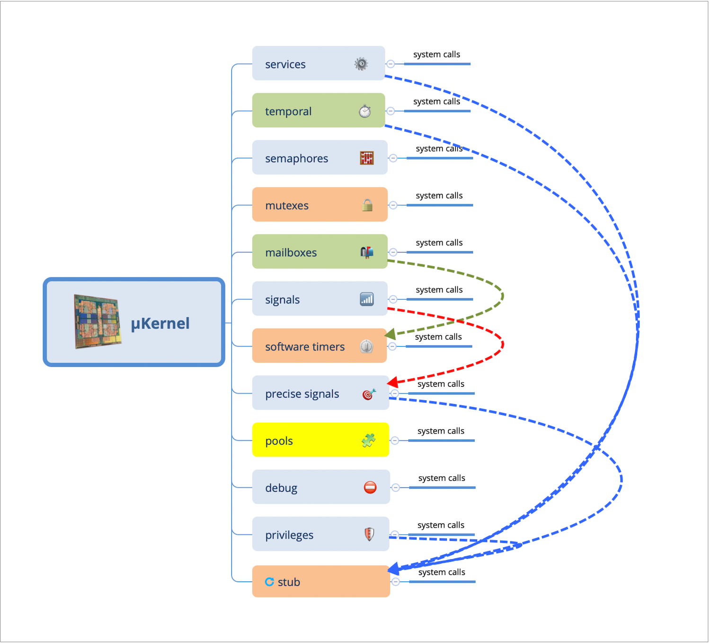

From the programmer’s perspective, the **µKernel** is organised into distinct groups of functions. These groups, also referred to as **families of system calls**, provide structured access to the services required to manage both the **µKernel** itself and user-level applications.

In total, **eleven functional groups** are defined, each responsible for a specific category of system-level functionality:

1. ⚙️ **Services** – Basic system operations such as task creation, deletion, and control.
2. ⏱️ **Temporal** – Time management functions, including delays, timeouts, and clock services.
3. 🧮 **Semaphores** – Counting synchronisation primitives for coordinating access to shared resources.
4. 🔒 **Mutexes** – Mutual exclusion mechanisms to ensure exclusive access to critical sections.
5. 📬 **Mailboxes** – Inter-process communication (IPC) through buffered message-passing.
6. 📶 **Signals** – Lightweight notification mechanisms for task synchronisation or alerts.
7. ⏲️ **Software Timers** – Timers managed by the software to trigger events after specific intervals.
8. 🎯 **Precise Signals** – Deterministic signalling mechanisms, often used in real-time contexts requiring high timing accuracy.
9. 🧩 **Pools** – Management of fixed-size memory or object pools for efficient resource allocation.
10. ⛔ **Debug** – Control over task suspension, termination, or pausing of execution.
11. 🛡️ **Privileges** – Management of access rights and system permissions to enforce security and isolation.

This modular organisation allows for a **lightweight, robust, and scalable kernel**, where each component can be independently maintained, extended, or replaced, offering significant advantages in embedded and real-time systems.

<div class="full_width_table">

| **Service System Calls**         |                                                           |
| :------------------------------- | :-------------------------------------------------------- |
| kern_init                        | Initialize the “kern” manager                             |
| kern_runKernel                   | Start the multi-process                                   |
| kern_criticalSection             | Enter - Exit of a critical section                        |
| kern_setSerialForProcess         | Set the default serial device for a process               |
| kern_getSerialForProcess         | Get the default serial device of a process                |
| kern_getState                    | Get the state of the µKernel                              |
| kern_createProcess               | Create and install a process                              |
| kern_killProcess                 | Kill a process                                            |
| kern_setPriority                 | Set a new static priority for a process                   |
| kern_getPriority                 | Get the static priority of a process                      |
| kern_getProcessById              | Get the process by its identifier                         |
| kern_getProcessRun               | Get the process of the running one                        |
| kern_installCallBack             | Install a callback routine                                |
|                                  |                                                           |
| **Temporal System Calls**        |                                                           |
| kern_suspendProcess              | Suspend the process for a time                            |
| kern_setNewTimeout               | Set a new internal timeout without to suspend the process |
| kern_resumeProcessWithTimeout    | Resume a process with timeout                             |
| kern_readRemainingProcessTimeout | Read the remaining timeout of a process                   |
| kern_switchFast                  | Force the context switching                               |
| kern_readTickCount               | Read the “tickCount” from the start of the µKernel        |
| kern_waitAtLeast                 | Wait for a short time (at least ... a certain time)       |
| kern_hasPendingTimeoutProcesses  | Check the pending timeout of a process                    |
|                                  |                                                           |
| **Semaphore System Calls**       |                                                           |
| kern_createSemaphore             | Create a semaphore                                        |
| kern_signalSemaphore             | Signal an event                                           |
| kern_waitSemaphore               | Waiting for an event                                      |
| kern_killSemaphore               | Kill a semaphore                                          |
| kern_restartSemaphore            | Restart a semaphore                                       |
| kern_getSemaphoreById            | Get the semaphore by its identifier                       |
|                                  |                                                           |
| **Mutex System Calls**           |                                                           |
| kern_createMutex                 | Create a mutex                                            |
| kern_unlockMutex                 | Unlock the mutex                                          |
| kern_lockMutex                   | Lock the mutex                                            |
| kern_killMutex                   | Kill a mutex                                              |
| kern_restartMutex                | Restart a mutex                                           |
| kern_getMutexById                | Get the mutex by its identifier                           |
|                                  |                                                           |
| **Mailbox System Calls**         |                                                           |
| kern_createMailbox               | Create a mailbox                                          |
| kern_setMailbox                  | Set a mailbox                                             |
| kern_writeMailbox                | Write a message to the mailbox                            |
| kern_writeQueue                  | Write a message in the queue                              |
| kern_readMailbox                 | Read a message from the mailbox                           |
| kern_readQueue                   | Read a message from the queue                             |
| kern_killMailbox                 | Kill a mailbox                                            |
| kern_getMailboxById              | Get the mailbox by its identifier                         |
|                                  |                                                           |
| **Signal System Calls**          |                                                           |
| kern_createSignalGroup           | Create a signal group                                     |
| kern_createBitSignal             | Create a bit signal                                       |
| kern_signalSignal                | Signal a signal                                           |
| kern_waitSignal                  | Waiting for a signal                                      |
| kern_getWaitingSignalMask        | Get the mask of a waiting signals                         |
| kern_clearPendingSignal          | Clear the pending signal                                  |
| kern_killSignalGroup             | Kill a signal group                                       |
| kern_killBitSignal               | Kill a bit signal                                         |
| kern_getSignaGrouplById          | Get the signal group by its identifier                    |
|                                  |                                                           |
| **Software timer System Calls**  |                                                           |
| kern_createSoftwareTimer         | Create a software timer                                   |
| kern_setSoftwareTimer            | Set a software timer                                      |
| kern_killSoftwareTimer           | Kill a software timer                                     |
| kern_getSoftwareTimerById        | Get the software timer by its identifier                  |
|                                  |                                                           |
| **Precise signals System Calls** |                                                           |
| kern_createPreciseSignal         | Create a precise signal                                   |
| kern_setPreciseSignal            | Set a precise signal                                      |
| kern_killPreciseSignal           | Kill a precise signal                                     |
| kern_getPreciseSignalById        | Get the precise signal by its identifier                  |
|                                  |                                                           |
| **Pool System Calls**            |                                                           |
| kern_createPool                  | Create a memory pool                                      |
| kern_setPool                     | Set a memory pool                                         |
| kern_allocateBlock               | Allocate a memory block                                   |
| kern_deAllocate                  | Deallocate a memory block                                 |
| kern_killPool                    | Kill a memory pool                                        |
| kern_getPoolById                 | Get the memory pool by its identifier                     |
|                                  |                                                           |
| **Debug System Calls**           |                                                           |
| kern_stopProcess                 | Stop a process (descheduled)                              |
| kern_reactivateProcess           | Reactivate the process                                    |
|                                  |                                                           |
| **SPrivilege System Calls**      |                                                           |
| kern_setPrivilegeMode            | Set a privilege for a process                             |
| kern_privilegeElevate            | Elevate a privilege                                       |

</div>

## References

1. **David Décotigny,** “Une infrastructure de simulation modulaire pour l’ évaluation de performances de systèmes temps-réel”, Thèse de doctorat de l’Université de Rennes 1, 2003.
2. **Larisa Rizvanovic,** “Comparison between Real Time Operating Systems in Hardware and Software”, Thesis presented to Mälardalens University, 2001.
3. **J. Stankovic, M. Spuri, M. DiNatale, and G. Buttazzo,** “Implications of classical scheduling results for real-time systems”, Technical Report UM- CS-1994-089, U. Mass, 1994.
4. **A. Colin and I. Puaut,** “Analyse de temps d’exécution au pire cas du système d’exploitation temps-réel RTEMS”, In Seconde Conférence Française sur les Systèmes d’Exploitation (CFSE2), pages 73–84, April 2001.
5. **G. Buttazzo and J. Stankovic,** “Red: Robust earliest deadline scheduling”, In Proceedings of the International Workshop on Responsive Computing Systems, 1993.
6. **Reeves, Glenn,** "What Really Happened on Mars?", Risks-Forum Digest, Volume 19: Issue 58, January 1998.
7. **Sha L., R. Rajkumar, and J.P. Lehoczky,** "Priority Inheritance Protocols: An Approach to Real-Time Synchronization", IEEE Transactions on Computers, September 1990, p. 1175.
8. **Kalinsky, David and Michael Barr,** "Priority Inversion" Embedded Systems Programming, April 2002, pp. 55-56.
9. **Jerry Farmer,** "A Real-Time Operating System for PICmicroTM Microcontrollers" Microchip AN585 1997.
10. **Keil Software,** "RTX51 Tiny, 8051 Real-Time OS" Keil Software, 1995.

## Links

[GNU](https://gcc.gnu.org)

[Newlib](https://sourceware.org/newlib/)

[Embedded](https://www.embedded.com)

[An Introduction to the GNU Compiler and Linker](https://gcc.gnu.org/wiki/Building_Cross_Toolchains_with_gcc?action=AttachFile&do=get&target=billgatliff-toolchains.pdf)
