# 🧩  The cortex H7F

## The Krampus_H743 board (cortex-H7F )

- STM32H743 cortex-H7F 400-MHz µController.
- 64-MBytes of SDRam (32-M x 16-bits).
- 8-MBytes of SPI FLASH.
- VIP - Extension bus.
- WROOM - Extension bus
- 3 serial interfaces + JTAG (via FTDI).
- Battery for the RTC.
- 8 LEDs & Configuration HEXA switches.
- DC/DC on board (Power-in up to 5.5-V).
- Battery charger
- High speed SPI (50-MHz) via FTDI.
- µSDCard interface.

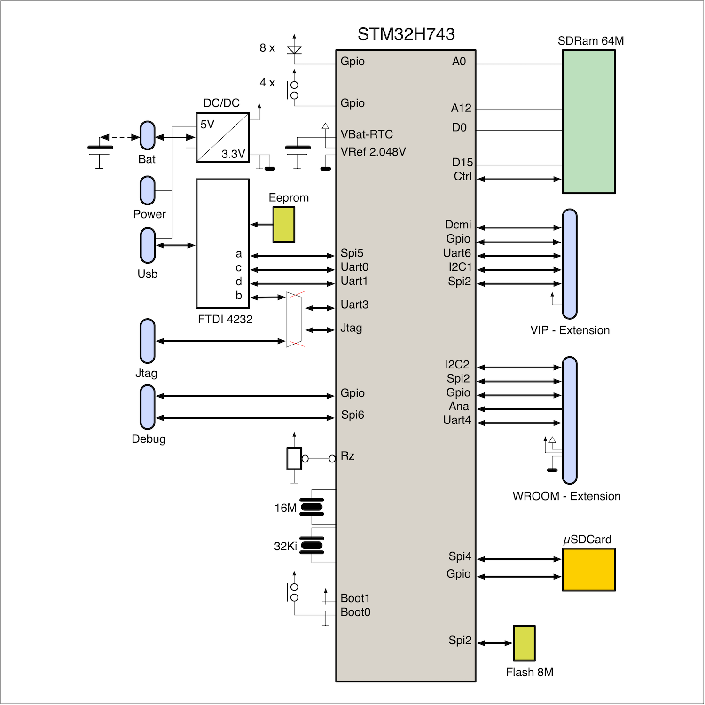

## The CPU unit

STM32H743 Microcontroller Overview. The **STM32H743** microcontroller is based on the **high-performance Arm® Cortex®-M7F** 32-bit RISC core, operating at frequencies of up to **400- MHz**. It is designed for demanding embedded applications that require both high computational performance and rich peripheral integration.

🧠 **Core Features:**

1. Cortex-M7F processor, featuring:
   1. Single- and double-precision **Floating Point Unit (FPU).**
   2. Support for all ARM data types and floating-point instructions.
   3. A comprehensive set of DSP (Digital Signal Processing) instructions.
   4. An integrated **Memory Protection Unit (MPU)** to enhance system security and task isolation.

🗃️ **Embedded Memory:**

1. Up to 2 -MB of Flash memory.
2. Up to **1 -MB of SRAM**, including multiple RAM banks for deterministic access.
3. Support for **zero-wait-state execution** from tightly coupled memory (TCM).

🔌 **Bus Architecture:**

1. Dual **APB buses** (Advanced Peripheral Bus).
2. Dual **AHB buses** (Advanced High-performance Bus).
3. A **32-bit multi-layer AHB bus matrix** for high-throughput parallelism and peripheral access.

🔍 **Analogue and Timing Resources:**

1. **3 × 12-bit ADCs** (Analogue-to-Digital Converters).
2. **2 × DACs** (Digital-to-Analogue Converters).
3. 1 × low-power RTC (Real-Time Clock).
4. 12 × general-purpose 16-bit timers, including PWM support.
5. 2 × 32-bit general-purpose timers.
6. Integrated True Random Number Generator (TRNG).

📡 **Communication Interfaces:**

1. Standard and advanced communication peripherals, including:
   1. USART, UART, SPI, I²C, I²S.
   2. CAN, USB OTG, SDIO, and Ethernet.
   3. Flexible memory controller (FMC) for external memory access.

🧩 **Key Benefits:**

1. Powerful compute and DSP performance for signal processing and control.
2. Secure execution environment with MPU.
3. Rich analogue and digital interfacing for mixed-signal applications.
4. Ideal for real-time control, motor drive, audio processing, and IoT edge devices.

Advanced Peripherals and Integration. The **STM32H743** microcontroller includes a range of **advanced peripherals** designed to support high-performance and feature-rich applications:

1. 📦 **SDIO interface** – for direct connection to SD and MMC memory cards.
2. 🔁 **Enhanced Flexible Static Memory Controller (FMC)** – enabling interfacing with external SRAM, NOR, NAND, and PSRAM memory devices.
3. 📷 **Camera Interface (DCMI)** – supporting **CMOS image sensors**, ideal for computer vision, image capture, or video streaming applications.

These integrated peripherals significantly reduce the need for external components, allowing for a **dramatic reduction in system Bill of Materials (BoM)**, while also saving board space and simplifying hardware design.

The **STM32H743** is a **complex and versatile microcontroller**, engineered for sophisticated embedded systems that demand a high level of integration, performance, and flexibility.

**The block diagram of the device is shown below**, illustrating the internal architecture and peripheral interconnections. These features make the STM32H743 an excellent choice for applications such as industrial control, embedded vision, audio processing, and high-speed data logging.

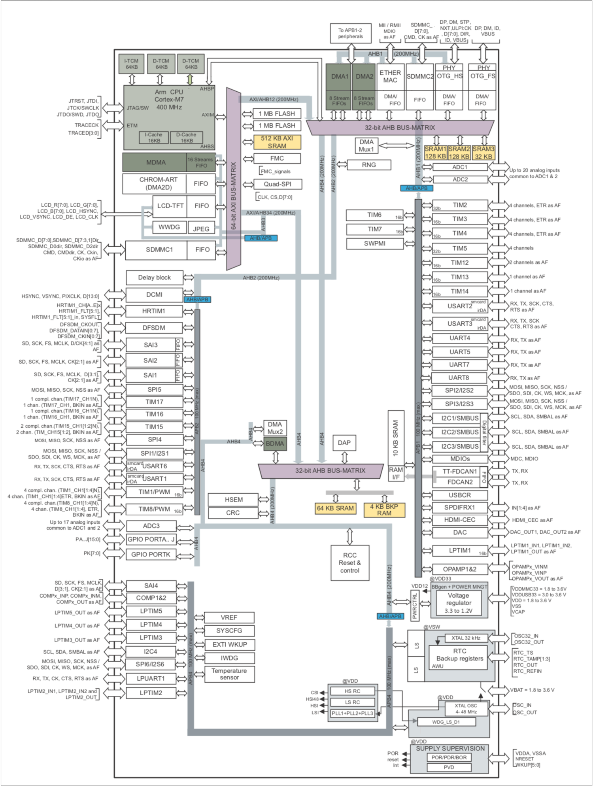

## Pins / interfaces configuration

Pin-to-Function Interconnection Matrix. The microcontroller includes a **Pin-to-Function interconnection matrix**, offering exceptional flexibility in system design and **PCB layout optimisation**. This feature enables developers to **assign peripheral functions to various physical pins**, helping to simplify routing and reduce design constraints.

🧩 **Key Capabilities:**

1. Multiplexed pin functions: Nearly every I/O pin can act either as a general-purpose GPIO or be mapped to a specific peripheral signal (e.g. UART, SPI, I²C, timers, etc.).
2. Electrical characteristics configuration:
   1. Internal pull-up or pull-down resistors.
   2. Push-pull or open-drain output modes.
   3. Slew rate control (fast or slow switching).
   4. Digital or analogue mode selection.

1. Pin configuration is handled through the Alternate Function I/O (AFIO) registers or the STM32 HAL libraries (e.g. via GPIO_InitTypeDef structures).

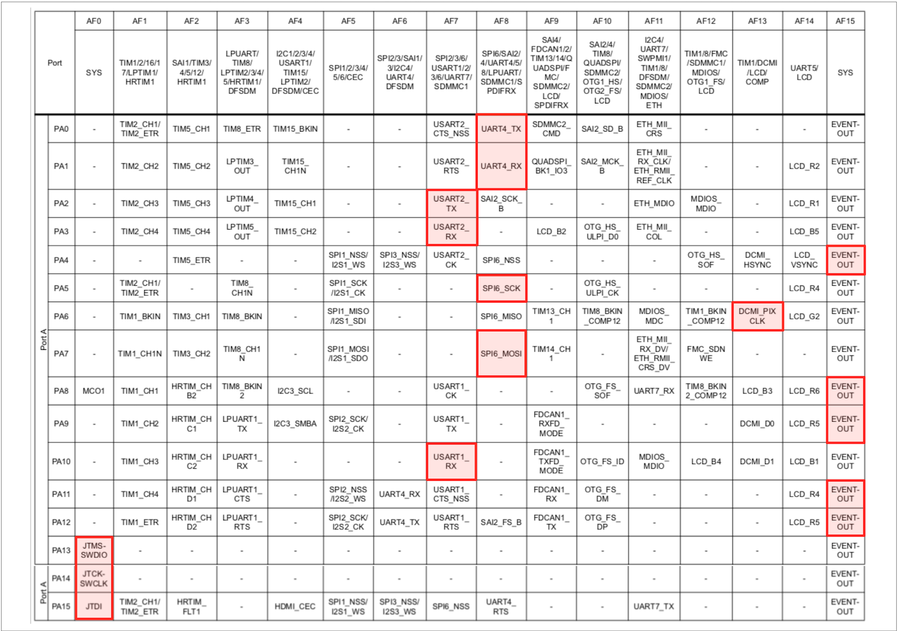

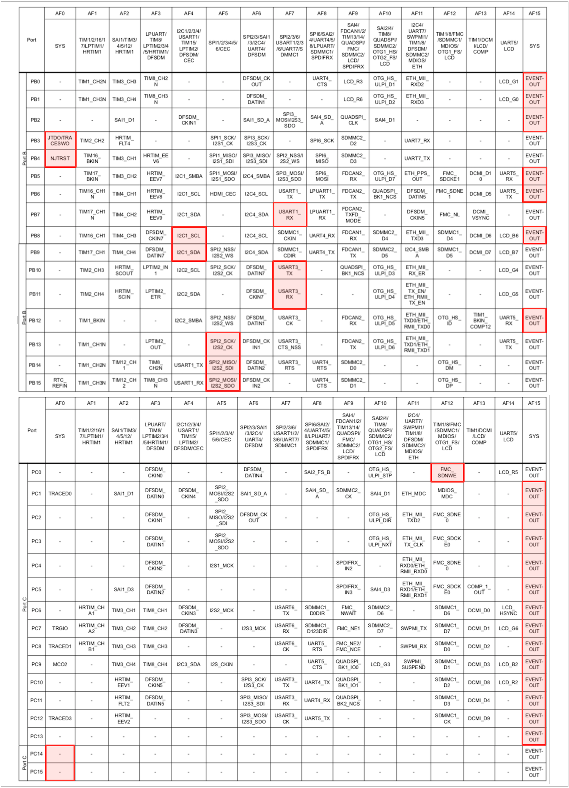

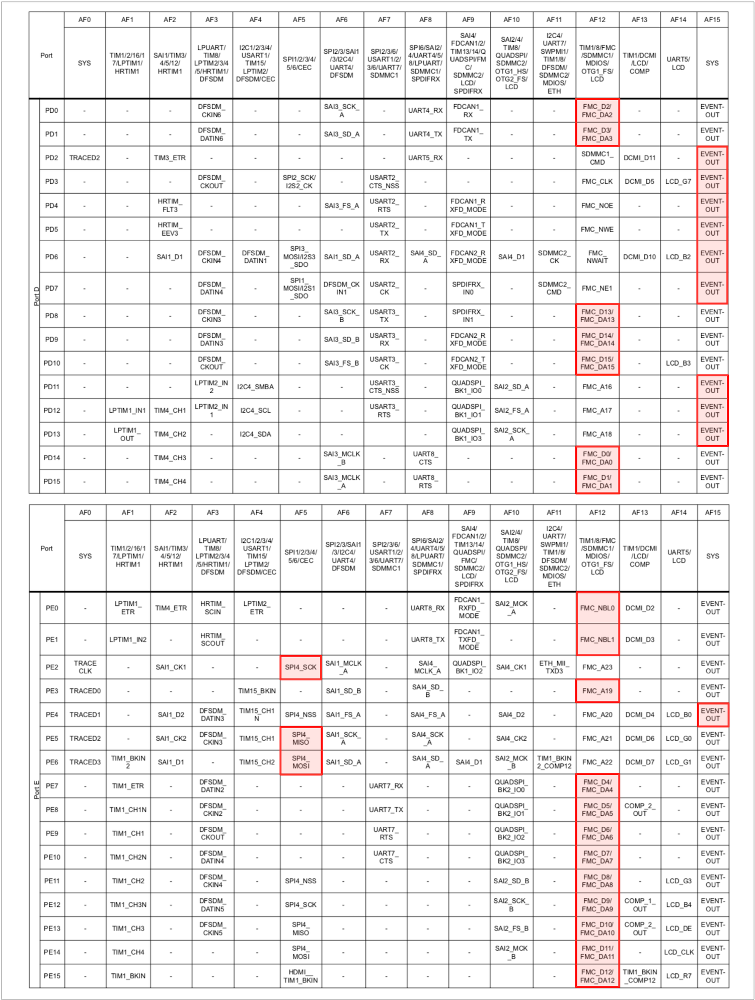


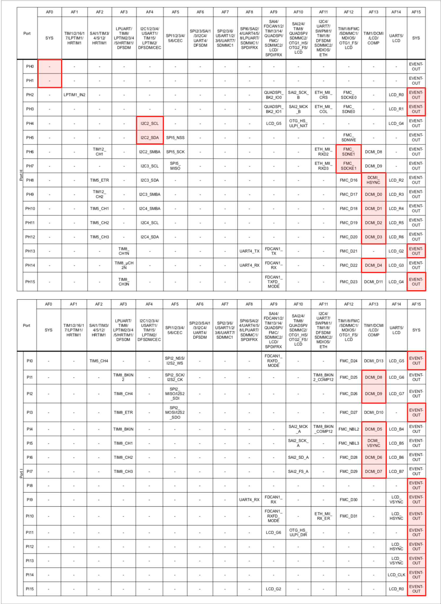

## PCB and the interfaces

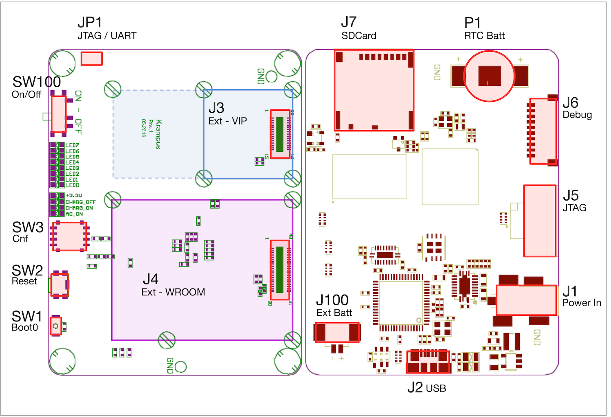

### The power supply

The **Krampus-H743** board supports flexible power input options and integrates intelligent power management to ensure stable operation across a variety of use cases.

**Power Input Range:**

1. The board can be powered by a supply voltage in the range of **4.2 -V to 5.5- V**.

🔋 **Power Management Features:**

1. An on-board **DC/DC converter** efficiently regulates the input voltage to generate the required supply rails for the microcontroller and peripherals.
2. Integrated **battery charging circuitry** supports external rechargeable battery sources.

🔌 **Primary Power Input Sources:**

1. **USB (Connector J2)** – suitable for development, debugging, or powering via a host computer.
2. Wall-mounted power adapter (Connector J1) – standard barrel jack input.
3. **External battery (Connector J100)** – for portable or untethered applications.

🕒 **Real-Time Clock Backup:**

1. A small **1.5 V on-board battery** (connected via **P1**) is used to **maintain the RTC (Real-Time Clock)**, preserving absolute time and calendar values during main power loss.

The power system is designed for **redundancy and flexibility**, making the board suitable for embedded, mobile, or industrial applications.
 Proper power source selection ensures safe battery charging and uninterrupted system operation.

### JTAG and the (FTDI) communications

The **Krampus-H743** board provides multiple options for **programming, debugging**, and **serial communication**, ensuring full compatibility with standard development tools.

🔧 **JTAG Interface:**

1. The **JTAG connection** is available via:
   1. FTDI USB interface through the FTDI port B.
   2. A standard 10-pin header (Connector J5).

1. This interface is used for:

1. Programming the internal Flash memory via OpenOCD.
2. Interactive debugging through **GDB (GNU Debugger).**

🔄 **USB/FTDI UART Channels:**

1. The USB/FTDI interface (via **Connector J2**) provides **three UART channels (2 + 1)** for communication:
   1. **UART2** → logically mapped to **KURT0.**
   2. **UART3** → logically mapped to **KURT1.**
   3. **UART1** → optionally mapped to **KURT2**, if **jumper JP1** is correctly positioned.

These UART channels allow flexible connectivity for data logging, command-line interfacing, or communication with external systems.

🧩 **Use Cases:**

1. Code flashing and debugging over JTAG using **OpenOCD + GDB.**
2. Serial console output during development.
3. Host-device communication (e.g. sending commands, telemetry, or diagnostics).

<div class="full_width_table">

|                   | **Function** | **JP1** | **Connector** | **cortex-H7F** | **µKernel** |                   |
| :---------------- | :----------- | :------ | :------------ | :------------- | :---------- | :---------------- |
| **FTDI chip**     |              |         |               | **Physical**   | **Logical** | **µKernel**       |
| FT-4232 Channel a | 50-MHz SPI   | -       | J2 micro usb  | SPI5           | XFER        | Viewer (imager)   |
| FT-4232 Channel b | JTAG         | JTAG    | J2 micro usb  | JTAG           | -           | -                 |
| FT-4232 Channel b | UART         | UART    | J2 micro usb  | UART1          | UART2       | Console           |
| FT-4232 Channel c | UART         | -       | J2 micro usb  | UART2          | KURT0       | Console (default) |
| FT-4232 Channel d | UART         | -       | J2 micro usb  | UART3          | KURT1       | Console           |

</div>

### The VIP board connector

The **J3** connector provides an extension interface designed to support peripherals and modules developed for the **Vision In Package (VIP)** system.

🧠 **Interface Features:**

1. 🔲 **4 × GPIOs** – general-purpose I/O lines for digital signalling or user-defined control.
2. 🔄 **1 × UART** – serial communication interface.
3. 🔁 **1 × SPI** – Serial Peripheral Interface for high-speed synchronous communication.
4. 🔄 **1 × I²C** – Inter-Integrated Circuit interface for connecting sensors and peripherals.
5. 📷 **1 × DCMI** – Digital Camera Interface for direct connection to CMOS image sensors.

All lines on the **J3 bus** are **multiplexed** and can be **reconfigured** via software to serve **alternative functions** as needed. This flexibility makes the J3 connector ideal for prototyping, extension modules, or application-specific hardware.

🧩 **Use Cases:**

1. Integrating VIP-compatible imaging or vision modules.
2. Adding external sensors, displays, or actuators.
3. Creating plug-in daughterboards for feature expansion.

Designed to simplify **hardware modularity** and **system expansion.** Software-controlled pin multiplexing allows complete customisation of the J3 interface.

<div class="full_width_table">

|               | **Function** | **Connector** | **cortex-H7F** | **µKernel** |             |
| :------------ | :----------- | :------------ | :------------- | :---------- | :---------- |
|               |              |               | **Physical**   | **Logical** | **µKernel** |
| Power supply  | 3.3-V        | J3 - 1, 2     | -              | -           | -           |
| Power supply  | GND          | J3 - 29, 30   | -              | -           | -           |
| OI_V_0        | GPIO (out)   | J3 - 3        | GPIO - H2      | CLK_EN      | img0        |
| OI_V_1        | GPIO (out)   | J3 - 4        | GPIO - H3      | DEN_A/G     | imu         |
| OI_V_2        | GPIO (out)   | J3 - 5        | GPIO - I10     | STANDBY     | img0        |
| OI_V_3        | GPIO (out)   | J3 - 6        | GPIO - I11     | EXPOSURE    | img0        |
| I2C_SDA       | I2C          | J3 - 7        | I2C1           | -           | i2c0        |
| I2C_CLK       | I2C          | J3 - 8        | I2C1           | -           | i2c0        |
| SPI - CLK     | SPI          | J3 - 9        | SPI2           | -           | imu         |
| /SPI - CS     | SPI          | J3 - 10       | GPIO - F10     | /SELMAGNETO | imu         |
| SPI - MOSI    | SPI          | J3 - 11       | SPI2           | -           | imu         |
| SPI - MISO    | SPI          | J3 - 12       | SPI2           | -           | imu         |
| TXD           | UART         | J3 - 27       | UART6          | /SELGYRO    | imu         |
| RXD           | UART         | J3 - 28       | UART6          | /IRQIMU     | imu         |
| DCMI - PIXCLK | DCMI         | J3 - 13       | DCMI           | PIXEL_CLK   | img0        |
| DCMI - HSYNC  | DCMI         | J3 - 25       | DCMI           | HSYNC       | img0        |
| DCMI - VSYNC  | DCMI         | J3 - 26       | DCMI           | VSYNC       | img0        |
| DCMI - D0     | DCMI         | J3 - 15       | DCMI           | D0          | img0        |
| DCMI - D1     | DCMI         | J3 - 16       | DCMI           | D1          | img0        |
| DCMI - D2     | DCMI         | J3 - 14       | DCMI           | D2          | img0        |
| DCMI - D3     | DCMI         | J3 - 17       | DCMI           | D3          | img0        |
| DCMI - D4     | DCMI         | J3 - 18       | DCMI           | D4          | img0        |
| DCMI - D5     | DCMI         | J3 - 19       | DCMI           | D5          | img0        |
| DCMI - D6     | DCMI         | J3 - 20       | DCMI           | D6          | img0        |
| DCMI - D7     | DCMI         | J3 - 21       | DCMI           | D7          | img0        |
| DCMI - D8     | DCMI         | J3 - 22       | DCMI           | D8          | img0        |
| DCMI - D9     | DCMI         | J3 - 23       | DCMI           | D9          | img0        |
| /RESET        | System       | J3 - 24       | System         | /Reset      | -           |

</div>

### The Extension board connector

**J4** allows to connect various extension interfaces. This extension bus is composed of 15 x GPIOs, 1 x UART, 1 x SPI, 1 x i2C, 2 x Analog inputs. Of course, all the bus lines can be reconfigured for other purposes.

<div class="full_width_table">

|                  | **Function** | **Connector**                 | **cortex-H7F** | **µKernel** |             |
| :--------------- | :----------- | :---------------------------- | :------------- | :---------- | :---------- |
|                  |              |                               | **Physical**   | **Logical** | **µKernel** |
| Power supply     | 3.3-V        | J4 - 1, 2                     | -              | -           | -           |
| Power supply     | GND          | J4 - 3, 6, 16, 18, 20, 39, 40 | -              | -           | -           |
| Analog reference | 2.048-V      | J4 - 7, 8                     | -              | -           | -           |
| ANA0             | Analog In    | J4 - 19                       | GPIO - C1      | -           | -           |
| ANA1             | Analog In    | J4 - 20                       | GPIO - C2      | -           | -           |
| IO_W_0           | GPIO (In)    | J4 - 25                       | GPIO - D2      | TX - WROOM  | wfi0        |
| IO_W_1           | GPIO (In)    | J3 - 10                       | GPIO - D3      | CTS - WROOM | wfi0        |
| IO_W_2           | GPIO (In)    | J3 - 11                       | GPIO - D4      | -           | -           |
| IO_W_3           | GPIO (In)    | J3 - 12                       | GPIO - D5      | -           | -           |
| IO_W_4           | GPIO (In)    | J4 - 35                       | GPIO - D6      | -           | -           |
| IO_W_5           | GPIO (In)    | J3 - 34                       | GPIO - D7      | -           | -           |
| IO_W_6           | GPIO (In)    | J3 - 27                       | GPIO - D11     | -           | -           |
| IO_W_7           | GPIO (In)    | J3 - 26                       | GPIO - D12     | -           | -           |
| OI_W_0           | GPIO (Out)   | J4 - 31                       | GPIO - G3      | RTS - WROOM | wfi0        |
| OI_W_1           | GPIO (Out)   | J4 - 29                       | GPIO - G6      | BOOT_ WROOM | wfi0        |
| OI_W_2           | GPIO (Out)   | J4 - 30                       | GPIO - G7      | BE - WROOM  | wfi0        |
| OI_W_3           | GPIO (Out)   | J4 - 13                       | GPIO - G9      | -           | -           |
| OI_W_4           | GPIO (Out)   | J4 - 33                       | GPIO - G10     | -           | -           |
| OI_W_5           | GPIO (Out)   | J4 - 32                       | GPIO - G11     | -           | -           |
| OI_W_6           | GPIO (Out)   | J4 - 28                       | GPIO - I0      | -           | -           |
| OI_W_7           | GPIO (Out)   | J4 - 9                        | GPIO - I3      | -           | -           |
| I2C_SDA          | I2C          | J4 - 15                       | I2C2           | -           | i2c1        |
| I2C_CLK          | I2C          | J4 - 14                       | I2C2           | -           | i2c1        |
| SPI - CLK        | SPI          | J4 - 36                       | SPI2           | -           | wfi0        |
| /SPI - CS        | SPI          | J4 - 10                       | GPIO - B0      | /BSELWROOM  | wfi0        |
| SPI - MOSI       | SPI          | J4 - 38                       | SPI2           | -           | wfi0        |
| SPI - MISO       | SPI          | J4 - 37                       | SPI2           | -           | wfi0        |
| TXD              | UART         | J4 - 24                       | UART4          | -           | wfi0        |
| RXD              | UART         | J4 - 23                       | UART4          | -           | wfi0        |
| /RESET           | System       | J4 - 22                       | System         | /Reset      | -           |

</div>

### The Debug & JTAG connector

Two connectors are in place to handle the debug activity; the **Debug** (**J6**) and the **JTAG** (**J5**) ones. The Debug is composed of a complete master SPI and 4 GPIOs.

<div class="full_width_table">

|                | **Function** | **Connector** | **cortex-H7F** | **µKernel** |             |
| :------------- | :----------- | :------------ | :------------- | :---------- | :---------- |
|                |              |               | **Physical**   | **Logical** | **µKernel** |
| Power supply   | 3.3-V        | J6 - 1        | -              | -           | -           |
| Power supply   | GND          | J6 - 10       | -              | -           | -           |
| SPI - CLK      | SPI          | J6 - 4        | SPI6           | -           | -           |
| /SPI - CS      | SPI          | J6 - 3        | GPIO - A4      | /BSELDebug  | -           |
| SPI - MOSI     | SPI          | J6 - 2        | SPI6           | -           | -           |
| SPI - MISO     | SPI          | J6 - 5        | SPI6           | -           | -           |
| IO_DBG_COM_REQ | GPIO         | J6 - 6        | GPIO - G13     | BDBGCOMREQ  | -           |
| IO_DBG_REQ     | GPIO         | J6 - 7        | GPIO - H13     | BDBGREQ     | -           |
| Logic_0        | GPIO         | J6 - 8        | GPIO - I8      | BLOGIC0     | -           |
| Logic_1        | GPIO         | J6 - 9        | GPIO - I9      | BLOGIC1     | -           |
| Power supply   | 3.3-V        | J5 - 1        | -              | -           | -           |
| Power supply   | GND          | J5 - 3, 5     | -              | -           | -           |
| SWDIO / TMS    | JTAG         | J5 - 2        | JTAG           | -           | -           |
| SWCL / TCK     | JTAG         | J5 - 4        | JTAG           | -           | -           |
| SWO / TDO      | JTAG         | J5 - 6        | JTAG           | -           | -           |
| JTDI           | JTAG         | J5 - 8        | JTAG           | -           | -           |
| /RESET         | System       | J5 - 10       | System         | /Reset      | -           |

</div>

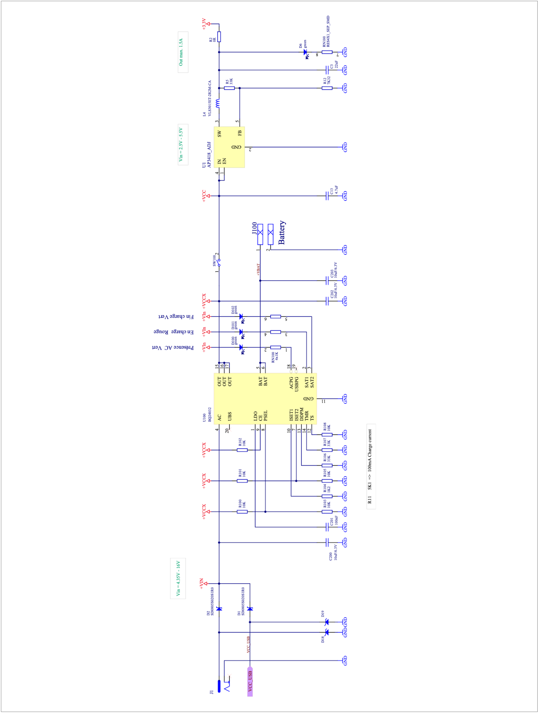

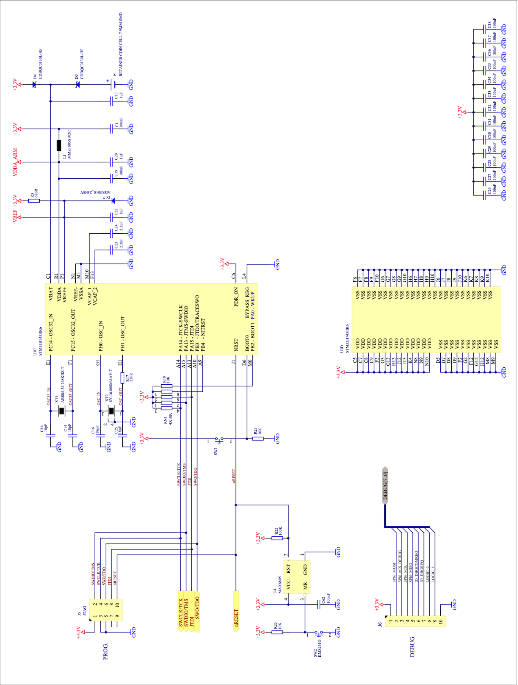

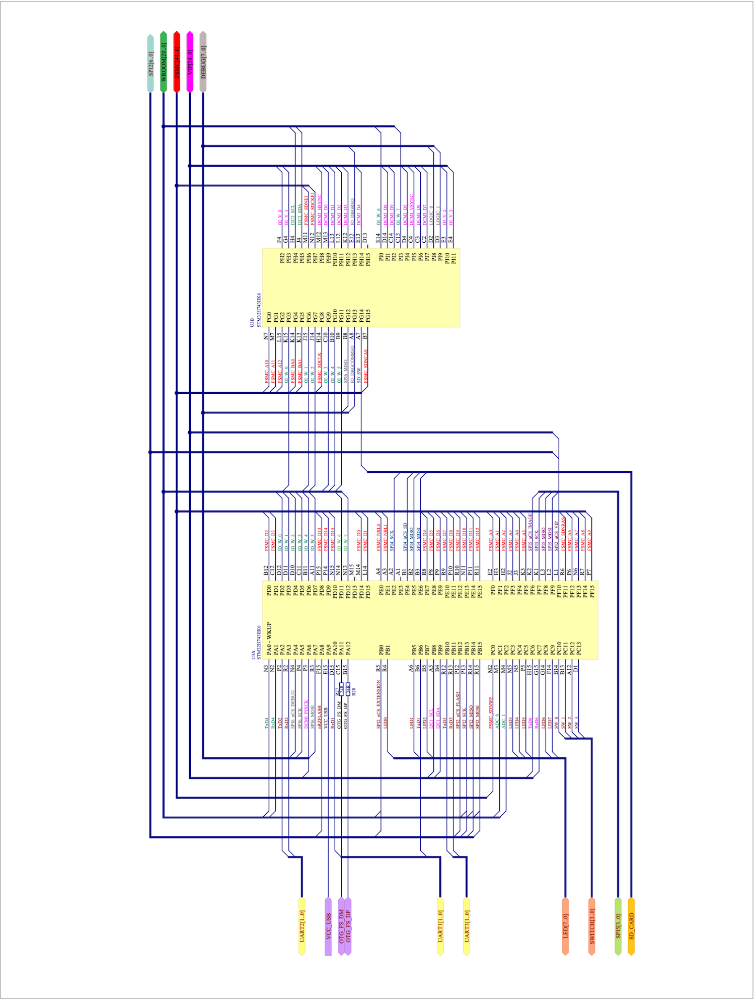

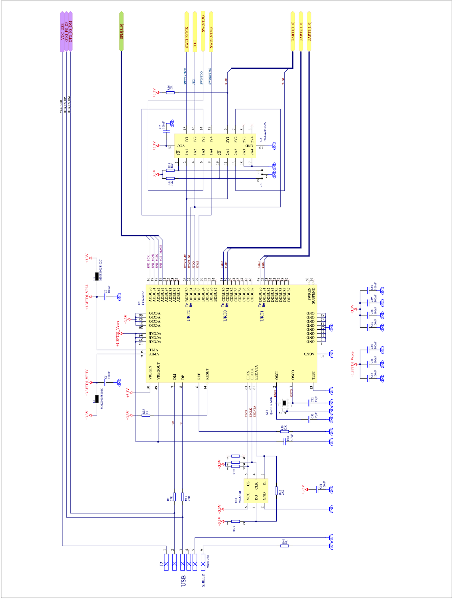

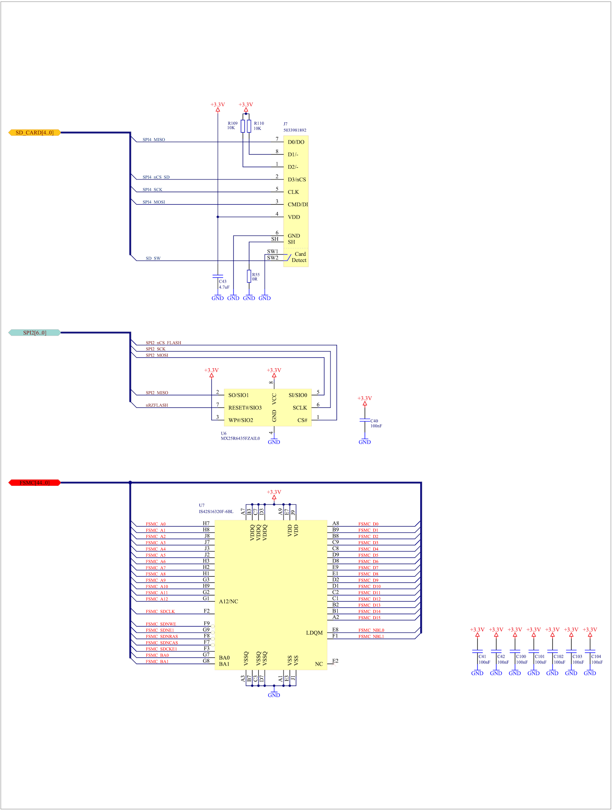

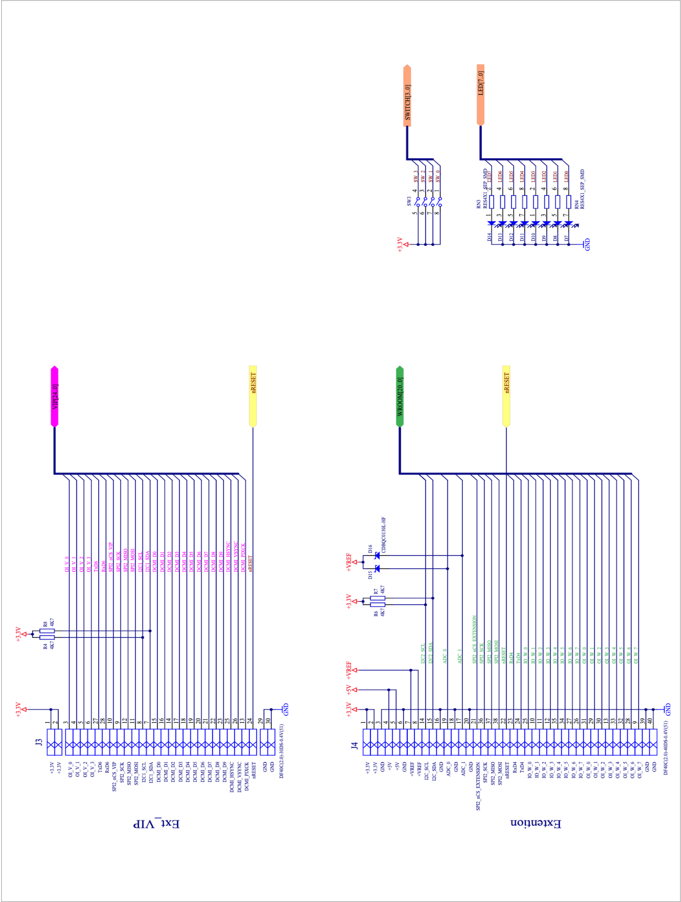

## Memory mapping and CPU initialisation

### µKOS-X mapping


### The CPU initialisation

```c
/*
; init.
; =====

; SPDX-License-Identifier: MIT

;------------------------------------------------------------------------
; Author:     Edo. Franzi    The 2025-01-01
;
; Project:    uKOS-X
; Goal:       Low level init for the uKOS-X Krampus_H743 module.
;
;             !!! This code HAS not to contain static data.
;             !!! It is called before to copy and to initialise
;             !!! the variable into the RAM.
;
;   (c) 2025-2026, Edo. Franzi
;   --------------------------
;                                              __ ______  _____
;   Edo. Franzi                         __  __/ //_/ __ \/ ___/
;   5-Route de Cheseaux                / / / / ,< / / / /\__ \
;   CH 1400 Cheseaux-Noréaz           / /_/ / /| / /_/ /___/ /
;                                     \__,_/_/ |_\____//____/
;   edo.franzi@ukos.ch
;
;   See the MIT License (License_uKOS-X.txt)
;
;------------------------------------------------------------------------
*/

#include    "uKOS.h"

// uKOS-X specific (see the module.h)
// ==================================

STRG_LOC_CONST(aStrApplication[]) = \
    "init         First hardware initialisations.           (c) EFr-2026";

STRG_LOC_CONST(aStrHelp[])        = \
    "Init\n"
    "====\n\n"

    "This code places in a quite state the hardware resources.\n\n";

MODULE(
    Init,                    // Module name
    KID_FAM_STARTUPS,        // Family (defined in the module.h)
    KNUM_INIT,               // Module id (defined in the module.h)
    NULL,                    // Address of the initialisation code
    NULL,                    // Address of the code
    NULL,                    // Address of the clean code
    " 1.0",                  // Revision string (major . minor)
    (1<<BSHOW)               // Flags
    0
);

// Runtime specific
// ================

#define    CACHE_I_S         // With the instruction cache
#define    CACHE_D_S         // With the data cache
#undef     SELF_REFRESH_S    // Refresh under the control of the FMC

extern uint32_t    linker_stEXRAM[], linker_lnEXRAM[];

// GPIO config macro

#define    CNFGPIO(port, \
    a15, a14, a13, a12, a11, a10, a9, a8, a7, a6, a5, a4, a3, a2, a1, a0, \
    b15, b14, b13, b12, b11, b10, b9, b8, b7, b6, b5, b4, b3, b2, b1, b0, \
    c15, c14, c13, c12, c11, c10, c9, c8, c7, c6, c5, c4, c3, c2, c1, c0, \
    d15, d14, d13, d12, d11, d10, d9, d8, d7, d6, d5, d4, d3, d2, d1, d0, \
    e15, e14, e13, e12, e11, e10, e9, e8, e7, e6, e5, e4, e3, e2, e1, e0, \
    f15, f14, f13, f12, f11, f10, f9, f8, f7, f6, f5, f4, f3, f2, f1, f0) \
    GPIO##port->AFR[1]  = (d15<<28) | (d14<<24) | (d13<<20) | (d12<<16) | \
                          (d11<<12) | (d10<<8)  | (d9<<4)   | (d8<<0);    \
    GPIO##port->AFR[0]  = (d7<<28)  | (d6<<24)  | (d5<<20)  | (d4<<16)  | \
                          (d3<<12)  | (d2<<8)   | (d1<<4)   | (d0<<0);    \
    GPIO##port->OSPEEDR = (b15<<30) | (b14<<28) | (b13<<26) | (b12<<24) | \
                          (b11<<22) | (b10<<20) | (b9<<18)  | (b8<<16)  | \
                          (b7<<14)  | (b6<<12)  | (b5<<10)  | (b4<<8)   | \
                          (b3<<6)   | (b2<<4)   | (b1<<2)   | (b0<<0);    \
    GPIO##port->OTYPER  = (e15<<15) | (e14<<14) | (e13<<13) | (e12<<12) | \
                          (e11<<11) | (e10<<10) | (e9<<9)   | (e8<<8)   | \
                          (e7<<7)   | (e6<<6)   | (e5<<5)   | (e4<<4)   | \
                          (e3<<3)   | (e2<<2)   | (e1<<1)   | (e0<<0);    \
    GPIO##port->MODER   = (a15<<30) | (a14<<28) | (a13<<26) | (a12<<24) | \
                          (a11<<22) | (a10<<20) | (a9<<18)  | (a8<<16)  | \
                          (a7<<14)  | (a6<<12)  | (a5<<10)  | (a4<<8)   | \
                          (a3<<6)   | (a2<<4)   | (a1<<2)   | (a0<<0);    \
    GPIO##port->PUPDR   = (c15<<30) | (c14<<28) | (c13<<26) | (c12<<24) | \
                          (c11<<22) | (c10<<20) | (c9<<18)  | (c8<<16)  | \
                          (c7<<14)  | (c6<<12)  | (c5<<10)  | (c4<<8)   | \
                          (c3<<6)   | (c2<<4)   | (c1<<2)   | (c0<<0);    \
    GPIO##port->ODR    |= (f15<<15) | (f14<<14) | (f13<<13) | (f12<<12) | \
                          (f11<<11) | (f10<<10) | (f9<<9)   | (f8<<8)   | \
                          (f7<<7)   | (f6<<6)   | (f5<<5)   | (f4<<4)   | \
                          (f3<<3)   | (f2<<2)   | (f1<<1)   | (f0<<0);

// SDRAM macro

#define    SDRAM_COMMAND_BANK2(command, mrd, cycles)                            \
           FMC_Bank5_6->SDCMR = (mrd<<9) | (cycles<<5) | (1<<3) | (command<<0); \
           while ((FMC_Bank5_6->SDSR & FMC_SDSR_BUSY) != 0) { ; }
// Prototypes

static           void local_GPIO_Configuration(void);
static           void local_RCC_Configuration(void);
static           void local_FMC_Configuration(void);
static           void local_MPU_Configuration(void);
static           void local_FPU_Configuration(void);
static           void local_wait_us(uint32_t us);
static           void local_CACHE_Enable(void);
static inline    void cache_D_Enable(void);
static inline    void cache_D_Disable(void);
static inline    void cache_D_Invalidate(void);
static inline    void cache_D_Clean(void);
static inline    void cache_I_Enable(void);
static inline    void cache_I_Disable(void);
static inline    void cache_I_Invalidate(void);

/*
 * \brief init_init
 *
 * - Initialize some basic periphs
 * - GPIO, watchdog, SDRAM
 *
 * \param[in]     -
 * \param[out]    -
 *
 */
void init_init(void) {

    DBGMCU->CR |= DBGMCU_CR_DBGSLEEP_D1;    // Enable the JTAG during the sleep

    local_GPIO_Configuration();             // GPIO Config
    local_RCC_Configuration();              // Clock Config
    local_FMC_Configuration();              // FMC Config
    local_MPU_Configuration();              // MPU Config
    local_FPU_Configuration();              // FPU Enabled
    local_CACHE_Enable();                   // Enable the instruction/data cache
}

/*
 * \brief local_FPU_Configuration
 *
 * - Enable the FPU
 *
 */
static  void local_FPU_Configuration(void) {

    SCB->CPACR |= ((SCB_CPACR_FPAF<<20u) | (SCB_CPACR_FPAF<<22u));
    FPU->FPCCR |= ((1u<<FPU_FPCCR_ASPEN) | (1u<<FPU_FPCCR_LSPEN));
}

/*
 * \brief local_GPIO_Configuration
 *
 * - GPIO configuration
 *
 */
static  void local_GPIO_Configuration(void) {

    RCC->AHB1ENR |= RCC_AHB1ENR_GPIOAEN;    // Turn on the GPIOA
    RCC->AHB1ENR |= RCC_AHB1ENR_GPIOBEN;    // Turn on the GPIOB
    RCC->AHB1ENR |= RCC_AHB1ENR_GPIOCEN;    // Turn on the GPIOC
    RCC->AHB1ENR |= RCC_AHB1ENR_GPIODEN;    // Turn on the GPIOD
    RCC->AHB1ENR |= RCC_AHB1ENR_GPIOEEN;    // Turn on the GPIOE
    RCC->AHB1ENR |= RCC_AHB1ENR_GPIOFEN;    // Turn on the GPIOF
    RCC->AHB1ENR |= RCC_AHB1ENR_GPIOGEN;    // Turn on the GPIOG
    RCC->AHB1ENR |= RCC_AHB1ENR_GPIOHEN;    // Turn on the GPIOH
    RCC->AHB1ENR |= RCC_AHB1ENR_GPIOIEN;    // Turn on the GPIOI

// Init all the GPIO A, B, C, D, E, F, G, H, I

// PA00, AL,  50-MHz, Push-pull    USART4_TX    AF8
// PA01, AL,  50-MHz, Pull-up      USART4_RX    AF8
// PA02, AL,  50-MHz, Push-pull    USART2_TX    AF7
// PA03, AL,  50-MHz, Pull-up      USART2_RX    AF7
// PA04, OU,  50-MHz, Push-pull    SPI6_NSS     AF15    /BSELDebug
// PA05, AL,  50-MHz, Push-pull    SPI6_SCK     AF8
// PA06, AL,  50-MHz, Push-pull    DCMI_PIXCK   AF13
// PA07, AL,  50-MHz, Push-pull    SPI6_MOSI    AF8
// PA08, OU,  50-MHz, Pull-up      RzFLASH      AF15    /BRzFLASH
// PA09, IN,  50-MHz, Pull-up      VBUS_FS!!    AF15
// PA10, AL,  50-MHz, Pull-up      USART1_RX    AF7
// PA11, IN,  50-MHz, Pull-up      OTG_DM!!     AF15
// PA12, IN,  50-MHz, Pull-up      OTG_DP!!     AF15
// PA13, AL,  50-MHz, Pull-up      TMS          AF0
// PA14, AL,  50-MHz, Pull-down    TCK          AF0
// PA15, AL,  50-MHz, Pull-up      TDI          AF0


    CNFGPIO(A,KAL,KAL,KAL,KIN,KIN,KAL,KIN,KOU,KAL,KAL,KAL,KOU,KAL,KAL,KAL,KAL,
              K50,K50,K50,K50,K50,K50,K50,K50,K50,K50,K50,K50,K50,K50,K50,K50,
              KPU,KPD,KPU,KPU,KPU,KPU,KPU,KNO,KNO,KNO,KNO,KNO,KPU,KNO,KPU,KNO,
              A00,A00,A00,A15,A15,A07,A15,A15,A08,A13,A08,A15,A07,A07,A08,A08,
              KPP,KPP,KPP,KPP,KPP,KPP,KPP,KPP,KPP,KPP,KPP,KPP,KPP,KPP,KPP,KPP,
              0,  0,  0,  0,  0,  0,  0,  1,  0,  0,  0,  1,  0,  0,  0,  0);

// PB00, OU,  50-MHz, Push-pull    SPI2_NSS     AF15    /BSELWroom
// PB01, OU,  50-MHz, Push-pull    LED0         AF15
// PB02, IN,  50-MHz, Pull-up      Boot1        AF15
// PB03, AL,  50-MHz, Push-pull    TDO          AF0
// PB04, AL,  50-MHz, Pull-up      NJTRST       AF0
// PB05, OU,  50-MHz, Push-pull    LED1         AF15
// PB06, AL,  50-MHz, Push-pull    USART1_TX    AF7
// PB07, OU,  50-MHz, Push-pull    LED2         AF15
// PB08, AL,  50-MHz, Open DU      I2C1_SCL     AF4
// PB09, AL,  50-MHz, Open DU      I2C1_SDA     AF4
// PB10, AL,  50-MHz, Push-pull    USART3_TX    AF7
// PB11, AL,  50-MHz, Pull-up      USART3_RX    AF7
// PB12, OU,  50-MHz, Push-pull    SPI2_NSS     AF15    /BSELFLASH
// PB13, AL,  50-MHz, Push-pull    SPI2_SCK     AF5
// PB14, AL,  50-MHz, Pull-up      SPI2_MISO    AF5
// PB15, AL,  50-MHz, Push-pull    SPI2_MOSI    AF5

    CNFGPIO(B,KAL,KAL,KAL,KOU,KAL,KAL,KAL,KAL,KOU,KAL,KOU,KAL,KAL,KIN,KOU,KOU,
              K50,K50,K50,K50,K50,K50,K50,K50,K50,K50,K50,K50,K50,K50,K50,K50,
              KNO,KPU,KNO,KNO,KPU,KNO,KPU,KPU,KNO,KNO,KNO,KPU,KNO,KPU,KNO,KNO,
              A05,A05,A05,A15,A07,A07,A04,A04,A15,A07,A15,A00,A00,A15,A15,A15,
              KPP,KPP,KPP,KPP,KPP,KPP,KOD,KOD,KPP,KPP,KPP,KPP,KPP,KPP,KPP,KPP,
              0,  0,  0,  1,  0,  0,  1,  1,  0,  0,  0,  0,  0,  0,  0,  1);

// PC00, AL,  99-MHz, Push-pull    SDNWE        AF12
// PC01, IN,  50-MHz, Pull-up      ADC0         AF15
// PC02, IN,  50-MHz, Pull-up      ADC1         AF15
// PC03, OU,  50-MHz, Push-pull    LED3         AF15
// PC04, OU,  50-MHz, Push-pull    LED4         AF15
// PC05, OU,  50-MHz, Push-pull    LED5         AF15
// PC06, OU,  50-MHz, Push-pull    USART6_TX    AF15    /BSELACCELERO
// PC07, IN,  50-MHz, Pull-up      USART6_RX    AF15    /BINTIMU
// PC08, OU,  50-MHz, Push-pull    LED6         AF15
// PC09, OU,  50-MHz, Push-pull    LED7         AF15
// PC10, IN,  50-MHz, Pull-down    SW0          AF15
// PC11, IN,  50-MHz, Pull-down    SW1          AF15
// PC12, IN,  50-MHz, Pull-down    SW2          AF15
// PC13, IN,  50-MHz, Pull-down    SW3          AF15
// PC14, AL,  50-MHz, -            OSC          AF0
// PC15, AL,  50-MHz, -            OSC          AF0

    CNFGPIO(C,KAL,KAL,KIN,KIN,KIN,KIN,KOU,KOU,KIN,KOU,KOU,KOU,KOU,KIN,KIN,KAL,
              K50,K50,K50,K50,K50,K50,K50,K50,K50,K50,K50,K50,K50,K50,K50,K99,
              KNO,KNO,KPD,KPD,KPD,KPD,KNO,KNO,KPU,KNO,KNO,KNO,KNO,KPU,KPU,KNO,
              A00,A00,A15,A15,A15,A15,A15,A15,A15,A15,A15,A15,A15,A15,A15,A12,
              KPP,KPP,KPP,KPP,KPP,KPP,KPP,KPP,KPP,KPP,KPP,KPP,KPP,KPP,KPP,KPP,
              0,  0,  0,  0,  0,  0,  0,  0,  0,  1,  0,  0,  0,  0,  0,  0);

// PD00, AL,  99-MHz, Push-pull    FMC_D2        AF12
// PD01, AL,  99-MHz, Push-pull    FMC_D3        AF12
// PD02, IN,  50-MHz, Pull-up      IO_W_0        AF15    RXD (Wroom status)
// PD03, IN,  50-MHz, Pull-up      IO_W_1        AF15    /CTS Wroom
// PD04, IN,  50-MHz, Pull-up      IO_W_2        AF15
// PD05, IN,  50-MHz, Pull-up      IO_W_3        AF15
// PD06, IN,  50-MHz, Pull-up      IO_W_4        AF15
// PD07, IN,  50-MHz, Pull-up      IO_W_5        AF15
// PD08, AL,  99-MHz, Push-pull    FMC_D13       AF12
// PD09, AL,  99-MHz, Push-pull    FMC_D14       AF12
// PD10, AL,  99-MHz, Push-pull    FMC_D15       AF12
// PD11, IN,  50-MHz, Push-pull    IO_W_6        AF15
// PD12, IN,  50-MHz, Push-pull    IO_W_7        AF15
// PD13, IN,  50-MHz, Pull-up      -             AF15
// PD14, AL,  99-MHz, Push-pull    FMC_D0        AF12
// PD15, AL,  99-MHz, Push-pull    FMC_D1        AF12

    CNFGPIO(D,KAL,KAL,KIN,KIN,KIN,KAL,KAL,KAL,KIN,KIN,KIN,KIN,KIN,KIN,KAL,KAL,
              K99,K99,K50,K50,K50,K99,K99,K99,K50,K50,K50,K50,K50,K50,K99,K99,
              KNO,KNO,KPU,KPU,KPU,KNO,KNO,KNO,KPU,KPU,KPU,KPU,KPU,KPU,KNO,KNO,
              A12,A12,A15,A15,A15,A12,A12,A12,A15,A15,A15,A15,A15,A15,A12,A12,
              KPP,KPP,KPP,KPP,KPP,KPP,KPP,KPP,KPP,KPP,KPP,KPP,KPP,KPP,KPP,KPP,
              0,  0,  0,  0,  0,  0,  0,  0,  0,  0,  0,  0,  0,  0,  0,  0);

// PE00, AL,  99-MHz, Push-pull    FMC_NBL0      AF12
// PE01, AL,  99-MHz, Push-pull    FMC_NBL1      AF12
// PE02, AL,  50-MHz, Push-pull    SPI4_SCK      AF5
// PE03, IN,  50-MHz, Pull-up      -             AF12
// PE04, OU,  50-MHz, Push-pull    SPI4_NSS      AF15    /BSELSDCARD
// PE05, AL,  50-MHz, Pull-up      SPI4_MISO     AF5
// PE06, AL,  50-MHz, Push-pull    SPI4_MOSI     AF5
// PE07, AL,  99-MHz, Push-pull    FMC_D4        AF12
// PE08, AL,  99-MHz, Push-pull    FMC_D5        AF12
// PE09, AL,  99-MHz, Push-pull    FMC_D6        AF12
// PE10, AL,  99-MHz, Push-pull    FMC_D7        AF12
// PE11, AL,  99-MHz, Push-pull    FMC_D8        AF12
// PE12, AL,  99-MHz, Push-pull    FMC_D9        AF12
// PE13, AL,  99-MHz, Push-pull    FMC_D10       AF12
// PE14, AL,  99-MHz, Push-pull    FMC_D11       AF12
// PE15, AL,  99-MHz, Push-pull    FMC_D12       AF12

    CNFGPIO(E,KAL,KAL,KAL,KAL,KAL,KAL,KAL,KAL,KAL,KAL,KAL,KOU,KIN,KAL,KAL,KAL,
              K99,K99,K99,K99,K99,K99,K99,K99,K99,K50,K50,K50,K50,K50,K99,K99,
              KNO,KNO,KNO,KNO,KNO,KNO,KNO,KNO,KNO,KNO,KPU,KNO,KPU,KNO,KPU,KPU,
              A12,A12,A12,A12,A12,A12,A12,A12,A12,A05,A05,A15,A15,A05,A12,A12,
              KPP,KPP,KPP,KPP,KPP,KPP,KPP,KPP,KPP,KPP,KPP,KPP,KPP,KPP,KPP,KPP,
              0,  0,  0,  0,  0,  0,  0,  0,  0,  0,  0,  1,  0,  0,  0,  0);

// PF00, AL,  99-MHz, Push-pull    FMC_A0        AF12
// PF01, AL,  99-MHz, Push-pull    FMC_A1        AF12
// PF02, AL,  99-MHz, Push-pull    FMC_A2        AF12
// PF03, AL,  99-MHz, Push-pull    FMC_A3        AF12
// PF04, AL,  99-MHz, Push-pull    FMC_A4        AF12
// PF05, AL,  99-MHz, Push-pull    FMC_A5        AF12
// PF06, AL,  50-MHz, Pull-up      SPI5_NSS      AF5    /IMAGE
// PF07, AL,  50-MHz, Pull-up      SPI5_SCK      AF5
// PF08, AL,  50-MHz, Pull-up      SPI5_MISO     AF5
// PF09, AL,  50-MHz, Pull-up      SPI5_MOSI     AF5
// PF10, OU,  50-MHz, Push-pull    SPI2_NSS      AF15    /BSELMAGNETO
// PF11, AL,  99-MHz, Push-pull    SDNRAS        AF12
// PF12, AL,  99-MHz, Push-pull    FMC_A6        AF12
// PF13, AL,  99-MHz, Push-pull    FMC_A7        AF12
// PF14, AL,  99-MHz, Push-pull    FMC_A8        AF12
// PF15, AL,  99-MHz, Push-pull    FMC_A9        AF12

    CNFGPIO(F,KAL,KAL,KAL,KAL,KAL,KOU,KAL,KAL,KAL,KAL,KAL,KAL,KAL,KAL,KAL,KAL,
              K99,K99,K99,K99,K99,K50,K50,K50,K50,K50,K99,K99,K99,K99,K99,K99,
              KNO,KNO,KNO,KNO,KNO,KNO,KPU,KPU,KPU,KPU,KNO,KNO,KNO,KNO,KNO,KNO,
              A12,A12,A12,A12,A12,A15,A05,A05,A05,A05,A12,A12,A12,A12,A12,A12,
              KPP,KPP,KPP,KPP,KPP,KPP,KPP,KPP,KPP,KPP,KPP,KPP,KPP,KPP,KPP,KPP,
              0,  0,  0,  0,  0,  1,  0,  0,  0,  0,  0,  0,  0,  0,  0,  0);

// PG00, AL,  99-MHz, Push-pull    FMC_A10       AF12
// PG01, AL,  99-MHz, Push-pull    FMC_A11       AF12
// PG02, AL,  99-MHz, Push-pull    FMC_A12       AF12
// PG03, OU,  50-MHz, Push-pull    OI_W_0        AF15    /RTS Wroom
// PG04, AL,  99-MHz, Push-pull    BA0           AF12
// PG05, AL,  99-MHz, Push-pull    BA1           AF12
// PG06, OU,  50-MHz, Push-pull    OI_W_1        AF15    /Boot Wroom
// PG07, OU,  50-MHz, Push-pull    OI_W_2        AF15    E Wroom
// PG08, AL,  99-MHz, Push-pull    SDCLK         AF12
// PG09, OU,  50-MHz, Push-pull    OI_W_3        AF15
// PG10, OU,  50-MHz, Push-pull    OI_W_4        AF15
// PG11, OU,  50-MHz, Push-pull    OI_W_5        AF15
// PG12, AL,  50-MHz, Push-pull    SPI6_MISO     AF5
// PG13, IN,  50-MHz, Pull-up      IO_DBGCOMR    AF15
// PG14, IN,  50-MHz, Pull-up      CD            AF15    /BNOSDCARD
// PG15, AL,  99-MHz, Push-pull    SDNCAS        AF12

    CNFGPIO(G,KAL,KIN,KIN,KAL,KOU,KOU,KOU,KAL,KOU,KOU,KAL,KAL,KOU,KAL,KAL,KAL,
              K99,K50,K50,K50,K50,K50,K50,K99,K50,K50,K99,K99,K50,K99,K99,K99,
              KNO,KPU,KPU,KPU,KNO,KNO,KNO,KNO,KNO,KNO,KNO,KNO,KNO,KNO,KNO,KNO,
              A12,A15,A15,A05,A15,A15,A15,A12,A15,A15,A12,A12,A15,A12,A12,A12,
              KPP,KPP,KPP,KPP,KPP,KPP,KPP,KPP,KPP,KPP,KPP,KPP,KPP,KPP,KPP,KPP,
              0,  0,  0,  0,  0,  0,  0,  0,  0,  1,  0,  0,  0,  0,  0,  0);

// PH00, AL,  50-MHz, -            OSC           AF0
// PH01, AL,  50-MHz, -            OSC           AF0
// PH02, OU,  50-MHz, Push-pull    OI_V_0        AF15    BCLK_EN
// PH03, OU,  50-MHz, Push-pull    OI_V_1        AF15
// PH04, AL,  50-MHz, Open DU      I2C2_SCL      AF4
// PH05, AL,  50-MHz, Open DU      I2C2_SDA      AF4
// PH06, AL,  99-MHz, Push-pull    SDNEE1        AF12
// PH07, AL,  99-MHz, Push-pull    SDCKE1        AF12
// PH08, AL,  50-MHz, Push-pull    DCMI_HSYNC    AF13
// PH09, AL,  50-MHz, Push-pull    DCMI_D0       AF13
// PH10, AL,  50-MHz, Push-pull    DCMI_D1       AF13
// PH11, AL,  50-MHz, Push-pull    DCMI_D2       AF13
// PH12, AL,  50-MHz, Push-pull    DCMI_D3       AF13
// PH13, IN,  50-MHz, Pull-up      IO_DBGREQ     AF15
// PH14, AL,  50-MHz, Push-pull    DCMI_D4       AF13
// PH15, IN,  50-MHz, Pull-up      -             AF15

    CNFGPIO(H,KIN,KAL,KIN,KAL,KAL,KAL,KAL,KAL,KAL,KAL,KAL,KAL,KOU,KOU,KAL,KAL,
              K50,K50,K50,K50,K50,K50,K50,K50,K99,K99,K50,K50,K50,K50,K50,K50,
              KPU,KNO,KPU,KNO,KNO,KNO,KNO,KNO,KNO,KNO,KPU,KPU,KNO,KNO,KNO,KNO,
              A15,A13,A15,A13,A13,A13,A13,A13,A12,A12,A04,A04,A15,A15,A00,A00,
              KPP,KPP,KPP,KPP,KPP,KPP,KPP,KPP,KPP,KPP,KOD,KOD,KPP,KPP,KPP,KPP,
              0,  0,  0,  0,  0,  0,  0,  0,  0,  0,  1,  1,  0,  0,  0,  0);

// PI00, OU,  50-MHz, Push-pull    OI_W_6        AF15
// PI01, AL,  50-MHz, Push-pull    DCMI_D8       AF13
// PI02, AL,  50-MHz, Push-pull    DCMI_D9       AF13
// PI03, OU,  50-MHz, Push-pull    OI_W_7        AF15
// PI04, AL,  50-MHz, Push-pull    DCMI_D5       AF13
// PI05, AL,  50-MHz, Push-pull    DCMI_VSYNC    AF13
// PI06, AL,  50-MHz, Push-pull    DCMI_D6       AF13
// PI07, AL,  50-MHz, Push-pull    DCMI_D7       AF13
// PI08, OU,  50-MHz, Push-pull    LOGIC0        AF15
// PI09, OU,  50-MHz, Push-pull    LOGIC1        AF15
// PI10, OU,  50-MHz, Push-pull    OI_V_2        AF15    BSTANDBY
// PI11, OU,  50-MHz, Push-pull    OI_V_3        AF15    BEXPOSUR
// PI12, IN,  50-MHz, Pull-up      -             AF15
// PI13, IN,  50-MHz, Pull-up      -             AF15
// PI14, IN,  50-MHz, Pull-up      -             AF15
// PI15, IN,  50-MHz, Pull-up      -             AF15

    CNFGPIO(I,KIN,KIN,KIN,KIN,KOU,KOU,KOU,KOU,KAL,KAL,KAL,KAL,KOU,KAL,KAL,KOU,
              K50,K50,K50,K50,K50,K50,K50,K50,K50,K50,K50,K50,K50,K50,K50,K50,
              KPU,KPU,KPU,KPU,KNO,KNO,KNO,KNO,KNO,KNO,KNO,KNO,KNO,KNO,KNO,KNO,
              A15,A15,A15,A15,A15,A15,A15,A15,A13,A13,A13,A13,A15,A13,A13,A15,
              KPP,KPP,KPP,KPP,KPP,KPP,KPP,KPP,KPP,KPP,KPP,KPP,KPP,KPP,KPP,KPP,
              0,  0,  0,  0,  0,  0,  0,  0,  0,  0,  0,  0,  0,  0,  0,  0);
}

/*
 * \brief local_RCC_Configuration
 *
 * PLL1 P:               400-MHz clock CPU
 *     - HPRE    / 2:    200-MHz AXI & AHB1, AHB2, AHB3, AHB4 periph clocks
 *     - D1PPRE  / 2:    100-MHz APB3 peripheral clock
 *     - D2PPRE1 / 2:    100-MHz APB1 peripheral clock
 *     - D2PPRE2 / 2:    100-MHz APB2 peripheral clock
 *     - D3PPRE  / 2:    100-MHz APB4 peripheral clock
 *
 * PLL1 Q:    200-MHz    clock usable for the peripherals via the PKSU & PKEU units
 * PLL1 R:    100-MHz    clock usable for the peripherals via the PKSU & PKEU units
 *
 * PLL2 P:    100-MHz    clock usable for the peripherals via the PKSU & PKEU units
 * PLL2 Q:     50-MHz    clock usable for the peripherals via the PKSU & PKEU units
 * PLL2 R:     25-MHz    clock usable for the peripherals via the PKSU & PKEU units
 *
 * PLL3 P:    256-MHz    clock usable for the peripherals via the PKSU & PKEU units
 * PLL3 Q:    128-MHz    clock usable for the peripherals via the PKSU & PKEU units
 * PLL3 R:     64-MHz    clock usable for the peripherals via the PKSU & PKEU units
 *
 * The RCC clock muxs are not touched. The default position is used.
 * For the main peripherals used by uKOS-X means:
 *
 * SPI 1,2,3                                ck = PLL1 Q
 * SPI 4,5                                  ck = rcc_pclk2 -> APB2
 * SPI 6                                    ck = rcc_pclk4 -> APB4
 * QUAD SPI                                 ck = rcc_hclk3 -> AHB3
 * I2C 1,2,3                                ck = rcc_pclk1 -> APB1
 * I2C 4                                    ck = rcc_pclk4 -> APB4
 * LPUSART 1                                ck = rcc_pclk4 -> APB4
 * USART 1,6                                ck = rcc_pclk2 -> APB2
 * USART 2,3,4,5,7,8                        ck = rcc_pclk1 -> APB1
 * FMC                                      ck = rcc_hclk3 -> AHB3
 * ADC 1,2,3                                ck = PLL2 P
 * RNG                                      ck = hsi48
 * LPTIM 1                                  ck = rcc_pclk1 -> APB1
 * LPTIM 2,3,4,5                            ck = rcc_pclk4 -> APB4
 * TIM 1,2,3,4,5,6,7,8,12,13,14,15,16,17    ck = ??? -> A??
 *
 */
static void local_RCC_Configuration(void) {

    RCC->CSR    |= RCC_CSR_LSION;              // Enable the LSI
    RCC->CR      = RCC_CR_HSION                // Set HSION bit
                 | RCC_CR_HSEON                // Set HSEON bit
                 | RCC_CR_HSI48ON;             // Set HSI48ON bit

    RCC->CFGR       = 0x00000000u;             // Reset CFGR registe
    RCC->CR        &= 0xEAF7ED7Fu;             //
    RCC->D1CFGR     = 0x00000000u;             // Reset D1CFGR register
    RCC->D2CFGR     = 0x00000000u;             // Reset D2CFGR register
    RCC->D3CFGR     = 0x00000000u;             // Reset D3CFGR register
    RCC->PLLCKSELR  = 0x00000000u;             // Reset PLLCKSELR register
    RCC->PLLCFGR    = 0x00000000u;             // Reset PLLCFGR register
    RCC->PLL1DIVR   = 0x00000000u;             // Reset PLL1DIVR register
    RCC->PLL1FRACR  = 0x00000000u;             // Reset PLL1FRACR register
    RCC->PLL2DIVR   = 0x00000000u;             // Reset PLL2DIVR register
    RCC->PLL2FRACR  = 0x00000000u;             // Reset PLL2FRACR register
    RCC->PLL3DIVR   = 0x00000000u;             // Reset PLL3DIVR register
    RCC->PLL3FRACR  = 0x00000000u;             // Reset PLL3FRACR register
    RCC->CR        &= 0xFFFBFFFFu;             // Reset HSEBYP bit
    RCC->CIER       = 0x00000000u;             // Disable all interrupts

    *((volatile uint32_t *)0x51008108u) = 0x000000001u;

// Source for the PLL 1 , 2 & 3 input clock (see DM00314099 pages 296, 309 & 348)

    RCC->PLLCKSELR = (0u<<0u)                  // PLL1, 2, 3 source HSI (64-MHz)
                   | (4u<<4u)                  // DivM1 / 4
                   | (4u<<12u)                 // DivM2 / 4
                   | (4u<<20u);                // DivM3 / 4

// PLL 1 CPU
// ---------

// For f(ck in) = 16-MHz
// f(vco) = f(ck in) * (N + 1)   f(vco) = 16-MHz, N = 49 ---> f(vco) = 800-MHz
// f(P) = f(vco) / (P + 1) P = 1                         ---> f(P)   = 400-MHz
// f(Q) = f(vco) / (Q + 1) Q = 3                         ---> f(Q)   = 200-MHz
// f(R) = f(vco) / (R + 1) R = 7                         ---> f(R)   = 100-MHz

    RCC->PLLCFGR |= (1u<<18u)                  // Div R enable
                  | (1u<<17u)                  // Div Q enable
                  | (1u<<16u)                  // Div P enable
                  | (3u<<2u)                   // Input 16-MHz
                  | (0u<<1u)                   // Wide VCO
                  | (0u<<0u);                  // Fractional latch

    RCC->PLL1DIVR = (7u<<24u)                  // Div R
                  | (3u<<16u)                  // Div Q
                  | (1u<<9u)                   // Div P
                  | (49u<<0u);                 // Div N 49 = 800-MHz

    RCC->PLL1FRACR  = 0x00000000u;             // Reset PLL1FRACR register
    RCC->CR        |= RCC_CR_PLL1ON;           // PLL1 on

// Waiting for the lock

    while ((RCC->CR & RCC_CR_PLL1RDY) == 0u) { ; }

// PLL 2 CPU
// ---------

// For f(ck in) = 16-MHz
// f(vco) = f(ck in) * (N + 1)     f(vco) = 16-MHz, N = 24 ---> f(vco) = 400-MHz
// f(P) = f(vco) / (P + 1) P = 3                           ---> f(P)   = 100-MHz
// f(Q) = f(vco) / (Q + 1) Q = 7                           ---> f(Q)   = 50-MHz
// f(R) = f(vco) / (R + 1) R = 15                          ---> f(R)   = 25-MHz

    RCC->PLLCFGR |= (1u<<21u)                  // Div R enable
                  | (1u<<20u)                  // Div Q enable
                  | (1u<<19u)                  // Div P enable
                  | (3u<<6u)                   // Input 16-MHz
                  | (0u<<5u)                   // Wide VCO
                  | (0u<<4u);                  // Fractional latch

    RCC->PLL2DIVR = (15u<<24u)                 // Div R
                  | (7u<<16u)                  // Div Q
                  | (3u<<9u)                   // Div P
                  | (24u<<0u);                 // Div N 24 = 400-MHz

    RCC->PLL2FRACR  = 0x00000000u;             // Reset PLL1FRACR register
    RCC->CR        |= RCC_CR_PLL2ON;           // PLL2 on

// Waiting for the lock

    while ((RCC->CR & RCC_CR_PLL2RDY) == 0u) { ; }

// PLL 3 CPU
// ---------

// For f(ck in) = 16-MHz
// f(vco) = f(ck in) * (N + 1)     f(vco) = 16-MHz, N = 31 ---> f(vco) = 512-MHz
// f(P) = f(vco) / (P + 1) P = 1                           ---> f(P)   = 256-MHz
// f(Q) = f(vco) / (Q + 1) Q = 4                           ---> f(Q)   = 102-MHz
// f(R) = f(vco) / (R + 1) R = 7                           ---> f(R)   = 64-MHz

    RCC->PLLCFGR |= (1u<<24u)                  // Div R enable
                  | (1u<<23u)                  // Div Q enable
                  | (1u<<22u)                  // Div P enable
                  | (3u<<10u)                  // Input 16-MHz
                  | (0u<<9u)                   // Wide VCO
                  | (0u<<8u);                  // Fractional latch

    RCC->PLL3DIVR = (7u<<24u)                  // Div R
                  | (4u<<16u)                  // Div Q
                  | (1u<<9u)                   // Div P
                  | (31u<<0u);                 // Div N 31 = 512-MHz

    RCC->PLL3FRACR  = 0x0000000;              // Reset PLL1FRACR register
    RCC->CR        |= RCC_CR_PLL3ON;           // PLL3 on

// Waiting for the lock

    while ((RCC->CR & RCC_CR_PLL3RDY) == ) { ; }

// Domain clocks
// -------------

    RCC->D1CFGR = (0u<<8u)                     // D1CPRE = 0
                | (4u<<4u)                     // D1PPRE / 2
                | (8u<<0u);                    // HPRE / 2

    RCC->D2CFGR = (5u<<8u)                     // D2PPRE2 / 4
                | (5u<<4u);                    // D2PPRE1 / 4

    RCC->D3CFGR = (4u<<4u);                    // D3PPRE / 2

// RTC
// ---

    PWR->CR1  |= PWR_CR1_DBP;
    RCC->BDCR  = RCC_BDCR_RTCEN
               | RCC_BDCR_LSEON
               | RCC_BDCR_RTCSEL_0
               | (3u<<3u);

    RTC->WPR   = 0xCAu;
    RTC->WPR   = 0x53u;

    RTC->CR    |= RTC_CR_BYPSHAD;

// Flash latency (for 400-MHz ... 2 wait states)
// ---------------------------------------------

    RCC->D1CFGR = (8u<<0u);                    // HCLK3 = ACLK = Sys / 2
    FLASH->ACR  = (3u<<4u)                     // Bus > 385-MHz
                | (2u<<0u);                    // 2 wait states

    RCC->CFGR   = (3u<<0u)                     // CPU clock = PLL
                | (2u<<8u);                    // RTC clock = HSE / 2
}

/*
 * \brief local_FMC_Configuration
 *
 * - FMC configuration
 *
 */
static void local_FMC_Configuration(void) {

    RCC->AHB3ENR |= RCC_AHB3ENR_FMCEN;

    local_wait_us(200000u);

// FMC bank 5-6 & CE1 configuration in the synchronous mode
// - SDRAM is a 42S16320F-6 speed grade, connected to bank 2 (0xD0000000)
//   Some bits in SDCR[1] are don't care, and the have to be set in SDCR[0],
//   they aren't just don't care, the controller will fail if they aren't at 0

    FMC_Bank5_6->SDCR[0] = (1u<<13u)           // 1 clocks cycle delay
                         | (1u<<12u)           // Read as bursts
                         | (2u<<10u);          // SDRAM runs @ 100-MHz

    FMC_Bank5_6->SDCR[1] = (0u<<9u)            // Write allowed
                         | (2u<<7u)            // CAS latency 2 cycles
                         | (1u<<6u)            // 4 internal banks
                         | (1u<<4u)            // 16-bit data bus
                         | (2u<<2u)            // 13-bit row address
                         | (2u<<0u);           // 10-bit column address

// One SDRAM clock cycle is 1/100-MHz = 10-ns
// Some bits in SDTR[1] are don't care, and the have to be set in SDTR[0],
// they aren't just don't care, the controller will fail if they aren't at 0

    FMC_Bank5_6->SDTR[0] = ((2u-1u)<<20u)      // 2 cycle TRP (20.x-ns > 18-ns)
                         | ((7u-1u)<<12u);     // 7 cycle TRC (70.x-ns > 60-ns)

    FMC_Bank5_6->SDTR[1] = ((2u-1u)<<24u)      // 2 cycle TRCD (20.x-ns > 18-ns)
                         | ((3u-1u)<<16u)      // 3 cycle TWR
                         | ((5u-1u)<<8u)       // 5 cycle TRAS (50.x-ns > 42-ns)
                         | ((8u-1u)<<4u)       // 8 cycle TXSR (80.x-ns > 70-ns)
                         | ((2u-1u)<<0u);      // 2 cycle TMRD

// SDRam mode register
// Mode: 11 10 09 08   07 06 05 04   03 02 01 00
//        -  -  1  0    0  0  1  0    0  0  0  0
//
// M9      = 1      Single location access
// M8 - M7 = 00     Standard operation
// M6 - M4 = 010    CAS latency 2
// M3      = 0      Sequential
// M2 - M0 = 000    Burst length 1

    SDRAM_COMMAND_BANK2(0x1u, 0u,     0u    );  // Command Clock Configuration Enable
    local_wait_us(200000);

    SDRAM_COMMAND_BANK2(0x2u, 0u,     0u    );  // Command All Bank Pre-charge
    SDRAM_COMMAND_BANK2(0x3u, 0u,     (2u-1u)); // Command Auto Refresh (2 cycles)
    SDRAM_COMMAND_BANK2(0x4u, 0x220u, 0u    );  // Command Load Mode Register

    #if (defined(SELF_REFRESH_S))
    SDRAM_COMMAND_BANK2(0x5u, 0u,     0u    );  // Command Self Refresh

    #else

// 64-ms/8192 = 7.8125-us
// 7.8125-us * 100-MHz = 781-20 = 761

    FMC_Bank5_6->SDRTR = (761u<<1u);
    while ((FMC_Bank5_6->SDSR & FMC_SDSR_BUSY) != 0u) { ; }
    #endif

// Remapping of the SDRAM bank 2 (from 0xD0000000 -> 0x70000000)

    FMC_Bank1->BCR1 |= (2u<<24u);
    FMC_Bank1->BCR1 |= FMC_BCR1_FMCEN;

// Clear the SDRAM

    memory = (volatile uint32_t *)&linker_stEXRAM;
    for (i = 0u; i < (uint32_t)&linker_lnEXRAM; i += 4u) {
        *memory++ = 0x00000000u;
    }
}

/*
 * \brief local_MPU_Configuration
 *
 * - Initialise the MPU for the different
 *   memory regions of the system
 *
 */
static void local_MPU_Configuration(void) {

    MPU->CTRL = 0x00000000u;                   // Disable the MPU

// Attributes for the FLASH area (0x08000000)

    MPU->RNR  = 0x00000000u;                   // Region 0
    MPU->RBAR = 0x08000000u;                   // Address
    MPU->RASR = (0u<<28u)                      // XN: 0 executable
              | (6u<<24u)                      // AP: 110 read-only
              | (0u<<19u)                      // TEX: 000 normal
              | (0u<<18u)                      // S: 0 non shareable
              | (1u<<17u)                      // C: 1 cashable
              | (0u<<16u)                      // B: 0 non bufferable
              | (0u<<8u)                       // Sub-region disable
              | (2u0<<1u)                      // 2-MB
              | (1u<<0u);                      // Region enabled

// Attributes for the SRAM-1-2-3 area (0x30000000)

    MPU->RNR  = 0x00000001u;                   // Region 1
    MPU->RBAR = 0x30000000u;                   // Address
    MPU->RASR = (0u<<28u)                      // XN: 0 executable
              | (3u<<24u)                      // AP: 011 read-write
              | (0u<<19u)                      // TEX: 000 normal
              | (0u<<18u)                      // S: 0 non shareable
              | (1u<<17u)                      // C: 1 cashable
              | (0u<<16u)                      // B: 0 non bufferable
              | (0u<<8u)                       // Sub-region disable
              | (18u<<1u)                      // 512-KB
              | (1u<<0u);                      // Region enabled

// Attributes for the SRAM-4 area (0x38000000)

    MPU->RNR  = 0x00000002u;                   // Region 2
    MPU->RBAR = 0x38000000u;                   // Address
    MPU->RASR = (0u<<28u)                      // XN: 0 executable
              | (3u<<24u)                      // AP: 011 read-write
              | (0u<<19u)                      // TEX: 000 normal
              | (0u<<18u)                      // S: 0 non shareable
              | (1u<<17u)                      // C: 1 cashable
              | (0u<<16u)                      // B: 0 non bufferable
              | (0u<<8u)                       // Sub-region disable
              | (1u5<<1u)                      // 64-KB
              | (1u<<0u);                      // Region enabled

// Attributes for the SRAM AXI area (0x24000000)

    MPU->RNR  = 0x00000003u;                   // Region 3
    MPU->RBAR = 0x24000000u;                   // Address
    MPU->RASR = (0u<<28u)                      // XN: 0 executable
              | (3u<<24u)                      // AP: 011 read-write
              | (0u<<19u)                      // TEX: 000 normal
              | (0u<<18u)                      // S: 0 non shareable
              | (1u<<17u)                      // C: 1 cashable
              | (0u<<16u)                      // B: 0 non bufferable
              | (0u<<8u)                       // Sub-region disable
              | (1u8<<1u)                      // 512-KB
              | (1u<<0u);                      // Region enabled

// Attributes for the SDRAM area (0x70000000)

    MPU->RNR  = 0x00000004u;                   // Region 4
    MPU->RBAR = 0x70000000u;                   // Address
    MPU->RASR = (0u<<28u)                      // XN: 0 executable
              | (3u<<24u)                      // AP: 011 read-write
              | (0u<<19u)                      // TEX: 000 normal
              | (0u<<18u)                      // S: 0 non shareable
              | (1u<<17u)                      // C: 1 cashable
              | (0u<<16u)                      // B: 0 non bufferable
              | (0u<<8u)                       // Sub-region disable
              | (25u<<1u)                      // 64-MB
              | (1u<<0u);                      // Region enabled

    MPU->CTRL = (1u<<2u)                       // Enable the usage of all the default
              | (1u<<1u)                       // MPU is enabled during the fault
              | (1u<<0u);                      // MPU enabled

    MEMO_SYNC_BARRIER;
    DATA_SYNC_BARRIER;
    INST_SYNC_BARRIER;

// Enable branch prediction
// Normally not necessary (always on)

    SCB->CCR |= (1u<<18u);
    DATA_SYNC_BARRIER;
}

/*
 * \brief local_wait_us
 *
 * - Wait for an approximative time in us
 *   - The flash has 2 wait states ~ 5-ns
 *   - The loop takes ~ 6 clocks (which is considered to be the margin)
 *
 */
#define KTICLKUS    ((1000u / 5u) / (1000u / (KFREQUENCY_AHB / 1000000u)))

static void local_wait_us(uint32_t us) {
    volatile uint32_t    time;

    time = us * KTICLKUS;
    while (--time > 0u) { ; }
}

/*
 * \brief local_CACHE_Enable
 *
 * - Enable the L1 instruction & the data caches
 *
 */
static void local_CACHE_Enable(void) {

    #if (defined(CACHE_I_S))
    cache_I_Enable();
    #endif

    #if (defined(CACHE_D_S))
    cache_D_Enable();
    #endif
}

#include    <model_cache.cm>
```
