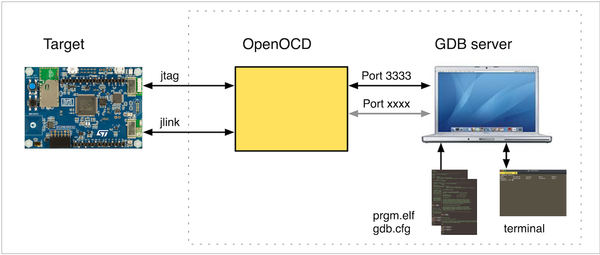
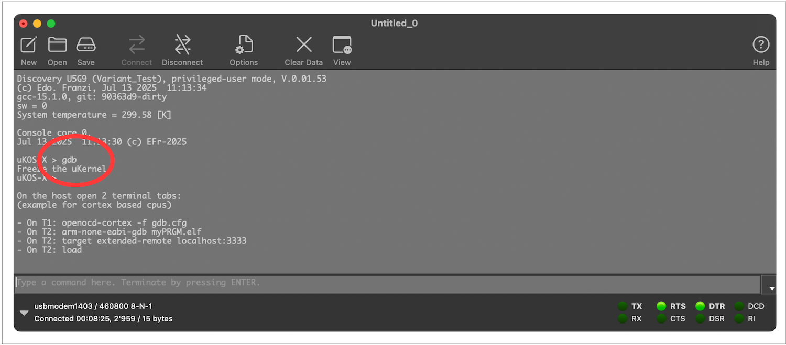
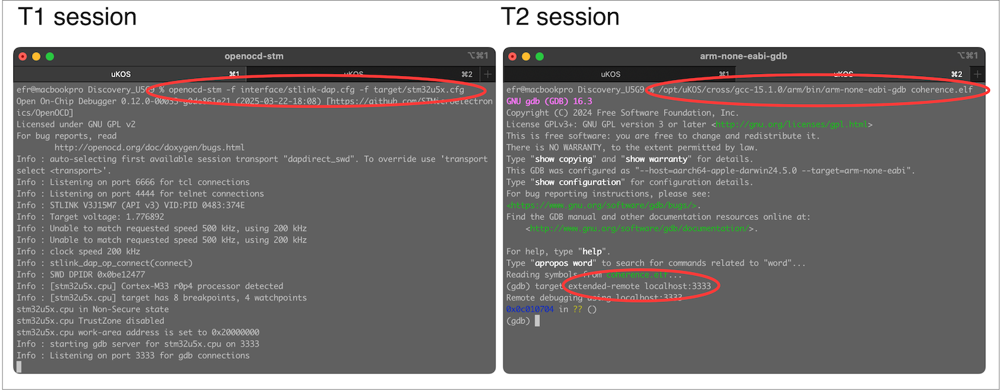
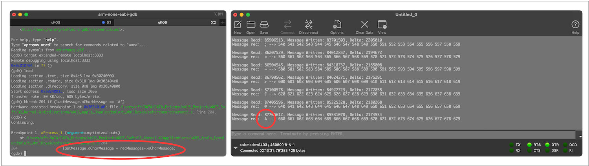
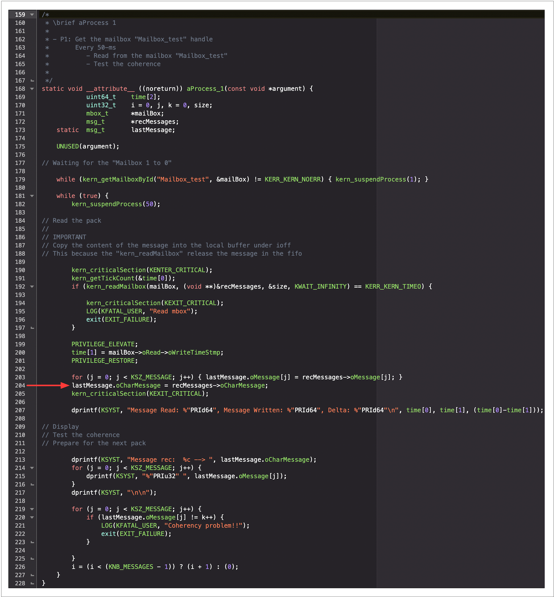

# 🌈  Annex A, debugging with gdb

## gdb: How to operate



The **GNU Debugger (GDB)** can be connected to the **target microcontroller** using either **OpenOCD** with **JTAG** or a **J-Link** interface. This connection provides a **powerful and flexible debugging environment**, allowing developers to interact with and control program execution directly from a host computer.

Connection Methods:

1. **OpenOCD + JTAG** – commonly used for STM32 development, offering open-source flexibility.
2. **Segger J-Link** – a widely supported commercial option with excellent performance and compatibility.

Typical Workflow:

1. Flash the firmware onto the target (via OpenOCD or J-Link tools).
2. Launch OpenOCD as a GDB server (openocd -f interface.cfg -f target.cfg).
3. Connect GDB to the running server (target remote localhost:3333).
4. Load symbols, set breakpoints, and begin debugging.

GDB provides **fine-grained control** over program execution, memory, and peripheral states. Combine GDB with a GUI debugger for enhanced productivity and ease of use. Ensure that the JTAG or SWD pins are accessible and not disabled in firmware

Server Interfaces Provided by OpenOCD. Upon launch, **OpenOCD** starts two separate TCP servers to support interactive development and debugging; GDB Server (Port 3333).

1. Allows a GDB client (on the host computer) to connect and control program execution.
2. Supports loading symbols, setting breakpoints, inspecting memory/registers, and stepping through code.
3. Common connection command, via bash:
    **openocd-stm -f interface/stlink-dap.cfg -f target/stm32u5x.cfg**
    **target remote localhost:3333**

### µKOS-X Support for GDB

The **µKOS-X** system includes a **built-in tool** designed to **streamline and simplify GDB usage**, particularly when working with OpenOCD. This tool helps to:

1. Automate initial connections.
2. Load symbol files and firmware images.
3. Provide an enhanced user experience for developers during embedded debugging sessions.

Ensure that the correct USB driver is installed for your JTAG adapter (e.g. ST-Link USB driver). Use the µKOS-X GDB support tool to save time during development and testing.

## A simple example to illustrate the operations

### Compiling a program with the right attributes

1. Compiling for Debugging with GDB. To enable source-level debugging, the application must be compiled with the -g compiler flag, which embeds debugging symbols into the executable.

   Note: The **µKOS-X** build system includes this flag by default in its Makefiles.

   Let’s walk through the debugging process of the example application: **coherence.c**, located in the Applications example folder. For this example, the selected hardware target is the **Discovery_U5G9**.

   Open a terminal session and follow those steps:

```bash
cd ../Applications/uKOS_Appls_Downloadable/b_MailBoxes/coherence/Discovery_U5G9
make -j USER_MODE=1
In the µKOS-X console, type gdb
```



### Launch a debug session

This steps requires to open 2 terminal sessions. In the first one **(T1)**, OpenOCD is launched. In the second one, **gdb** is connected to the port 3333 **(T2)**. On the **gdb** terminal **(T1)**, type **load**.



When working with different STM32 Cortex-based microcontrollers, it is important to use the appropriate version of **OpenOCD**, as not all variants support every CPU family natively.

OpenOCD Variants:

1. **openocd-cortex**
   1. General-purpose version.
   2. Suitable for all ARM Cortex-M CPUs.
   3. ❌ Not compatible with **STM32Uxxx** series.

2. **openocd-stm**

3. 🛠 Specially adapted version.
4. Required for **STM32Uxxx** microcontrollers.
5. Implements additional support and fixes not yet merged upstream.

```
On T1: openocd-stm -f interface/stlink-dap.cfg -f target/stm32u5x.cfg
On T2: /opt/uKOS/cross/gcc-15.2.0/arm/bin/arm-none-eabi-gdb coherence.elf
On T2: target extended-remote localhost:3333
On T2: load
```

### Now we can use gdb to debug the program

In the **gdb** terminal session **(T2)** we need to load the program:

<div class="full_width_table">

| **Useful gdb command**    | **Action** | **Example or description**              |
| :------------------------ | :--------- | :-------------------------------------- |
| c                         | -          | Continue /run the program               |
| n                         | -          | Next line                               |
| s                         | -          | Next line stepping into the function    |
| hbreak srcLine            | Permanent  | hbreak 123                              |
| hbreak srcLine condition  | Permanent  | hbreak 123 if (varible > 123)           |
| thbreak srcLine condition | Temporary  | thbreak 123 if (varible > 123)          |
| info break                | -          | info break                              |
| clear srcLine             | -          | Delete the breakpoint at srcLine        |
| info local                | -          | Display all the local routine variables |
| print variableName        | -          | Display the variableName                |

</div>

The loaded program (**coherence.elf**) executes 2 processes. Imagine that we want to run the program and to stop it at the line **204** only if the variable **lastMessage.oCharMessage == ‘A’**.



On the **gdb** session **(T2)** set a conditional breakpoint and execute the program.

In the **gdb** terminal session **(T2)** we need to load the program:

```bash
hbreak 204 if (lastMessage.oCharMessage == 'A')
c
```



## Links

[gdb](http://www.yolinux.com/TUTORIALS/GDB-Commands.html)

[gdb Cheatsheet](https://cs.brown.edu/courses/cs033/docs/guides/gdb.pdf)
