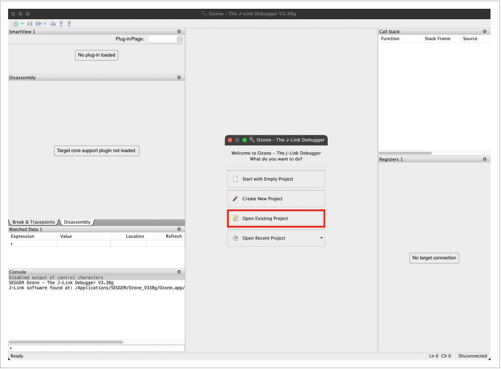
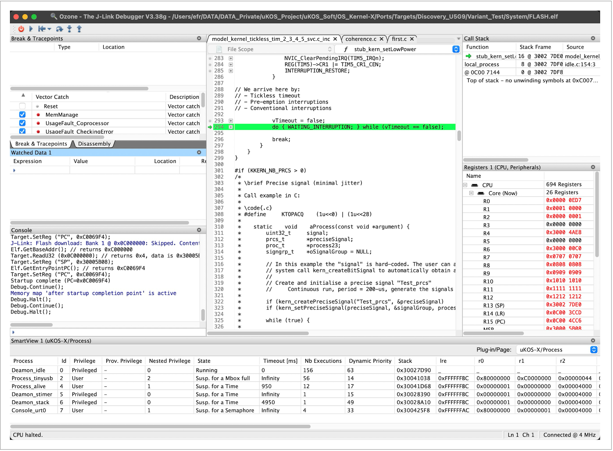

# 🌈  Annex B, Debugging with Ozone

## Ozone

Arguably the most effective debugger for embedded targets is the combination of **Ozone and its associated JTAG probe**. Ozone offers a robust graphical user interface that facilitates intuitive navigation through the debugging process. Developers can set breakpoints, inspect variables, monitor memory regions, and step through code with precision and ease.

For projects based on the **µKOS-X** real-time operating system, a **dedicated Ozone plugin** is available. This plugin enables in-depth inspection of the kernel's internal structures, including threads, semaphores, message queues, and timers. As a result, developers gain a clearer understanding of system behaviour at runtime, which greatly enhances diagnostic capabilities and accelerates troubleshooting.

This integration of **Ozone with both the JTAG interface and the µKOS-X plugin** represents a powerful toolchain for embedded software development, offering transparency, control, and efficiency in complex debugging scenarios.

### A simple example to illustrate the operations

#### Preparing the program

The most effective way to **debug a µKOS-X application** is to integrate it directly into the operating system and treat it as a command-line interface (CLI) tool. This approach requires only a minimal modification to the application’s code, **making it lightweight and non-intrusive**. By embedding the application within the OS image, developers can invoke it from the µKOS-X shell just like any other built-in command.

This setup allows for two convenient modes of execution: the application can either be run from RAM using the CLI **sloader** utility, or it can be compiled directly into the OS for seamless debugging. Both options offer full access to the µKOS-X environment and internal services, providing a consistent and controlled context for testing and analysis.

By leveraging this method, developers benefit from enhanced visibility into the application’s behaviour within the OS, without the need for complex deployment steps or extensive code changes.

##### *The original code*

All µKOS-X applications **must include a small descriptor table** that provides essential metadata required by the operating system. This table typically contains information such as the application’s name, version, entry point, stack size, and memory requirements. It allows the OS to correctly identify, load, and manage the application at runtime, whether it is embedded in the OS image or downloaded dynamically.

As an example, consider the application **coherence.c**, located in the directory:

**OS_Kernel-X/Applications/uKOS_Appls_Downloadable/b_MailBoxes/coherence**

This example illustrates how to structure the descriptor table and implement the entry function to ensure proper integration with the µKOS-X environment. Including this metadata is mandatory for the application to be correctly recognised and executed by the µKOS-X loader (**sloader**) or when statically linked into the OS.

```c
// The original header

MODULE(
    UserAppl,                              // Module name
    KID_FAM_APPLICATIONS,                  // Family
    KNUM_APPLICATION,                      // Module
    NULL,                                  // Address of pre init
    aStart,                                // Address of the code
    NULL,                                  // Address of post clean
    " 1.0",                                // Revision string
    ((1u<<BSHOW) | (1u<<BEXE_CONSOLE)),    // Flags
    0                                      // Execution cores
);
...

int    main(int argc, const char *argv[]) {
    ...
}

// The modified header

#if (defined(ROMABLE_S))

// Prototypes

static   int32_t   prgm(uint32_t argc, const char_t *argv[]);

MODULE(
    Coherence,                             // Module name
    KID_FAM_CLI,                           // Family
    (('_'<<8)+'C'),                        // Module
    NULL,                                  // Address of pre init
    prgm,                                  // Address of the code
    NULL,                                  // Address of post clean
    " 1.0",                                // Revision string
    ((1u<<BSHOW) | (1u<<BEXE_CONSOLE)),    // Flags
    0                                      // Execution cores
);

#else
MODULE(
    UserAppl,                              // Module name
    KID_FAM_APPLICATIONS,                  // Family
    KNUM_APPLICATION,                      // Module
    NULL,                                  // Address of pre init
    aStart,                                // Address of the code
    NULL,                                  // Address of post clean
    " 1.0",                                // Revision string
    ((1u<<BSHOW) | (1u<<BEXE_CONSOLE)),    // Flags
    0                                      // Execution cores
);
#endif

...

MAIN_ENTRY(argc, argv[]) {
    ...
}
```

The macro **ROMABLE_S** is defined by the µKOS-X makefile suite when compiling a complete system image. Its purpose is to indicate that the build is targeting a **ROMable** (i.e. flash-resident) system configuration, as opposed to a RAM-only or dynamically loaded application.

This macro allows developers to conditionally compile sections of code depending on whether the application is intended to be embedded within the OS or loaded separately at runtime. For example, certain initialisation routines or linker attributes may differ based on whether **ROMABLE_S** is defined.

#### Adapting the makefile for the target

To debug the **coherence.c** application as part of the target system, it must first be integrated into the system build. This requires adding the module name to the appropriate section of the **target’s makefile**, typically within the list of application sources or modules to be compiled and linked with the OS image.

By including coherence.c in the build process, the application becomes a statically embedded component of the µKOS-X system. This enables full debugging capabilities using tools such as Ozone, as the application will execute from within the main firmware, allowing access to both the OS internals and the application context.

Once the makefile is updated, rebuilding the system will produce a firmware image with coherence integrated, ready for deployment and debugging.

```makefile
# The CLI components (user)

PATH_APPL        =  $(PATH_UKOS)/Applications/uKOS_Appls_Downloadable

CLI_U            =  $(PATH_UKOS)/OS/CLI/bangla/BaNgLa.c
CLI_U            += $(PATH_UKOS)/OS/CLI/console/console.c
CLI_U            += $(PATH_UKOS)/OS/CLI/cycle/cycle.c
...
CLI_U            += $(PATH_UKOS)/OS/CLI/viewer/viewer.c
CLI_U            += $(PATH_UKOS)/OS/CLI/wkserial/wkserial.c
CLI_U            += $(PATH_UKOS)/OS/CLI/wki2c/wki2c.c
CLI_U            += $(PATH_APPL)/b_MailBoxes/coherence/coherence.c
CLI_U            += $(PATH_UKOS)/OS/CLI/viewer/viewer_uvc0_simule.c
...
```

##### *Operations for the debugging:*

```bash
cd OS_Kernel-X/Ports/Targets/Discovery_U5G9/Variant_Test/System
make -j USER_MODE=1
Launch Ozone: Open Existing Project: ozone_config.jdebug
Burn the flash and debug
Open the µKOS-X view:
```



The **ozone_config.jdebug** script also handles the installation of the **µKOS-X plugin**. This script is used to configure the Ozone debugger for a specific target, setting up memory maps, symbols, and initialisation sequences. As part of its setup process, it automatically loads the **µKOS-X plugin**, which enables advanced kernel awareness features within the debugger.

With the plugin installed, Ozone can display real-time information about the µKOS-X operating system, such as active threads, stack usage, semaphores, timers, and other kernel objects. This greatly enhances the debugging experience, allowing developers to gain deep insights into the system’s internal state during execution.

The use of **ozone_config.jdebug** ensures that the debugging environment is consistently and correctly configured, saving time and reducing the potential for manual setup errors.

**Menu View->SmartView->SmartView 1**


