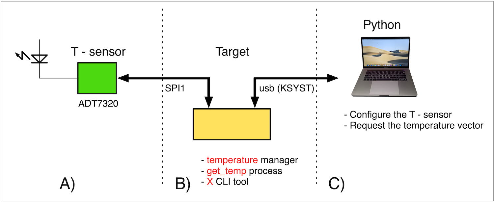
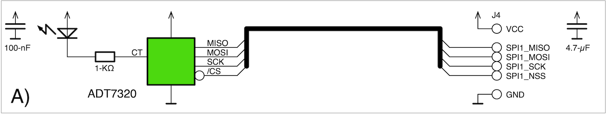
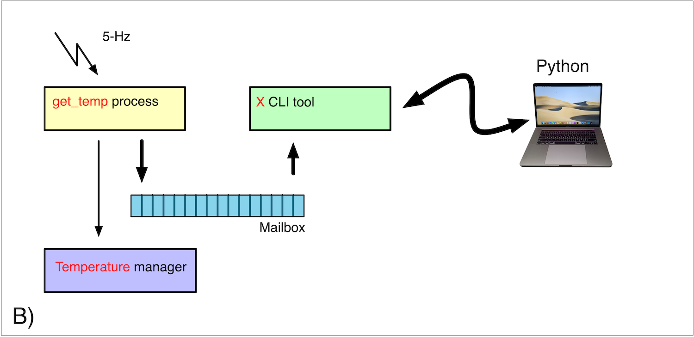
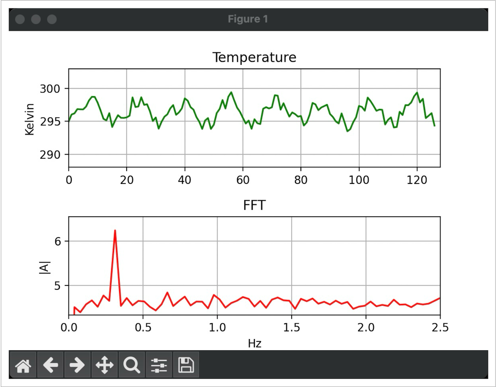

# 🌈  Annex C, A full application

## A full application

The most effective way to gain a practical understanding of how to work with **µKOS-X** is likely to develop a complete application that encompasses all major aspects of the system — from low-level hardware interaction to high-level host application integration.

A simple, minimalist example that covers these areas could be a temperature acquisition system, demonstrating the end-to-end process from physical hardware to software interfacing.

Within the **µKOS-X** package, the **temperature** manager is already defined. This example illustrates how to interface tmp0 with a dedicated hardware stub that controls a specific temperature sensor. The overall application is structured around the following key components:

1. A **temperature stub** interface for the **ADT7320** temperature sensor.
2. A **background process** that acquires temperature data every 200-ms.
3. A **mailbox mechanism** to store the last 128 temperature samples.
4. A Command-Line Interface (CLI) X tool to retrieve the 128-sample temperature vector from the mailbox.
5. A **Python**-based host application that queries the temperature data from µKOS-X and displays it accordingly.

This example provides a complete walkthrough of µKOS-X usage — from device driver integration to inter-process communication and external data visualisation.



### The temperature sensor (A)

The selected temperature sensor is the **ADT7320** from **Analog Devices**. This high-precision digital temperature sensor integrates an **internal bandgap reference**, a **temperature sensing element**, and a **16-bit analogue-to-digital converter (ADC)**. The ADC digitises the temperature with a resolution of **0.0078 -°C**, offering highly accurate measurements.

The ADC resolution is **user-programmable** and can be adjusted via the **SPI interface**, allowing flexible configuration to suit different application requirements.

A **LED is connected** to the sensor to indicate when the measured temperature exceeds a **predefined threshold**. This visual alert is triggered by the **CT pin**, an **open-drain output** that becomes active once the temperature surpasses a **programmable critical limit**.

The ADT7320 is designed to operate across a **supply voltage range of 2.7 -V to 5.5 -V**. When powered at **3.3-V**, it typically draws an average supply current of **210-μA**. For power-sensitive applications, the sensor offers a **shutdown mode**, reducing the current consumption to **approximately 2.0- μA** at 3.3 -V.

The device is rated for reliable operation across a wide temperature range, from **−40 -°C to +150 -°C**, making it suitable for both industrial and embedded systems requiring robust thermal monitoring.



### The µKOS-X software (B)

For this application, we need to develop three specific software components within the **µKOS-X framework**:

1. The hardware interface: **stub_temperature_adt7320.c**.
2. The background temperature acquisition process: **temperature.c**.
3. The command-line interface (CLI) tool: **X.c**.

To ensure proper integration and coordination within the system, specific identifiers must be predefined in the central header file modules.h. These identifiers are essential for referencing the manager, the process, and the communication protocol consistently across all modules.

Below are the selected identifiers designated for each component:

1. Manager identifier: **KNUM_TEMPERATURE.**
2. Process identifier: **KNUM_GET_TEMP.**
3. Protocol identifier: **KNUM_X.**



#### “temperature” manager system calls

<div class="full_width_table">

| **temperature System Calls** |                        |
| :--------------------------- | :--------------------- |
| temperature_reserve          | Reserve the peripheral |
| temperature_release          | Release the peripheral |
| temperature_read             | Get the temperature    |
| temperature_write            | Set the temperature    |

</div>

The manager **temperature** is already defined within the **µKOS-X framework**. Therefore, our task is to implement the exported stub that provides the hardware interface between the **temperature** manager and the **ADT7320** temperature sensor.

This stub is responsible for abstracting the low-level hardware details and exposing a standardised interface to the µKOS-X kernel. It must implement all the required functions expected by the tmp0 manager — including initialisation, read access to temperature values, and any necessary control routines.

The stub is to be implemented in the source file:

1. **stub_temperature_adt7320.c.**

This file will contain all exported functions, properly registered and linked to the tmp0 manager. These functions allow µKOS-X to interact with the ADT7320 sensor in a **hardware-agnostic manner**, ensuring reusability and modularity within the system.

1. **void stub_temperature_init(void)**.
2. **int32_t stub_temperature_read(float64_t \*temperature)**.
3. **int32_t stub_temperature_write(float64_t temperature).**

```C
/*
; stub_temperature_adt7320.
; =========================

; SPDX-License-Identifier: MIT

;------------------------------------------------------------------------
; Author:     Edo. Franzi    The 2025-01-01
; Modifs:
;
; Project:    uKOS-X
; Goal:       stub for the "temperature" manager module.
;
;   (c) 2025-2026, Edo. Franzi
;   --------------------------
;                                              __ ______  _____
;   Edo. Franzi                         __  __/ //_/ __ \/ ___/
;   5-Route de Cheseaux                / / / / ,< / / / /\__ \
;   CH 1400 Cheseaux-Noréaz           / /_/ / /| / /_/ /___/ /
;                                     \__,_/_/ |_\____//____/
;   edo.franzi@ukos.ch
;
;   See the MIT License (License_uKOS-X.txt)
;
;------------------------------------------------------------------------
*/

#include     "uKOS.h"

#define    BSEL_ADT7320     4u          // PORT A 4, /CS of the ADT7320
#define    KNB_REG          0x07u       // Nb. of registers
#define    KWRITE           0x00u       // Write bit
#define    KREAD            0x40u       // Read bit

#define    REGSTATUS        (0x0u<<3u)  // Register status (R) 8
#define    REGCONFIG        (0x1u<<3u)  // Register configuration (W) 8
#define    REGTEMPER        (0x2u<<3u)  // Register temperature (R) 16
#define    REGID            (0x3u<<3u)  // Register ID (R) 8
#define    REGTCRSET        (0x4u<<3u)  // Register T Crit set point (W) 16
#define    REGTHYSET        (0x5u<<3u)  // Register T Hyster set point (W) 8
#define    REGTHISET        (0x6u<<3u)  // Register T High set point (W) 16
#define    REGTLOSET        (0x7u<<3u)  // Register T Low set point (W) 16

// Prototypes
// ==========

static uint8_t    local_writeReadSPI(uint8_t data);

/*
 * \brief stub_temperature_init
 *
 * - Initialise some specific CPU parts
 *
 */
void stub_temperature_init(void) {

    RCC->APB2ENR |= RCC_APB2ENR_SPI1EN;          // Turn on the SPI1

// Initialise the SPI1 Master, POL0 = CPHA0 = 1, f42 / 32 (1.3-MBit/s)

    GPIOA->ODR |= (1<<BSELADT7320);              // _/ the NSS chip select
    SPI1->CR1   = SPI_CR1_MSTR                   // Master on
                |  SPI_CR1_CPHA                  // PHA 1
                |  SPI_CR1_CPOL                  // POL 1
                |  SPI_CR1_BR_2;                 // f42 / 32
    SPI1->CR2  |= SPI_CR2_SSOE;                  //
    SPI1->CR1  |= SPI_CR1_SPE;                   // Enable the SPI1

// Reset of the serial interface of the ADT7320

    GPIOA->ODR &= (uint32_t)~(1u<<BSEL_ADT7320);  // \_ the NSS chip select
    local_writeReadSPI(0xFFu);                    //
    local_writeReadSPI(0xFFu);                    //
    local_writeReadSPI(0xFFu);                    //
    local_writeReadSPI(0xFFu);                    // At lest 32 bits @ 1
    GPIOA->ODR |= (1u<<BSEL_ADT7320);             // _/ the NSS chip select

    kern_suspendProcess(1u);                       //

// Initialise the ADT7320

    GPIOA->ODR &= (uint32_t)~(1u<<BSEL_ADT7320);  // \_ the NSS chip select
    local_writeReadSPI(REGCONFIG | KWRITE);       //
    local_writeReadSPI(0x90u);                    // REGCONFIG 10010000
    GPIOA->ODR |= (1u<<BSEL_ADT7320);             // _/ the NSS chip select
    kern_suspendProcess(1000u);                   // waiting for the end of
                                                  // the first conversion
}

/*
 * \brief stub_temperature_read
 *
 * - Read the temperature
 *
 */
int32_t stub_temperature_read(float64_t *temperature) {
    uint8_t    msb, lsb;
    int16_t    value;

    GPIOA->ODR &= (uint32_t)~(1u<<BSEL_ADT7320); // \_ the NSS chip select
    local_writeReadSPI(REGTEMPER | KREAD);       //
    msb = local_writeReadSPI(0xFFu);             // register msb value
    lsb = local_writeReadSPI(0xFFu);             // register lsb value

    value = (int16_t)((msb<<8u) | lsb);          // register value_16

// Scale the result

    *temperature = (0.0078 * (float64_t)value);

    GPIOA->ODR |= (1u<<BSEL_ADT7320);            // _/ the NSS chip select
    return (KTMP0NOERR);
}

/*
 * \brief stub_temperature_write
 *
 * - Write the temperature
 *
 */
int32_t stub_temperature_write(float64_t temperature) {
    uint8_t     msb, lsb;
    uint16_t    value;

    value = (int16_t)(temperature / 0.0078);

    msb = (uint8_t)(value>>8u);                  //
    lsb = (uint8_t)(value);                      //

    GPIOA->ODR &= (uint32_t)~(1u<<BSEL_ADT7320); // \_ the NSS chip select
    local_writeReadSPI(REGTHISET | KWRITE);      //
    local_writeReadSPI(msb);                     // register msb value
    local_writeReadSPI(lsb);                     // register lsb value
    GPIOA->ODR |= (1u<<BSEL_ADT7320);            // _/ the NSS chip select
    return (KTMP0NOERR);
}

// Local routines
// ==============

/*
 * \brief local_writeReadSPI
 *
 */
static uint8_t local_writeReadSPI(uint8_t data) {
    volatile uint16_t    dummy __attribute__ ((unused));

// Send a Byte ... and waiting for the end of the transfer

    dummy = SPI1->DR;                            // Clear the RX flag
    SPI1->DR = (uint16_t)data;                   // Send a data
    while ((SPI1->SR & SPI_SR_RXNE) == 0u) { ; } // Waiting for the RX flag
    __asm__(" nop");                             //
    __asm__(" nop");                             // Overlap of the CS
    return ((uint8_t)SPI1->DR);                  //
}
```

#### The background process

A simple background process is responsible for periodically collecting temperature readings from the sensor and publishing a rolling buffer containing the last 128 samples. This buffer is made available to other components via a mailbox, which provides a thread-safe mechanism for inter-process communication within the µKOS-X framework.


To facilitate testing and development in the absence of physical hardware, the system includes a simulation mode. By defining the compilation flag **SIMULE_S**, the background process can be configured to emulate a synthetic temperature profile, enabling full functional testing of the application logic.

To activate this simulation mode, simply define the **SIMULE_S** flag prior to compilation — either in your project settings or directly in the compilation command.

```c
/*
; get_temp.
; =========

; SPDX-License-Identifier: MIT

;------------------------------------------------------------------------
; Author:     Edo. Franzi    The 2025-01-01
; Modifs:
;
; Project:    uKOS-X
; Goal:       get_temp process; continuous acquisition of the temperature.
;             The result is pushed in a mailbox.
;
;             Process                        Tool
;             get_temp                       X
;             while
;                 - malloc of a buffer k
;                 - send the buffer k        - receive the buffer k
;                 - k++                      - copy it
;                                            - free the buffer k
;
;   (c) 2025-2026, Edo. Franzi
;   --------------------------
;                                              __ ______  _____
;   Edo. Franzi                         __  __/ //_/ __ \/ ___/
;   5-Route de Cheseaux                / / / / ,< / / / /\__ \
;   CH 1400 Cheseaux-Noréaz           / /_/ / /| / /_/ /___/ /
;                                     \__,_/_/ |_\____//____/
;   edo.franzi@ukos.ch
;
;   See the MIT License (License_uKOS-X.txt)
;
;------------------------------------------------------------------------
*/

#include    "uKOS.h"
#include    <stdlib.h>

// uKOS-X specific (see the module.h)
// ==================================

LOC_CONST_STRG(aStrApplication[]) =
    "get_temp     temperature acquisition process           (c) EFr-2026";
LOC_CONST_STRG(aStrHelp[]) =
    "get_temp process\n"
    "================\n\n"

    "Acquisition of the temperature\n\n";

    "Module built on "__DATE__"  "__TIME__" (c) EFr-2026\n\n";

// Prototypes

static int32_t    prgm(uint32_t argc, const char_t *argv[]);
static int32_t    temperature_clean(uint32_t argc, const char_t *argv[]);
static void       local_process(const void *argument);

// This process has to run on the following cores:

#define    KEXECUTION_CORE    (1u<<BCORE_0)

MODULE(
    Get_temp,                // Module name
    KID_FAM_PROCESS,         // Family (defined in the module.h)
    KNUM_GET_TEMP,           // Module id (defined in the module.h)
    NULL,                    // Address of pre init
    prgm,                    // Address of the code
    temperature_clean,       // Address of post clean
    " 1.0",                  // Revision string (major . minor)
    (1<<BSHOW),              // Flags
    KEXECUTION_CORE          // Execution cores
);

// Process specific
// ================

static bool    vKillRequest[KNB_CORES] = MCSET(false);

#if (!defined(KTEMPERATURE_ZERO_KELVIN))
#define    KTEMPERATURE_ZERO_KELVIN    ((float64_t)(-273.16))
#endif

#define    KTIME_ACQ      200u       // 200-ms
#define    KNB_SAMPLES    128u       // Nb. of samples

STRG_LOC_CONST(aStrIden[]) = "Process_get_temp";
STRG_LOC_CONST(aStrText[]) = "Process get_temp: acq. temp   (c) EFr-2026";

/*
 * \brief Main entry point
 *
 */
static int32_t prgm(uint32_t argc, char_t *argv[]) {
    uint32_t    core;
    proc_t      *process;

    UNUSED(argc);
    UNUSED(argv);

    core = GET_RUNNING_CORE;
    vKillRequest[core] = false;

    PROCESS_STACKMALLOC(
        0,                           // Index
        vSpecification,              // Specifications
        aStrText,                    // Info string (NULL if anonymous)
        KKERN_SZ_STACK_MM,           // Stack size (number of words)
        local_process,               // Code of the process
        aStrIden,                    // Identifier (NULL if anonymous)
        KSYST,                       // Default Serial Communication Manager
        KKERN_PRIORITY_NORMAL_00,    // Priority normal
    );

    if (kern_createProcess(&vSpecification, &vKillRequest[core], &process)
        != KERR_KERN_NOERR) {
        LOG(KFATAL_SYSTEM, "temperature: create proc”);
        exit(EXIT_OS_PANIC);
    }

    LOG(KINFO_SYSTEM, "temperature: process temperature launched");
    return (EXIT_OS_SUCCESS_CLI);
}

/*
 * \brief temperature_clean
 *
 * - Try to clean the ressources
 *        - Free all the ressources
 *
 */
static int32_t    temperature_clean(uint32_t argc, const char_t *argv[]) {
    uint32_t    core;

    UNUSED(argc);
    UNUSED(argv);

    core = GET_RUNNING_CORE;
    vKillRequest[core] = true;
    return (EXIT_OS_SUCCESS);
}

/*
 * \brief local_process
 *
 * - Temperature acquisitions (5-Hz)
 *   In the simulated table a period is represented by 16 samples
 *   200-ms per sample -> 3.2-s -> 1/3.2 = 0.3125-Hz
 *
 */
static void __attribute__ ((noreturn)) local_process(const void *argument) {
                    mbox_t     *mailBox;
                    int16_t    *temperature = NULL;
                    uint16_t   i;
                    uint32_t   sizeSnd;
                    mcnf_t     configure = {
                                   .oNbMaxPacks    = 10u,
                                   .oDataEntrySize = 0u
                               };
           const    bool       *killRequest;

    #if (!defined(CONFIG_REAL_TMPERATURE_S))
                    uint32_t   random;
    static const    float64_t  aSimule[KNB_SAMPLES] = {
                20.23, 20.52, 21.23, 21.87, 22.21, 22.67, 23.12, 23.67,
                23.78, 23.34, 22.76, 22.09, 21.56, 21.14, 20.55, 20.03,
                20.23, 20.52, 21.23, 21.87, 22.21, 22.67, 23.12, 23.67,
                23.78, 23.34, 22.76, 22.09, 21.56, 21.14, 20.55, 20.03,
                20.23, 20.52, 21.23, 21.87, 22.21, 22.67, 23.12, 23.67,
                23.78, 23.34, 22.76, 22.09, 21.56, 21.14, 20.55, 20.03,
                20.23, 20.52, 21.23, 21.87, 22.21, 22.67, 23.12, 23.67,
                23.78, 23.34, 22.76, 22.09, 21.56, 21.14, 20.55, 20.03,
                20.23, 20.52, 21.23, 21.87, 22.21, 22.67, 23.12, 23.67,
                23.78, 23.34, 22.76, 22.09, 21.56, 21.14, 20.55, 20.03,
                20.23, 20.52, 21.23, 21.87, 22.21, 22.67, 23.12, 23.67,
                23.78, 23.34, 22.76, 22.09, 21.56, 21.14, 20.55, 20.03,
                20.23, 20.52, 21.23, 21.87, 22.21, 22.67, 23.12, 23.67,
                23.78, 23.34, 22.76, 22.09, 21.56, 21.14, 20.55, 20.03,
                20.23, 20.52, 21.23, 21.87, 22.21, 22.67, 23.12, 23.67,
                23.78, 23.34, 22.76, 22.09, 21.56, 21.14, 20.55, 20.03 };
    #else
                    float64_t  instTemperature;
    #endif

    killRequest = (const bool *)argument;

// Create the mailbox "Temperature"

    if (kern_createMailbox("Temperature", &mailBox) \
        != KERR_KERN_NOERR) {
        LOG(KFATAL_SYSTEM, "temperature: create Mbox”); exit(EXIT_OS_PANIC);   }
    if (kern_setMailbox(mailBox, &configure) \
        != KERR_KERN_NOERR) {
        LOG(KFATAL_SYSTEM, "temperature: set mbox\n”);
        exit(EXIT_OS_FAILURE); }

    while (*killRequest == false) {
        kern_suspendProcess(KTIME_ACQ);

// Request a temperature buffer
// It will be free by the tool X

        temperature = (int16_t *)memo_malloc(KMEMO_ALIGN_8, \
                      (KNB_SAMPLES * sizeof(int16_t)), "temperature");
        if (temperature == NULL) {
            LOG(KFATAL_SYSTEM, "temperature: out of memory");
            exit(EXIT_OS_FAILURE);
        }

// Rearrange the vector & store the new value inside the mailbox
// The temperature acquisition is emulated (see table),
// then, a random noise (-1.28 .. +1.27 degree) is added
// The (random & 0xFF) -> +127/-128 numbers

        #if (defined(CONFIG_REAL_TMPERATURE_S))
        for (i = 0u; i < (KNB_SAMPLES - 1u); i++) {
            temperature[KNB_SAMPLES - 1u - i] = \
            temperature[KNB_SAMPLES - 2u - i];
        }

        temperature_read(&instTemperature);
        temperature[0] = \
        (int16_t)((instTemperature - KTEMPERATURE_ZERO_KELVIN) * 100.0);

        #else
        for (i = 0u; i < KNB_SAMPLES; i++) {
            random_read(KRANDOM_SOFT, &random, 1u);
            temperature[i] = (int16_t)((aSimule[i] \
                           - KTEMPERATURE_ZERO_KELVIN) * 100.0) \
                           + (int16_t)(random & 0xFFu);
        }
        #endif

// As long as the mailbox is not full, send a the temperature

        sizeSnd = (KNB_SAMPLES * sizeof(uint16_t));
        if (kern_writeMailbox(mailBox, &temperature[0], sizeSnd, \
            KWAIT_INFINITY) != KERR_KERN_NOERR) {
            (void)dprintf(KSYST, "mbox problem\n");
            LOG(KFATAL_USER, "temperature: mbox problem");
            exit(EXIT_OS_FAILURE);
        }

    }

// Kill the process & the ressources

    INTERRUPTION_OFF;
    kern_killMailbox(mailBox);
    memo_free(temperature);
    exit(EXIT_OS_SUCCESS);
}
```

#### The CLI tool X

The CLI tool **module X** is responsible for handling messages received from a host computer. In the context of our application, it provides a command interface that allows the host to request and read the temperature vector, which is returned in ASCII format for ease of parsing and display.

```c
/*
; X.
; ==

; SPDX-License-Identifier: MIT

;------------------------------------------------------------------------
; Author:     Edo. Franzi    The 2025-01-01
; Modifs:
;
; Project:    uKOS-X
; Goal:       Control the temperature.
;
;   (c) 2025-2026, Edo. Franzi
;   --------------------------
;                                              __ ______  _____
;   Edo. Franzi                         __  __/ //_/ __ \/ ___/
;   5-Route de Cheseaux                / / / / ,< / / / /\__ \
;   CH 1400 Cheseaux-Noréaz           / /_/ / /| / /_/ /___/ /
;                                     \__,_/_/ |_\____//____/
;   edo.franzi@ukos.ch
;
;   See the MIT License (License_uKOS-X.txt)
;
;------------------------------------------------------------------------
*/

#include    "uKOS.h"

// uKOS-X specific (see the module.h)
// ==================================

LOC_CONST_STRG(aStrApplication[]) =
    ”X            Control the temperature.                  (c) EFr-2026";
LOC_CONST_STRG(aStrHelp[]) =
    ”Control the temperature\n"
    "=======================\n\n"

    "This tool module allows to operate on the xtmp\n"
    "temperature manager\n\n"

    "Input format:  X\n"
    "Output format: x,t0,t1,t...t127\n\n";

    "Module built on "__DATE__"  "__TIME__" (c) EFr-2026\n\n";

static  int32_t prgm(uint32_t argc, char_t *argv[]);

MODULE(
    X,                                   // Module name
    KID_FAM_CLI,                         // Family (defined in the module.h)
    KNUM_X,                              // Module id
    NULL,                                // Address of pre init
    prgm,                                // Address of the code
    NULL,                                // Address of post clean
    " 1.0",                              // Revision string (major . minor)
    ((1<<BSHOW) | (1<<BEXE_CONSOLE)),    // Flags
    0                                    // Execution cores
);

// Protocol specific
// =================

#define    KNB_SAMPLES    128u           // Nb. of samples (size of the vector)

/*
 * \brief Main entry point
 *
 */
static int32_t prgm(uint32_t argc, char_t *argv[]) {
           uint32_t    core, sizeRec;
           int32_t     status;
           uint16_t    *bufRec, i;
    static uint16_t    vTemperature[KNB_CORES][KNB_SAMPLES];
    static bool        vInitialised[KNB_CORES] = MCSET(false);
    static mbox_t      *vMailBox[KNB_CORES];

    UNUSED(argc);
    UNUSED(argv);

    core = GET_RUNNING_CORE;

    if (vInitialised[core] == false) {
        if (kern_getMailboxById("Temperature", &vMailBox[core]) \
            != KERR_KERN_NOERR) {
            (void)dprintf(KSYST, "Process Temperature not installed!\n");
            return (EXIT_OS_FAILURE);
        }

        vInitialised[core] = true;
    }

// Receive the message (wait until the FIFO is not empty)

    sizeRec = (KNB_SAMPLES * sizeof(uint16_t));
    status  = kern_readMailbox(vMailBox[core], (void **)&bufRec, &sizeRec, 10000);

    switch (status) {
        case KERR_KERN_NOERR: {
            break;
        }
        case KERR_KERN_TIMEO:
        case KERR_KERN_MBKIL: {
            (void)dprintf(KSYST, "The process Temperature was killed!\n");
            vInitialised[core] = false;
            break;
        }
        default: {
            (void)dprintf(KSYST, "mbox problem\n");
            LOG(KFATAL_USER, "x: mbox problem");
            exit(EXIT_OS_FAILURE);
        }
    }

// Copy it into the temperature buffer before to "free" the memory

    memcpy(&vTemperature[core][0], bufRec, (KNB_SAMPLES * sizeof(uint16_t)));
    memo_free(bufRec);

    (void)dprintf(KSYST, "x,");
    for (i = 0u; i < (KNB_SAMPLES - 1u); i++) {
        (void)dprintf(KSYST, "%d,",  vTemperature[core][i]);
    }
    (void)dprintf(KSYST, "%d\n", vTemperature[core][KNB_SAMPLES - 1]);

    return (EXIT_OS_SUCCESS_CLI);
}
```

#### The Python software (C)

**Python** is an ideal tool for **data acquisition, processing, and visualisation**, thanks to its rich ecosystem of scientific libraries such as **NumPy**, **Pandas**, and **Matplotlib**. In this application, the Python script communicates with the µKOS-X system by **requesting a new temperature vector**, which it can then process, analyse, and display in various formats — including plots, tables, or dashboards.

While Python offers exceptional flexibility and ease of integration, other **visualisation and signal processing tools** — such as **MATLAB**, **LabVIEW**, or **Mathematica** — can also be used to achieve similar objectives. These platforms are well-suited for more advanced numerical analysis or real-time monitoring tasks, depending on the needs of the application and the user’s familiarity.



```python
# SPDX-License-Identifier: MIT

#------------------------------------------------------------------------
# Author:     Edo. Franzi    The 2025-01-01
# Modifs:
#
# Project:    uKOS-X
# Goal:       Read a 128 element vector (temperature).
#             Display the temperature vector
#             Display the FFT of the temperature vector
#
#             Necessary packages:
#             pip3 install numpy pyserial matplotlib
#
#             python3 X.py
#
#   (c) 2025-2026, Edo. Franzi
#   --------------------------
#                                              __ ______  _____
#   Edo. Franzi                         __  __/ //_/ __ \/ ___/
#   5-Route de Cheseaux                / / / / ,< / / / /\__ \
#   CH 1400 Cheseaux-Noréaz           / /_/ / /| / /_/ /___/ /
#                                     \__,_/_/ |_\____//____/
#   edo.franzi@ukos.ch
#
#   See the MIT License (License_uKOS-X.txt)
#
#------------------------------------------------------------------------

# Necessary packages

import    serial
import    serial.tools.list_ports
import    time
import    numpy as np
import    matplotlib.pyplot as plt

KNB_SAMPLES         = 128                   # Number of samples
KNB_SAMPLES_P2      = 128                   # Next power of 2 >= KNB_SAMPLES
KSAMPLING_FREQUENCY = 5                     # Sampling frequency (Hz)
KTIME_LOOP          = 0.05                  # Loop time (s)
KDELTA_TEMPERATURE  = 30                    # Delta temperature (for display)
KSERIAL_PORT_STLINK = 'usbmodem'            # 'usbmodem' for STLink
KSERIAL_PORT_FTDI   = 'usbserial-uKOS_2'    # 'usbserial' for FTDI
KBAUDRATE           = 460800                # Baudrate

# Compute the FFT of the temperature vector
# -----------------------------------------

def compute_fft(temperatures):
    frequencies   = np.linspace(0, KSAMPLING_FREQUENCY / 2, (KNB_SAMPLES_P2 // 2) + 1)
    result        = np.fft.fft(temperatures, KNB_SAMPLES_P2) / KNB_SAMPLES
    amplitudes    = np.abs(result[:(KNB_SAMPLES_P2 // 2) + 1])
    dcValue       = amplitudes[0]
    amplitudes[0] = 0

    foIndex = int(np.argmax(amplitudes))
    fo = (KSAMPLING_FREQUENCY / 2) * foIndex / (KNB_SAMPLES / 2)
    return (frequencies, (amplitudes * 2), dcValue, fo)

# Read the temperature vector
# ---------------------------

# Clean the input buffer
# Send the X command to the target
# Recover the answer x,23456,34345,33355,..\n
# Create a clean "temperature" vector

def read_temperatureVector(fdSerial):
    fdSerial.reset_input_buffer()
    fdSerial.write(b'X\n')

    answer = fdSerial.readline().decode().strip()
    if not answer.startswith("x,"):
        raise Exception("Unexpected response from device!")

    rawData = answer[2:].split(',')[:-1]
    vector  = [int(val) for val in rawData]
    temperatures = np.array(vector) / 100.0
    return (temperatures)

# Serial channel management
# -------------------------

# Try to open the channel
#    List all the possible candidates that contain “KSERIAL_PORT_STLINK"
#      or "KSERIAL_PORT_FTDI"
#
# Configure the channel

def serial_portList():
    ports = list(serial.tools.list_ports.comports())
    return [
        deviceName.device for deviceName in ports
        if KSERIAL_PORT_STLINK in deviceName.device
        or KSERIAL_PORT_FTDI in deviceName.device
    ]

def serial_openConnection():
    ports = serial_portList()
    if not ports:
        raise Exception("No matching serial ports found!")

    port = ports[0]
    fdSerial = serial.Serial(port, KBAUDRATE, timeout = 10)
    print(f"Connected to {port}")
    return (fdSerial)

# Main
# ----

# Mode interactif ON
# Display the temperature vector
# Display the FFT of the temperature vector

def main():
    fdSerial = None

    try:
        fdSerial = serial_openConnection()
        plt.ion()

        fig, (ax1, ax2) = plt.subplots(2, 1, figsize = (6, 4))
        fig.subplots_adjust(hspace = 0.5)

        line1, = ax1.plot([], [], 'g', label = "Temperature (K)")
        line2, = ax2.plot([], [], 'r', label = "FFT Amplitude")

        ax1.set_ylim(273 + (KDELTA_TEMPERATURE // 2), 273
                     + KDELTA_TEMPERATURE)
        ax1.set_xlim(0, KNB_SAMPLES)
        ax1.set_title("Temperature")
        ax1.set_ylabel("Kelvin")
        ax1.grid(True)

        ax2.set_xlim(0, KSAMPLING_FREQUENCY / 2)
        ax2.set_ylim(0, 10)
        ax2.set_title("FFT")
        ax2.set_xlabel("Hz")
        ax2.set_ylabel("|A|")
        ax2.grid(True)

        while True:
            try:
                temperatures = read_temperatureVector(fdSerial)
                frequencies, amplitudes, dcValue
                fo = compute_fft(temperatures)

                print(f"DC = {dcValue:.2f} K, fo = {fo:.2f} Hz")

                line1.set_ydata(temperatures)
                line1.set_xdata(np.arange(len(temperatures)))
                line2.set_ydata(amplitudes)
                line2.set_xdata(frequencies)
                ax2.set_ylim(
                    float(np.mean(amplitudes)) * 0.95,
                    float(np.max(amplitudes)) * 1.05
                )
                fig.canvas.draw()
                fig.canvas.flush_events()
                time.sleep(KTIME_LOOP)

                except Exception as e:
                    print("Acquisition error:", e)
                    time.sleep(1)

    finally:
        if 'fdSerial' in locals() and fdSerial.is_open:
            fdSerial.close()
            print("Serial connection closed.")

# Main entry point
if __name__ == '__main__':
    main()
```
