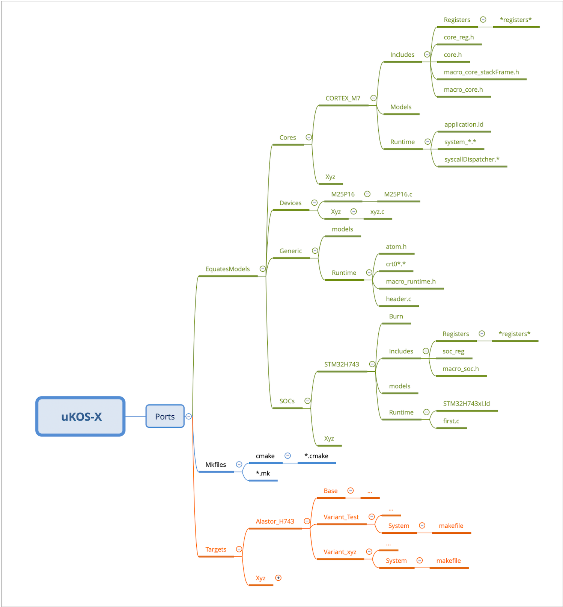
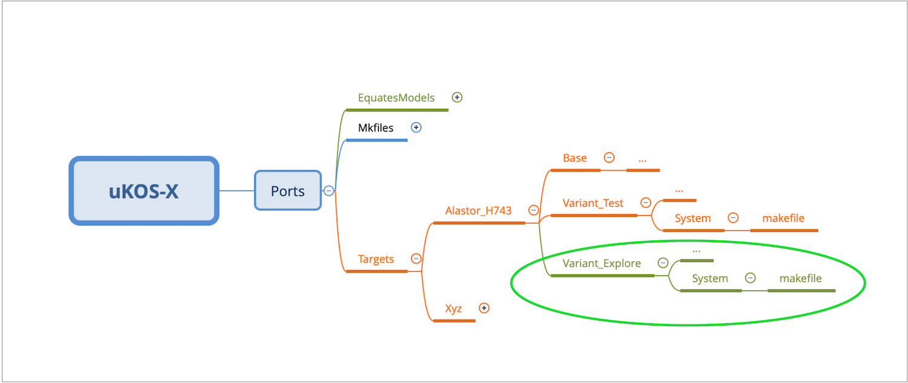
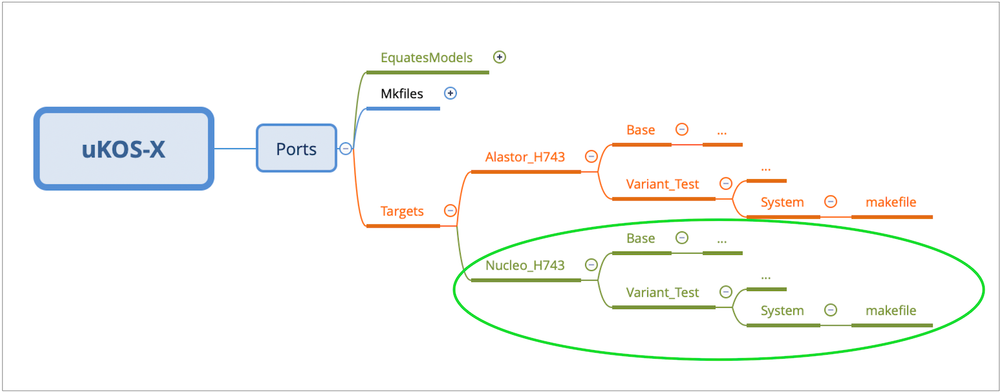

# 🌈  Annex E, Porting µKOS-X

## Introduction

Porting **µKOS-X** to a different target platform is not an inherently complex task. However, it is essential to begin with a solid understanding of the system’s architecture and overall organisation (we strongly recommend reading this book beforehand).

In this section, we will walk through a detailed, step-by-step example illustrating the complete process of porting and configuring µKOS-X for a new target. To keep the explanation clear and manageable, we will focus exclusively on targets that use a **CPU already supported by the system**.

Naturally, it is also possible to port µKOS-X to platforms with different, unsupported CPUs. However, such cases involve significantly greater complexity and require deeper modifications to the kernel and hardware abstraction layers..

## Considered target: ST Nucleo_H743 board

In this example, we examine the porting of µKOS-X to the **ST Nucleo_H743** target. The reference platform used for comparison is the **Alastor_H743**. Both targets have been enhanced with additional peripherals to expand their functional capabilities. The upgraded configurations include the following components:

<div class="full_width_table">

| **Function** | **µKOS-X**  | **Peripheral**   | **Peripheral**  |
| :----------- | :---------- | :--------------- | :-------------- |
|              | **Manager** | **Alastor_H743** | **Nucleo_H743** |
| JTAG         | -           | JTAG             | JTAG            |
| Serial KURT0 | urt0        | USART2           | USART3          |
| Serial KURT1 | urt1        | USART3           | USART2          |
| Serial KCDC0 | cdc0        | -                | USB             |

</div>

### Preparing the software package

As previously mentioned, the new **Nucleo_H743** target closely resembles the **Alastor_H743**. Therefore, the initial step in the porting process is to create a project structure for the new target. This can be easily accomplished by duplicating the existing **Alastor_H743** project and adapting it for use with the **Nucleo_H743**.
```bash
cd ${PATH_UKOS_X_PACKAGE}/Ports/Targets
cp -r Alastor_H743 Nucleo_H743
```

### Modify the necessary files

Now the customisation process starts. Step-by-step it is necessary to modify the specific target files. The colour indicates the degree of complexity for such a modification. Anyway, it is strongly suggested to visualise and to compare the marked files; this will help to understand the porting.

```bash
A) Low complexity modifications
B) Moderate complexity modifications
C) Serious complexity modifications
D) Need to be rewritten / or deleted

A) ./README

-- The Base

A) ./Base/Lib_serials/urt0/stub_urt0_usart3.c
A) ./Base/Lib_serials/urt1/stub_urt1_usart2.c

A) ./Base/Lib_cryptographics/random/stub_random.c

A) ./Base/Lib_generics/machine/stub_machine.c

A) ./Base/Lib_kernels/kern/stub_kern_kernel.c

A) ./Base/Lib_peripherals/i2c0/stub_i2c0_si2c2.c
A) ./Base/Lib_peripherals/led/stub_led.c
A) ./Base/Lib_peripherals/spi0/stub_spi0_sspi3.c
A) ./Base/Lib_peripherals/switch/stub_switch.c
A) ./Base/Lib_peripherals/watchdog/stub_watchdog.c

A) ./Base/Processes/alive/stub_alive.c

A) ./Base/Runtime/cmns.c
A) ./Base/Runtime/exce.c
A) ./Base/Runtime/link_p.ld
A) ./Base/Runtime/link_pu.ld
A) ./Base/Runtime/link_p.lld
A) ./Base/Runtime/link_pu.lld
A) ./Base/Runtime/link_App.ld

-- The Variant

A) ./Variant_Test/Includes/Board/board.h

A) ./Variant_Test/Processes/startUp/stub_startUp.c
A) ./Variant_Test/Processes/TinyUSB/stub_TinyUSB.c

A) ./Variant_Test/Runtime/clockTree.h
C) ./Variant_Test/Runtime/init.c

A) ./Variant_Test/System/ozone_config.jdebug
A) ./Variant_Test/System/makefile

A) ./Variant_Test/CMakeLists.txt
```

### Building the new system

Now that all the modifications are in place, we can proceed to create a script for building the complete project.

```bash
cd ${PATH_UKOS_X_PACKAGE}/Ports/Targets/Nucleo_H743/Variant_Test/System
make -j USER_MODE=1
```

## Folder & file organisation

The project follows a strict folder and file organisation. This disciplined structure enables users to customise new projects by modifying only a few paths within the makefiles. The key is to consistently maintain the file structure of the **Ports** folder across all projects.


### Example: adding a variant to an existing target

In this example, the target already exists, and the **Base** configuration is included in the µKOS-X package. The objective here is simply to create a **Variant_** version derived from a target that is already available within the µKOS-X package.



```bash
PREFIX            ?=  arm-none-eabi-
COMPILER_FAMILY   ?=  gcc

BOARD              =  Alastor_H743
V                  =  Variant_Test
SOC                =  STM32H743
CORE               =  CORTEX_M7
OPTIMISATION       =  -Os
VERSIONING         =  GIT
FLAGS_USER        += -DuKOS_NAME=''
FLAGS_USER        += -DuKOS_OWNER='(c) Edo. Franzi'
```

### Example: adding a new target of a known CPU

In this example, the target does not yet exist; the only known element is the CPU. The objective here is to build both the **Base** and the **Variant_** configurations from scratch.



```bash
PREFIX            ?=  arm-none-eabi-
COMPILER_FAMILY   ?=  gcc

BOARD              =  Nucleo_H743
V                  =  Variant_Test
SOC                =  STM32H743
CORE               =  CORTEX_M7
OPTIMISATION       =  -Os
VERSIONING         =  GIT
FLAGS_USER        += -DuKOS_NAME=''
FLAGS_USER        += -DuKOS_OWNER='(c) Edo. Franzi'
```
