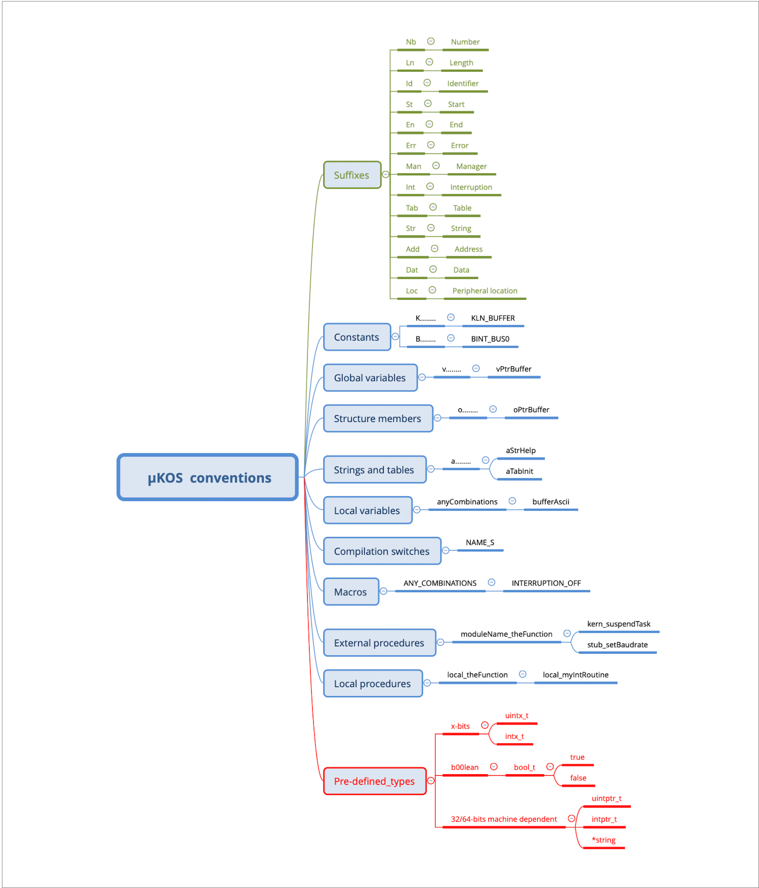

# 🌈  Annex F, The µKOS-X package

## Rules and conventions used for the project

To ensure consistency throughout the entire µKOS-X project, the following software development guidelines have been adopted and maintained.



The text editor used is **BBEdit**, and all **ASCII source files** (*.c, *.h, *.s, *.ld, and more) are formatted according to the following conventions:

1. Font: Monaco, 9-point.
2. Tabulation: 4 spaces.
3. Line termination: LF (UNIX style).

## The package

The downloaded **µKOS-X** package includes all the schematics, source files, makefiles, and tools required to build the system and develop applications.

Before getting started, it is necessary to set up your environment by creating a **.zshrc** file (for macOS and for Ubuntu).

Once this is done, additional required packages must be downloaded and installed to complete the setup.

### Prerequisites for OSX (26.xx)

#### Configure the .zshrc

```bash
# SPDX-License-Identifier: MIT

#------------------------------------------------------------------------
# Author:     Edo. Franzi    The 2025-01-01
# Modifs:
#
# Project:    uKOS-X
# Goal:       Main profile (example).
#
#   (c) 2025-2026, Edo. Franzi
#   --------------------------
#                                              __ ______  _____
#   Edo. Franzi                         __  __/ //_/ __ \/ ___/
#   5-Route de Cheseaux                / / / / ,< / / / /\__ \
#   CH 1400 Cheseaux-Noréaz           / /_/ / /| / /_/ /___/ /
#                                     \__,_/_/ |_\____//____/
#   edo.franzi@ukos.ch
#
#   See the MIT License (License_uKOS-X.txt)
#
#------------------------------------------------------------------------

PYTHON_REV=3.13
alias python3=‘/opt/local/Library/Frameworks/Python.framework/Versions/ \
               ${PYTHON_REV}/bin/python${PYTHON_REV}’
alias pip3=‘/opt/local/Library/Frameworks/Python.framework/Versions/ \
            ${PYTHON_REV}/bin/pip3’

alias githash='git describe --always --dirty --match='

# make
# Or we install gmake with macport and set a symbolic link
#    sudo ln -sf /opt/local/bin/gmake /usr/local/bin/make
# Or we use an alias
#    alias make='gmake'
#    PATH="/opt/local/libexec/gnubin:${PATH}"

# Set the PATH for the development environment
# --------------------------------------------

PATH="/Applications/CMake.app/Contents/bin":"$PATH"
PATH="/opt/local/libexec/gnubin:${PATH}"
PATH=${PATH}:/opt/local/bin:/opt/local/sbin
PATH=${PATH}:/opt/subversion/bin
PATH=${PATH}:/usr/local/bin
PATH=${PATH}:/usr/bin
PATH=${PATH}:/usr/local/lib/pkgconfig
PATH=${PATH}:/opt/local/Library/Frameworks/Python.framework/Versions/${PYTHON_REV}/bin
MANPATH=${MANPATH}:/opt/local/share/man

# Project environment
# -------------------
#
# PATH_PORTS_ROOT     = Macports tools
# PATH_UKOS_ROOT      = uKOS-X Project (active workspace)
# PATH_UKOS_X_PACKAGE = uKOS-X kernel

PATH_PORTS_ROOT=/opt/local
PATH_UKOS_ROOT=${HOME}/Your_Path_To_The_uKOS-X_Package
PATH_UKOS_X_PACKAGE=${PATH_UKOS_ROOT}/OS_Kernel-X

# Cross compilation environment
# -----------------------------
#
# PATH_TOOLS_ROOT     = Tool location
# PATH_TOOLS_GCC      = GCC root location
# PATH_TOOLS_UNIX     = uKOS-X BIN UNIX tool location

PATH_TOOLS_ROOT=/opt/uKOS
PATH_TOOLS_GCC=${PATH_TOOLS_ROOT}
PATH_TOOLS_UNIX=${PATH_TOOLS_ROOT}/local/bin

PATH_GCC_ARM=${PATH_TOOLS_GCC}/cross/gcc-current/arm
PATH_GCC_RVXX=${PATH_TOOLS_GCC}/cross/gcc-current/riscv
PATH_LLVM_ARM=${PATH_TOOLS_GCC}/cross/llvm-current/arm
PATH_LLVM_RVXX=${PATH_TOOLS_GCC}/cross/llvm-current/riscv
PATH_GCC_DFUUTIL=${PATH_TOOLS_GCC}/cross/dfu-util-current
PATH_PICOTOOL=${PATH_TOOLS_GCC}/cross/picotool-current

PATH=${PATH}:${PATH_TOOLS_UNIX}
PATH=${PATH}:${PATH_TOOLS_GCC}/cross/cppcheck-current/bin
PATH=${PATH}:${PATH_TOOLS_GCC}/cross/doxygen-current/bin
PATH=${PATH}:${PATH_TOOLS_GCC}/cross/graphviz-current/bin
PATH=${PATH}:${PATH_TOOLS_GCC}/cross/openocd-current/cortex/bin
PATH=${PATH}:${PATH_TOOLS_GCC}/cross/openocd-current/stm/bin
PATH=${PATH}:${PATH_TOOLS_GCC}/cross/openocd-current/riscv32/bin
PATH=${PATH}:${PATH_TOOLS_GCC}/cross/openocd-current/riscv64/bin
PATH=${PATH}:${PATH_GCC_DFUUTIL}/bin
PATH=${PATH}:${PATH_PICOTOOL}/bin
PATH=${PATH}:${HOME}/Library/Python/${PYTHON_REV}/bin

export PATH_TOOLS_ROOT
export PATH_TOOLS_GCC
export PATH_TOOLS_UNIX
export PATH_UKOS_X_PACKAGE
export PATH_GCC_ARM
export PATH_GCC_RVXX
export PATH_LLVM_ARM
export PATH_LLVM_RVXX
export PATH_GCC_DFUUTIL
export MANPATH
export PATH
export STM32_PRG_PATH=/Applications/STMicroelectronics/STM32Cube/ \
                      STM32CubeProgrammer/ STM32CubeProgrammer.app/Contents/MacOs/bin

```

#### Install the Macports and some additional packages

```bash
# Follow the instructions: http://www.macports.org

sudo port install automake
sudo port install libtool
sudo port install autoconf
sudo port install pkgconfig
sudo port install coreutils
sudo port install md5sha1sum
sudo port install ghostscript
sudo port install texinfo
sudo port install ctags
sudo port install wget
sudo port install hidapi
sudo port install py313-pip
sudo port install ninja
sudo port install meson
sudo port install bison
sudo port install pandoc
sudo port install gmake
sudo port install zlib
sudo port install yq
pip3 install kflash
pip3 install numpy
pip3 install pyserial
pip3 install matplotlib
pip3 install pillow
```

### Prerequisites for Ubuntu (25.04)

#### Configure the .zshrc

```bash
# SPDX-License-Identifier: MIT

#------------------------------------------------------------------------
# Author:     Edo. Franzi    The 2025-01-01
# Modifs:
#
# Project:    uKOS-X
# Goal:       Main profile.
#
#   (c) 2025-2026, Edo. Franzi
#   --------------------------
#                                              __ ______  _____
#   Edo. Franzi                         __  __/ //_/ __ \/ ___/
#   5-Route de Cheseaux                / / / / ,< / / / /\__ \
#   CH 1400 Cheseaux-Noréaz           / /_/ / /| / /_/ /___/ /
#                                     \__,_/_/ |_\____//____/
#   edo.franzi@ukos.ch
#
#   See the MIT License (License_uKOS-X.txt)
#
#------------------------------------------------------------------------

PROMPT='%n:%~%# ‘

# Set the PATH for the development environment
# --------------------------------------------

export PATH=/opt/uKOS/cross/cppcheck-current/bin:$PATH

PATH=${PATH}:/opt/local/bin:/opt/local/sbin
PATH=${PATH}:/opt/subversion/bin
PATH=${PATH}:/usr/local/bin
PATH=${PATH}:/usr/bin
PATH=${PATH}:/usr/local/lib/pkgconfig

# Project environment
# -------------------

PATH_UKOS_ROOT=${HOME}/uKOS_Soft
PATH_UKOS_X_PACKAGE=${PATH_UKOS_ROOT}/OS_Kernel-X
PATH_TOOLS_TSTROM=${PATH_UKOS_X_PACKAGE}/Applications/uKOS_TestRom

# Cross compilation environment
# -----------------------------

PATH_TOOLS_ROOT=/opt/uKOS
PATH_TOOLS_GCC=${PATH_TOOLS_ROOT}
PATH_TOOLS_UNIX=${PATH_TOOLS_ROOT}/local/bin

PATH_GCC_ARM=${PATH_TOOLS_GCC}/cross/gcc-current/arm
PATH_GCC_RVXX=${PATH_TOOLS_GCC}/cross/gcc-current/riscv
PATH_LLVM_ARM=${PATH_TOOLS_GCC}/cross/llvm-current/arm
PATH_LLVM_RVXX=${PATH_TOOLS_GCC}/cross/llvm-current/riscv
PATH_GCC_DFUUTIL=${PATH_TOOLS_GCC}/cross/dfu-util-current
PATH_PICOTOOL=${PATH_TOOLS_GCC}/cross/picotool-current

PATH=${PATH}:${PATH_TOOLS_UNIX}
PATH=${PATH}:${PATH_TOOLS_GCC}/cross/cppcheck-current/bin
PATH=${PATH}:${PATH_TOOLS_GCC}/cross/doxygen-current/bin
PATH=${PATH}:${PATH_TOOLS_GCC}/cross/graphviz-current/bin
PATH=${PATH}:${PATH_TOOLS_GCC}/cross/openocd-current/cortex/bin
PATH=${PATH}:${PATH_TOOLS_GCC}/cross/openocd-current/riscv32/bin
PATH=${PATH}:${PATH_TOOLS_GCC}/cross/openocd-current/riscv64/bin

export PATH_TOOLS_ROOT
export PATH_TOOLS_GCC
export PATH_TOOLS_UNIX
export PATH_UKOS_X_PACKAGE
export PATH_GCC_ARM
export PATH_GCC_RVXX
export PATH_LLVM_ARM
export PATH_LLVM_RVXX
export PATH_GCC_DFUUTIL
export PATH_PICOTOOL
export PATH

```

#### Ubuntu desktop installation for Mac ARM Mx

```bash
sudo reboot
sudo apt install open-vm-tools-desktop

# user = ukos and group = ukos
cd /opt
sudo mkdir -p uKOS
sudo chown -R user:group uKOS
sudo chmod -R o+rw uKOS
git config --global user.email "ukos@ukos.ch"
git config --global user.name “uKOS"
```

#### Install some additional packages

```bash
# Update the ready installed packages
sudo apt update && sudo apt upgrade -y

# Install the compilation tools
sudo apt install -y \
build-essential \
libtool libtool-bin \
bison flex gawk m4 texinfo automake \
libncurses-dev \
libusb-1.0-0-dev libusb-dev \
zlib1g-dev \
libpcre3 libpcre3-dev \
libgl1-mesa-dev \
libhidapi-dev \
intltool \
libgtk2.0-dev \
libudev-dev \
libjaylink-dev \
ninja-build \
meson \
clang \
cmake \
git \
gtkterm \
curl \
pandoc \
lzip \
zsh \
python3-pip \
python-is-python3 \
python3.13-venv

# Install additional fonts
sudo apt install -y ttf-mscorefonts-installer culmus
# Un-install/install yq
sudo apt remove -y yq || true
sudo snap install yq
# zsh by default
chsh -s /usr/bin/zsh || true
# Install venv-kflash
apt install python3.13-venv
python3 -m venv ~/uKOS_Soft/venv-uKOS
source ~/uKOS_Soft/venv-uKOS/bin/activate
pip install kflash
pip3 install PyYAML
```

#### Add a new rule for using the FTDI, the Silicon Lab chips & GD32DFU

```bash
# Create a file 90-ukos-ftdi.rules containing these rules:

ACTION!="add|change", GOTO="ukos_ftdi_rules_end"
SUBSYSTEM!="usb|tty", GOTO="ukos_ftdi_rules_end"
ATTRS{idProduct}=="6011", ATTRS{idVendor}=="0403", ATTRS{product}=="uKOS - Kernel", GROUP="dialout"
ATTRS{idProduct}=="6011", ATTRS{idVendor}=="0403", ATTRS{product}=="uKOS - Kernel", ENV{ID_USB_INTERFACE_NUM}=="00", RUN+="/bin/sh -c '/bin/echo $devpath | /usr/bin/cut -d / -f 8 > /sys/bus/usb/drivers/ftdi_sio/unbind'"
ATTRS{idProduct}=="6015", ATTRS{idVendor}=="0403", ATTRS{product}=="uKOS - FIFO", GROUP="dialout"
ATTRS{idProduct}=="6015", ATTRS{idVendor}=="0403", ATTRS{product}=="uKOS - FIFO", ENV{ID_USB_INTERFACE_NUM}=="00", RUN+="/bin/sh -c '/bin/echo $devpath | /usr/bin/cut -d / -f 8 > /sys/bus/usb/drivers/ftdi_sio/unbind'"
LABEL="ukos_ftdi_rules_end"

# Create a file 90-ukos-cp210x.rules containing these rules:

SUBSYSTEMS=="usb", ATTRS{idVendor}=="10c4", ATTRS{idProduct}==“ea60", MODE=“0666"

# Create a file 40-ukos-dfuse.rules containing these rules:

ATTRS{idVendor}=="28e9", ATTRS{idProduct}=="0189", GROUP="plugdev", MODE="660"

# Copy the files into the rules.d folder

sudo cp xyz/90-ukos-ftdi.rules .
sudo cp xyz/90-ukos-cp210x.rules .
sudo cp xyz/40-ukos-dfuse.rules .

sudo adduser ${USER} plugdev
```

K210 devices use the **CH341 UART** converter chip, which is natively supported by Ubuntu. However, its operation can be disrupted by the **BRLTTY** service — a background process that “provides access to the Linux/Unix console (in text mode) for blind users via a refreshable braille display.”

To allow a serial terminal to access the CH341 interface correctly, it is necessary to **disable the BRLTTY service**.

```bash
for f in /usr/lib/udev/rules.d/*brltty*.rules; do
    sudo ln -s /dev/null "/etc/udev/rules.d/$(basename "$f")"
done
sudo udevadm control --reload-rules
```

### Install the “cross-compilers”

Just follow the indications available in the Annex G **“GCC Toolchains”**.

### Build additional µKOS-X UNIX tools

```bash
cd ${PATH_UKOS_X_PACKAGE}/Ports/Tools/UNIX_Tools
./clean.sh
./build.sh
```

### Build all the µKOS-X systems

Now that everything is in place, the µKOS-X system can be built for all supported targets.

```bash
cd ${PATH_UKOS_X_PACKAGE}/Ports/Targets
./clean.sh
./build.sh
```

If everything has been configured as explained, at the end of the **“make”** the µKOS-X system is available to be downloaded and re-flashed **${PATH_UKOS_X_PACKAGE}/Ports/Targets/Nucleo_743/Variant_Test/System/FLASH.elf**.

### Build all the µKOS-X applications

```bash
cd {PATH_UKOS_X_PACKAGE}/Applications/uKOS_Appls_Downloadable
./clean.sh
./build.sh
```

### Build the “doxygen” documentation

```bash
cd ${PATH_UKOS_X_PACKAGE}/Documentation/Doxygen
./build.sh
```
