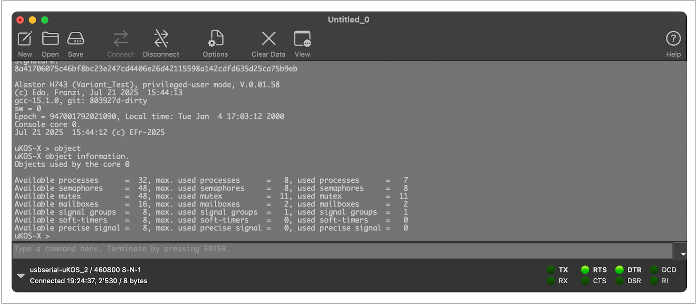
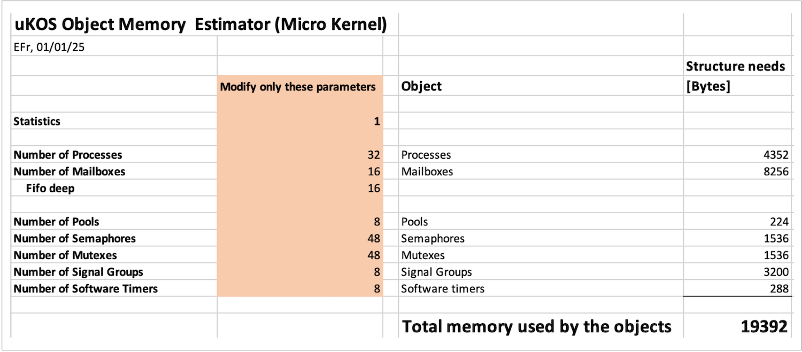

# 🌈  Annex I, µKOS-X object memory allocation

## Introduction

From the perspective of **object memory allocation** — covering elements such as processes, semaphores, mailboxes, software timers, and more — **real-time operating systems (RTOS)** can generally be classified into three main categories: **static**, **quasi-static**, and **dynamic**.

### Static and Quasi-Static RTOS

These types of RTOS are designed with a strong focus on **robustness** and **temporal determinism**, which are critical requirements in high-reliability systems.

1. In a **static RTOS**, the number and configuration of all system objects are defined entirely at **compile-time**. No dynamic allocation occurs at runtime, resulting in predictable memory usage and execution timing.
2. A **quasi-static RTOS** offers more flexibility. Object allocation may be performed **dynamically**, but only within a **predefined and controlled memory region**. This allows for a level of runtime configurability without compromising the deterministic behaviour expected in time-critical systems.

These RTOS types are commonly found in **high-end embedded applications** such as **aerospace, automotive, medical devices**, and **industrial automation**, where **system integrity, reliability**, and **predictable real-time performance** are paramount.

### Dynamic RTOS

In contrast, **dynamic RTOS** provide a high degree of configurability and runtime flexibility, typically relying on **general-purpose memory allocation schemes** such as heap-based allocators. While this allows for more adaptable system behaviour, it usually comes at the cost of **reduced robustness** and **weakened temporal determinism**, particularly due to memory fragmentation and non-deterministic allocation timing.

Dynamic RTOS are more suited to **cost-sensitive consumer applications** — such as household electronics or multimedia devices — where real-time guarantees are less critical and the system can tolerate a degree of unpredictability.

**µKOS-X** falls into the category of a **quasi-static RTOS**. It strikes a careful balance between flexibility and predictability, making it well-suited for demanding embedded systems where both **runtime adaptability** and **real-time performance** are required.

## Optimal object configuration for an application

The configuration process can be carried out easily using a **two-step approach**. Initially, the user must estimate the approximate number of system objects required by the application.

To illustrate the configuration procedure, consider the following example:

The application's initial resource estimation suggests the following object requirements:

1. Approximately **20 processes.**
2. Approximately **10 mailboxes.**
3. Approximately **5 software timers.**
4. Approximately **20 semaphores.**
5. Approximately **20 mutexes.**

This initial guess provides the foundation for configuring the µKOS-X system to allocate the appropriate resources efficiently and deterministically.

### Step 1

The final **kernel and system configuration** is defined directly within the **target-specific makefile**.

To ensure stability and avoid resource shortages during runtime, it is recommended to apply a **safety margin** to the initial object estimates. In our example, a simple and effective approach is to **increase each estimated value by approximately 50%**.

This precaution allows the system to accommodate unexpected loads or growth in application complexity, without compromising performance or determinism.

```makefile
# Number of process
CONF_SYSTEM		+= -DKKERN_NB_PROCESSES=32
# Number of mailboxes
CONF_SYSTEM		+= -DKKERN_NB_MAILBOXES=16
# Number of semaphores
CONF_SYSTEM		+= -DKKERN_NB_SEMAPHORES=48
# Number of mutexes
CONF_SYSTEM		+= -DKKERN_NB_MUTEXES=48
# Number of software timers
CONF_SYSTEM		+= -DKKERN_NB_SOFTWARE_TIMERS=8
# Number of signal groups
CONF_SYSTEM		+= -DKKERN_NB_SIGNALS=8
# Number of memory pools
CONF_SYSTEM		+= -DKKERN_NB_POOLS=8
# Number of precise signals
CONF_SYSTEM		+= -DKKERN_NB_PRECISE_SIGNALS=8
```

### Step 2

Now, run the application and allow **µKOS-X** to operate for a sufficient period so it can collect accurate information regarding the actual number of objects in use.

After a reasonable runtime — depending on the nature and behaviour of your application — you can query the system to display the precise object usage statistics.

To do this, simply type the command **object** in the console:

This will provide a detailed report of the number and types of kernel objects currently in use, allowing you to fine-tune the configuration for optimal memory utilisation.



Use the displayed information — specifically the **max. used** values from the **object** command output — to fine-tune the object allocation settings in the target makefile.

This adjustment ensures that only the necessary resources are reserved, helping to optimise memory usage while maintaining system stability and determinism.

To determine and to verify the amount of memory used by µKOS-X objects, simply use the Excel tool **Object_Memory_Estimator.xlsx** located in the Lib_kernels folder.


